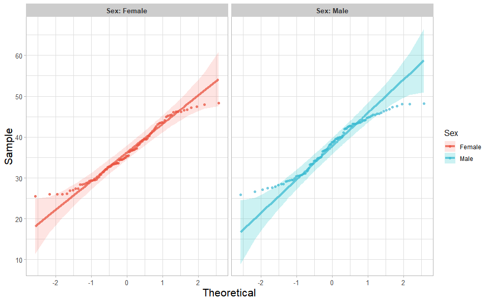
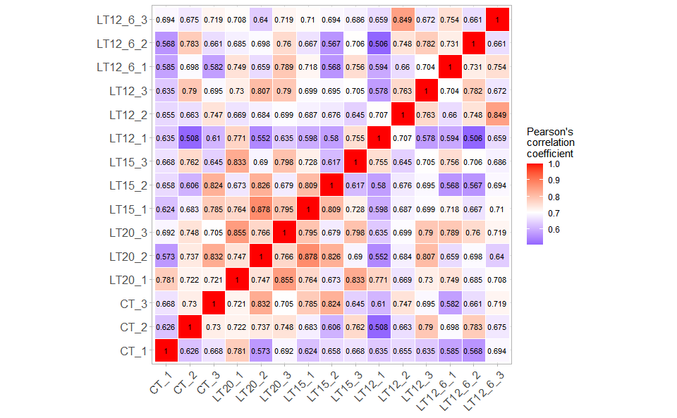
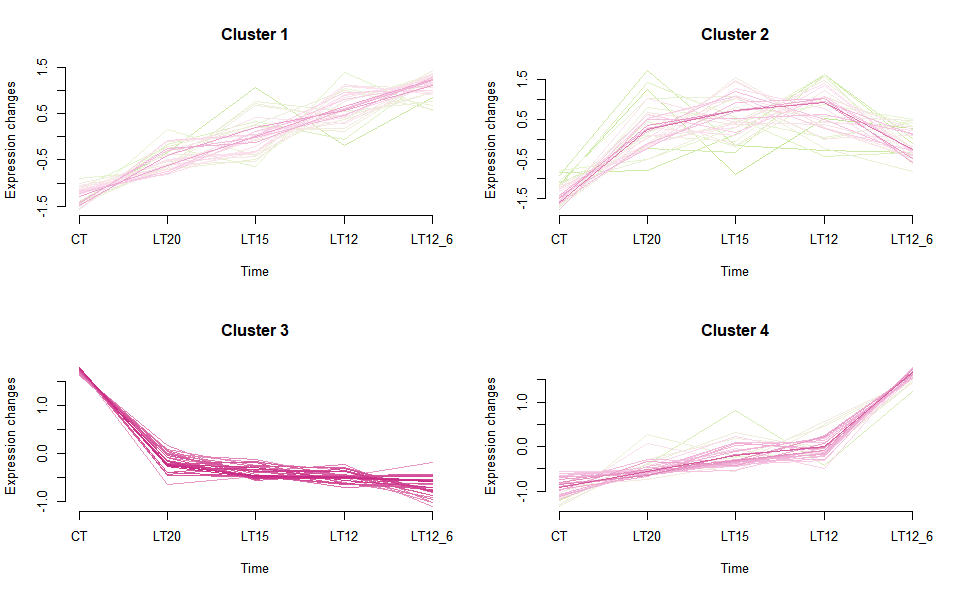
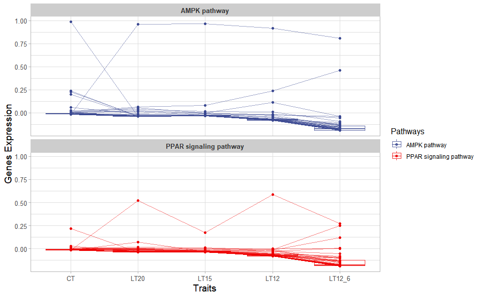
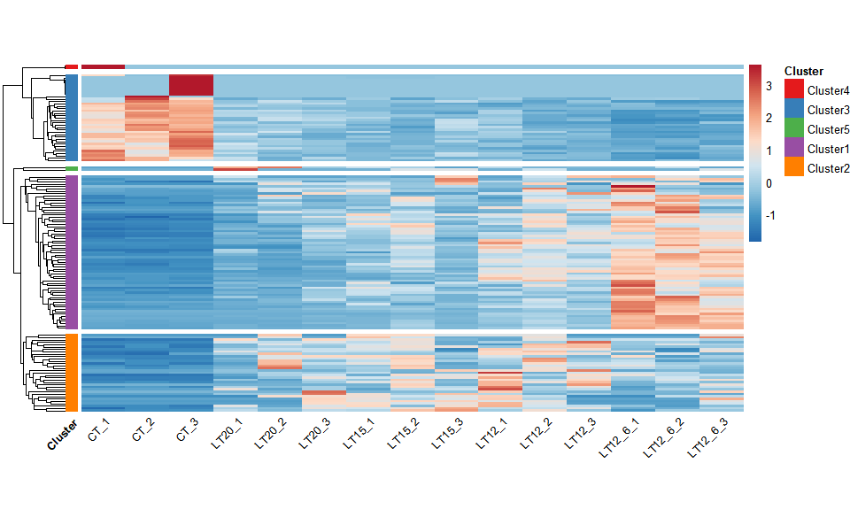
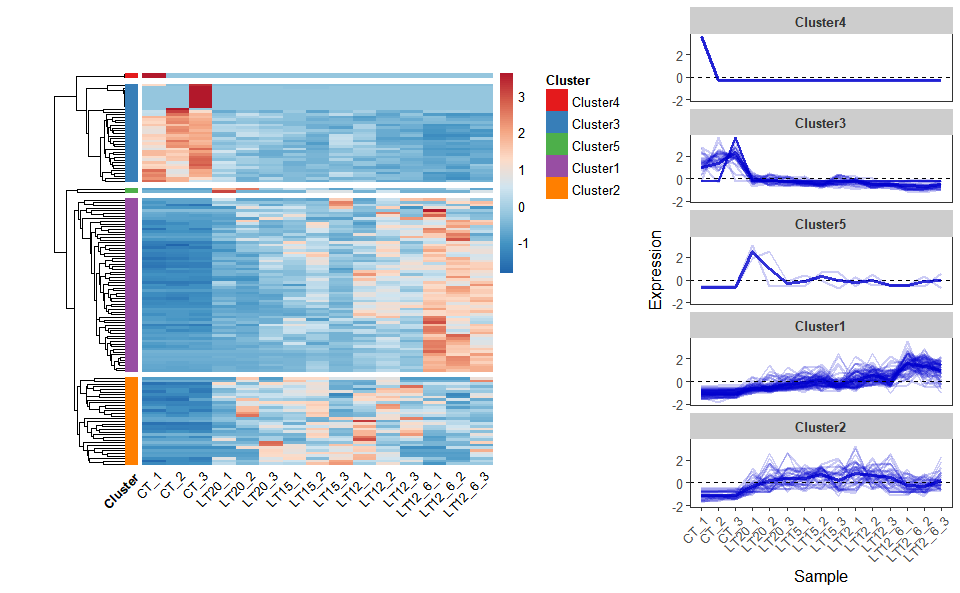
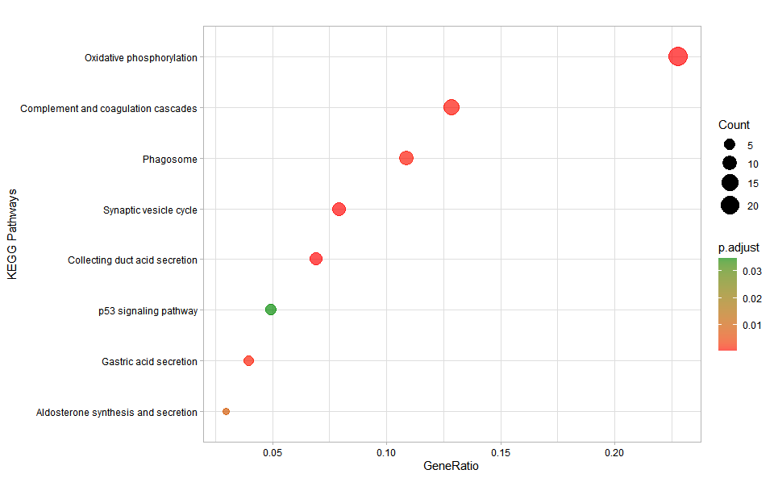

# TOmicsVis

## 1. Introduction

#### 1.1 Meta Information

**TOmicsVis**: TranscriptOmics Visualization.

**Website**: <https://benben-miao.github.io/TOmicsVis/>

#### 1.2 Github and CRAN Install

[](https://cran.rstudio.com/web/packages/TOmicsVis/index.html)

**1.2.1 Install required packages from Bioconductor:**

``` r
# Install required packages from Bioconductor
install.packages("BiocManager")
BiocManager::install(c("ComplexHeatmap", "EnhancedVolcano", "clusterProfiler", "enrichplot", "impute", "preprocessCore", "Mfuzz"))
```

**1.2.2 Github**: <https://github.com/benben-miao/TOmicsVis/>

**Install from Github:**

``` r
install.packages("devtools")
devtools::install_github("benben-miao/TOmicsVis")

# Resolve network by GitClone
devtools::install_git("https://gitclone.com/github.com/benben-miao/TOmicsVis.git")
```

**1.2.3 CRAN**: <https://cran.r-project.org/package=TOmicsVis>

**Install from CRAN:**

``` r
# Install from CRAN
install.packages("TOmicsVis")
```

#### 1.3 Articles and Courses

**Videos Courses:** <https://space.bilibili.com/34105515/channel/series>

**Article Introduction:**
[全解TOmicsVis完美应用于转录组可视化R包](https://mp.weixin.qq.com/s/g8sRcK_ExlsOFniMWEJnVQ)

**Article Courses:** [TOmicsVis
转录组学R代码分析及可视化视频](https://mp.weixin.qq.com/s/mVXJmHPAnC9J1-zMj7eG7g)

#### 1.4 About and Authors

**OmicsSuite**: [Omics Suite Github:
https://github.com/omicssuite/](https://github.com/omicssuite/)

**Authors**:

- [benben-miao Github:
  https://github.com/benben-miao/](https://github.com/benben-miao/)

- [dongwei1220 Github:
  https://github.com/dongwei1220/](https://github.com/dongwei1220/)

## 2. Libary packages

``` r
# 1. Library TOmicsVis package
library(TOmicsVis)
#> 载入需要的程辑包：Biobase
#> 载入需要的程辑包：BiocGenerics
#> 
#> 载入程辑包：'BiocGenerics'
#> The following objects are masked from 'package:stats':
#> 
#>     IQR, mad, sd, var, xtabs
#> The following objects are masked from 'package:base':
#> 
#>     anyDuplicated, aperm, append, as.data.frame, basename, cbind,
#>     colnames, dirname, do.call, duplicated, eval, evalq, Filter, Find,
#>     get, grep, grepl, intersect, is.unsorted, lapply, Map, mapply,
#>     match, mget, order, paste, pmax, pmax.int, pmin, pmin.int,
#>     Position, rank, rbind, Reduce, rownames, sapply, setdiff, sort,
#>     table, tapply, union, unique, unsplit, which.max, which.min
#> Welcome to Bioconductor
#> 
#>     Vignettes contain introductory material; view with
#>     'browseVignettes()'. To cite Bioconductor, see
#>     'citation("Biobase")', and for packages 'citation("pkgname")'.
#> 载入需要的程辑包：e1071
#> 
#> Registered S3 method overwritten by 'GGally':
#>   method from   
#>   +.gg   ggplot2
#> 
#> 载入程辑包：'DynDoc'
#> The following object is masked from 'package:BiocGenerics':
#> 
#>     path

# 2. Extra package
# install.packages("ggplot2")
library(ggplot2)
```

## 3. Usage cases

### 3.1 Samples Statistics

#### 3.1.1 quantile_plot

**Input Data:** Dataframe: Weight and Sex traits dataframe (1st-col:
Weight, 2nd-col: Sex).

**Output Plot:** Quantile plot for visualizing data distribution.

``` r
# 1. Load example datasets
data(weight_sex)
head(weight_sex)
#>   Weight    Sex
#> 1  36.74 Female
#> 2  38.54 Female
#> 3  44.91 Female
#> 4  43.53 Female
#> 5  39.03 Female
#> 6  26.01 Female

# 2. Run quantile_plot plot function
quantile_plot(
  data = weight_sex,
  my_shape = "fill_circle",
  point_size = 1.5,
  conf_int = TRUE,
  conf_level = 0.95,
  split_panel = "Split_Panel",
  legend_pos = "right",
  legend_dir = "vertical",
  sci_fill_color = "Sci_NPG",
  sci_color_alpha = 0.75,
  ggTheme = "theme_light"
)
```

<!-- -->

Get help using command `?TOmicsVis::quantile_plot` or reference page
<https://benben-miao.github.io/TOmicsVis/reference/quantile_plot.html>.

``` r
# Get help with command in R console.
# ?TOmicsVis::quantile_plot
```

#### 3.1.2 box_plot

**Input Data:** Dataframe: Length, Width, Weight, and Sex traits
dataframe (1st-col: Value, 2nd-col: Traits, 3rd-col: Sex).

**Output Plot:** Plot: Box plot support two levels and multiple groups
with P value.

``` r
# 1. Load example datasets
data(traits_sex)
head(traits_sex)
#>   Value Traits    Sex
#> 1 36.74 Weight Female
#> 2 38.54 Weight Female
#> 3 44.91 Weight Female
#> 4 43.53 Weight Female
#> 5 39.03 Weight Female
#> 6 26.01 Weight Female

# 2. Run box_plot plot function
box_plot(
  data = traits_sex,
  test_method = "t.test",
  test_label = "p.format",
  notch = TRUE,
  group_level = "Three_Column",
  add_element = "jitter",
  my_shape = "fill_circle",
  sci_fill_color = "Sci_AAAS",
  sci_fill_alpha = 0.5,
  sci_color_alpha = 1,
  legend_pos = "right",
  legend_dir = "vertical",
  ggTheme = "theme_light"
)
```

<!-- -->

Get help using command `?TOmicsVis::box_plot` or reference page
<https://benben-miao.github.io/TOmicsVis/reference/box_plot.html>.

``` r
# Get help with command in R console.
# ?TOmicsVis::box_plot
```

#### 3.1.3 violin_plot

**Input Data:** Dataframe: Length, Width, Weight, and Sex traits
dataframe (1st-col: Value, 2nd-col: Traits, 3rd-col: Sex).

**Output Plot:** Plot: Violin plot support two levels and multiple
groups with P value.

``` r
# 1. Load example datasets
data(traits_sex)

# 2. Run violin_plot plot function
violin_plot(
  data = traits_sex,
  test_method = "t.test",
  test_label = "p.format",
  group_level = "Three_Column",
  violin_orientation = "vertical",
  add_element = "boxplot",
  element_alpha = 0.5,
  my_shape = "plus_times",
  sci_fill_color = "Sci_AAAS",
  sci_fill_alpha = 0.5,
  sci_color_alpha = 1,
  legend_pos = "right",
  legend_dir = "vertical",
  ggTheme = "theme_light"
)
```

<!-- -->

Get help using command `?TOmicsVis::violin_plot` or reference page
<https://benben-miao.github.io/TOmicsVis/reference/violin_plot.html>.

``` r
# Get help with command in R console.
# ?TOmicsVis::violin_plot
```

#### 3.1.4 survival_plot

**Input Data:** Dataframe: survival record data (1st-col: Time, 2nd-col:
Status, 3rd-col: Group).

**Output Plot:** Survival plot for analyzing and visualizing survival
data.

``` r
# 1. Load example datasets
data(survival_data)
head(survival_data)
#>   Time Status Group
#> 1   48      0    CT
#> 2   48      0    CT
#> 3   48      0    CT
#> 4   48      0    CT
#> 5   48      0    CT
#> 6   48      0    CT

# 2. Run survival_plot plot function
survival_plot(
  data = survival_data,
  curve_function = "pct",
  conf_inter = TRUE,
  interval_style = "ribbon",
  risk_table = TRUE,
  num_censor = TRUE,
  sci_palette = "aaas",
  ggTheme = "theme_light",
  x_start = 0,
  y_start = 0,
  y_end = 100,
  x_break = 10,
  y_break = 10
)
```

<!-- -->

Get help using command `?TOmicsVis::survival_plot` or reference page
<https://benben-miao.github.io/TOmicsVis/reference/survival_plot.html>.

``` r
# Get help with command in R console.
# ?TOmicsVis::survival_plot
```

### 3.2 Traits Analysis

#### 3.2.1 corr_heatmap

**Input Data:** Dataframe: All genes in all samples expression dataframe
of RNA-Seq (1st-col: Genes, 2nd-col~: Samples).

**Output Plot:** Plot: heatmap plot filled with Pearson correlation
values and P values.

``` r
# 1. Load example dataset
data(gene_expression)
head(gene_expression)
#>              Genes   CT_1   CT_2   CT_3 LT20_1 LT20_2 LT20_3 LT15_1 LT15_2
#> 1     transcript_0 655.78 631.08 669.89 654.21 402.56 447.09 510.08 442.22
#> 2     transcript_1  92.72 112.26 150.30  88.35  76.35  94.55 120.24  80.89
#> 3    transcript_10  21.74  31.11  22.58  15.09  13.67  13.24  12.48   7.53
#> 4   transcript_100   0.00   0.00   0.00   0.00   0.00   0.00   0.00   0.00
#> 5  transcript_1000   0.00  14.15  36.01   0.00   0.00 193.59 208.45   0.00
#> 6 transcript_10000  89.18 158.04  86.28  82.97 117.78 102.24 129.61 112.73
#>   LT15_3 LT12_1 LT12_2 LT12_3 LT12_6_1 LT12_6_2 LT12_6_3
#> 1 399.82 483.30 437.89 444.06   405.43   416.63   464.75
#> 2  73.94  96.25  82.62  85.48    65.12    61.94    73.44
#> 3  13.35  11.16  11.36   6.96     7.82     4.01    10.02
#> 4   0.00   0.00   0.00   0.00     0.00     0.00     0.00
#> 5 232.40 148.58   0.00 181.61     0.02    12.18     0.00
#> 6  85.70  80.89 124.11 115.25   113.87   107.69   119.83

# 2. Run corr_heatmap plot function
corr_heatmap(
  data = gene_expression,
  corr_method = "pearson",
  cell_shape = "square",
  fill_type = "full",
  lable_size = 3,
  axis_angle = 45,
  axis_size = 12,
  lable_digits = 3,
  color_low = "blue",
  color_mid = "white",
  color_high = "red",
  outline_color = "white",
  ggTheme = "theme_light"
)
#> Scale for fill is already present.
#> Adding another scale for fill, which will replace the existing scale.
```

<!-- -->

Get help using command `?TOmicsVis::corr_heatmap` or reference page
<https://benben-miao.github.io/TOmicsVis/reference/corr_heatmap.html>.

``` r
# Get help with command in R console.
# ?TOmicsVis::corr_heatmap
```

#### 3.2.2 pca_analysis

**Input Data1:** Dataframe: All genes in all samples expression
dataframe of RNA-Seq (1st-col: Genes, 2nd-col~: Samples).

**Input Data2:** Dataframe: Samples and groups for gene expression
(1st-col: Samples, 2nd-col: Groups).

**Output Table:** PCA dimensional reduction analysis for RNA-Seq.

``` r
# 1. Load example datasets
data(gene_expression)

data(samples_groups)
head(samples_groups)
#>   Samples Groups
#> 1    CT_1     CT
#> 2    CT_2     CT
#> 3    CT_3     CT
#> 4  LT20_1   LT20
#> 5  LT20_2   LT20
#> 6  LT20_3   LT20

# 2. Run pca_analysis plot function
res <- pca_analysis(gene_expression, samples_groups)
head(res)
#>               PC1         PC2         PC3        PC4         PC5       PC6
#> CT_1   -27010.536 -18328.2803   5955.2569 46547.7319  11394.1043 -7197.285
#> CT_2    16248.651  29132.9251   -824.1857 20747.9618 -18798.8755 21096.088
#> CT_3    22421.017 -26832.3964   6789.4490  5864.1171 -15375.3418 17424.861
#> LT20_1 -18587.073   -472.9036 -21638.7836  7765.9575    114.1225 -3943.968
#> LT20_2  33275.933  -9874.9959 -14991.3942 -7443.9250  -4600.8302 -8072.298
#> LT20_3  -1596.255  11683.5426 -10892.8493   381.0795  11080.3560 -8994.187
#>                PC7        PC8        PC9        PC10        PC11       PC12
#> CT_1     2150.6739   4850.320   4051.745   7666.9445  -3141.9327  -2487.939
#> CT_2   -12329.1138  -3353.734   4805.659   1503.8533  11184.0296  -4865.436
#> CT_3    12744.2255 -10037.516 -11468.842    202.4016 -11001.6260  -3847.291
#> LT20_1   8864.7482 -14171.127  -1968.082  -3562.1899   7446.2105  14831.486
#> LT20_2   -941.3943  -5072.401   5345.106   6494.1383  -3954.2153   9351.346
#> LT20_3   7263.9321  -7774.725  -1853.546 -21427.2641    -46.1503 -12507.011
#>              PC13       PC14          PC15
#> CT_1    -2704.613  2396.7383  2.528517e-11
#> CT_2    -2633.057 -1375.3352  6.825657e-11
#> CT_3     5193.978   188.5601  2.255671e-11
#> LT20_1   3937.457 -7871.8062  4.864246e-11
#> LT20_2 -12904.673  6071.6618 -2.020696e-10
#> LT20_3  -5369.380  2606.1762  1.903509e-11
```

Get help using command `?TOmicsVis::pca_analysis` or reference page
<https://benben-miao.github.io/TOmicsVis/reference/pca_analysis.html>.

``` r
# Get help with command in R console.
# ?TOmicsVis::pca_analysis
```

#### 3.2.3 pca_plot

**Input Data1:** Dataframe: All genes in all samples expression
dataframe of RNA-Seq (1st-col: Genes, 2nd-col~: Samples).

**Input Data2:** Dataframe: Samples and groups for gene expression
(1st-col: Samples, 2nd-col: Groups).

**Output Plot:** Plot: PCA dimensional reduction visualization for
RNA-Seq.

``` r
# 1. Load example datasets
data(gene_expression)

data(samples_groups)
head(samples_groups)
#>   Samples Groups
#> 1    CT_1     CT
#> 2    CT_2     CT
#> 3    CT_3     CT
#> 4  LT20_1   LT20
#> 5  LT20_2   LT20
#> 6  LT20_3   LT20

# 2. Run pca_plot plot function
pca_plot(
  sample_gene = gene_expression,
  group_sample = samples_groups,
  xPC = 1,
  yPC = 2,
  point_size = 5,
  text_size = 5,
  fill_alpha = 0.10,
  border_alpha = 0.00,
  legend_pos = "right",
  legend_dir = "vertical",
  ggTheme = "theme_light"
)
```

<!-- -->

Get help using command `?TOmicsVis::pca_plot` or reference page
<https://benben-miao.github.io/TOmicsVis/reference/pca_plot.html>.

``` r
# Get help with command in R console.
# ?TOmicsVis::pca_plot
```

#### 3.2.4 tsne_analysis

**Input Data1:** Dataframe: All genes in all samples expression
dataframe of RNA-Seq (1st-col: Genes, 2nd-col~: Samples).

**Input Data2:** Dataframe: Samples and groups for gene expression
(1st-col: Samples, 2nd-col: Groups).

**Output Table:** TSNE analysis for analyzing and visualizing TSNE
algorithm.

``` r
# 1. Load example datasets
data(gene_expression)
data(samples_groups)

# 2. Run tsne_analysis plot function
res <- tsne_analysis(gene_expression, samples_groups)
head(res)
#>       TSNE1     TSNE2
#> 1 -67.41252 -16.61397
#> 2  43.08349 -34.02654
#> 3 123.32273  54.14358
#> 4 -42.52065 -31.30027
#> 5  94.98790  48.97986
#> 6 -23.90637 -22.26434
```

Get help using command `?TOmicsVis::tsne_analysis` or reference page
<https://benben-miao.github.io/TOmicsVis/reference/tsne_analysis.html>.

``` r
# Get help with command in R console.
# ?TOmicsVis::tsne_analysis
```

#### 3.2.5 tsne_plot

**Input Data1:** Dataframe: All genes in all samples expression
dataframe of RNA-Seq (1st-col: Genes, 2nd-col~: Samples).

**Input Data2:** Dataframe: Samples and groups for gene expression
(1st-col: Samples, 2nd-col: Groups).

**Output Plot:** TSNE plot for analyzing and visualizing TSNE algorithm.

``` r
# 1. Load example datasets
data(gene_expression)
data(samples_groups)

# 2. Run tsne_plot plot function
tsne_plot(
  sample_gene = gene_expression,
  group_sample = samples_groups,
  seed = 1,
  multi_shape = FALSE,
  point_size = 5,
  point_alpha = 0.8,
  text_size = 5,
  text_alpha = 0.80,
  fill_alpha = 0.10,
  border_alpha = 0.00,
  sci_fill_color = "Sci_AAAS",
  legend_pos = "right",
  legend_dir = "vertical",
  ggTheme = "theme_light"
)
```

<!-- -->

Get help using command `?TOmicsVis::tsne_plot` or reference page
<https://benben-miao.github.io/TOmicsVis/reference/tsne_plot.html>.

``` r
# Get help with command in R console.
# ?TOmicsVis::tsne_plot
```

#### 3.2.6 umap_analysis

**Input Data1:** Dataframe: All genes in all samples expression
dataframe of RNA-Seq (1st-col: Genes, 2nd-col~: Samples).

**Input Data2:** Dataframe: Samples and groups for gene expression
(1st-col: Samples, 2nd-col: Groups).

**Output Table:** UMAP analysis for analyzing RNA-Seq data.

``` r
# 1. Load example datasets
data(gene_expression)
data(samples_groups)

# 2. Run tsne_plot plot function
res <- umap_analysis(gene_expression, samples_groups)
head(res)
#>             UMAP1       UMAP2
#> CT_1   -0.6752746  0.49425898
#> CT_2    1.0232441  0.03062202
#> CT_3   -0.4722297 -1.32183550
#> LT20_1 -0.2414214  0.13870703
#> LT20_2  0.1991701 -1.23434000
#> LT20_3  0.6431577  1.11879669
```

Get help using command `?TOmicsVis::umap_analysis` or reference page
<https://benben-miao.github.io/TOmicsVis/reference/umap_analysis.html>.

``` r
# Get help with command in R console.
# ?TOmicsVis::umap_analysis
```

#### 3.2.7 umap_plot

**Input Data1:** Dataframe: All genes in all samples expression
dataframe of RNA-Seq (1st-col: Genes, 2nd-col~: Samples).

**Input Data2:** Dataframe: Samples and groups for gene expression
(1st-col: Samples, 2nd-col: Groups).

**Output Plot:** UMAP plot for analyzing and visualizing UMAP algorithm.

``` r
# 1. Load example datasets
data(gene_expression)
data(samples_groups)

# 2. Run tsne_plot plot function
umap_plot(
  sample_gene = gene_expression,
  group_sample = samples_groups,
  seed = 1,
  multi_shape = TRUE,
  point_size = 5,
  point_alpha = 1,
  text_size = 5,
  text_alpha = 0.80,
  fill_alpha = 0.00,
  border_alpha = 0.00,
  sci_fill_color = "Sci_AAAS",
  legend_pos = "right",
  legend_dir = "vertical",
  ggTheme = "theme_light"
)
```

<!-- -->

Get help using command `?TOmicsVis::umap_plot` or reference page
<https://benben-miao.github.io/TOmicsVis/reference/umap_plot.html>.

``` r
# Get help with command in R console.
# ?TOmicsVis::umap_plot
```

#### 3.2.8 dendro_plot

**Input Data:** Dataframe: All genes in all samples expression dataframe
of RNA-Seq (1st-col: Genes, 2nd-col~: Samples).

**Output Plot:** Plot: dendrogram for multiple samples clustering.

``` r
# 1. Load example datasets
data(gene_expression)

# 2. Run plot function
dendro_plot(
  data = gene_expression,
  dist_method = "euclidean",
  hc_method = "ward.D2",
  tree_type = "rectangle",
  k_num = 5,
  palette = "npg",
  color_labels_by_k = TRUE,
  horiz = FALSE,
  label_size = 1,
  line_width = 1,
  rect = TRUE,
  rect_fill = TRUE,
  xlab = "Samples",
  ylab = "Height",
  ggTheme = "theme_light"
)
#> Registered S3 method overwritten by 'dendextend':
#>   method     from 
#>   rev.hclust vegan
```

<!-- -->

Get help using command `?TOmicsVis::dendro_plot` or reference page
<https://benben-miao.github.io/TOmicsVis/reference/dendro_plot.html>.

``` r
# Get help with command in R console.
# ?TOmicsVis::dendro_plot
```

### 3.3 Differential Expression Analyais

#### 3.3.1 venn_plot

**Input Data2:** Dataframe: Paired comparisons differentially expressed
genes (degs) among groups (1st-col~: degs of paired comparisons).

**Output Plot:** Venn plot for stat common and unique gene among
multiple sets.

``` r
# 1. Load example datasets
data(degs_lists)
head(degs_lists)
#>        CT.vs.LT20      CT.vs.LT15       CT.vs.LT12     CT.vs.LT12_6
#> 1 transcript_9024 transcript_4738  transcript_9956 transcript_10354
#> 2  transcript_604 transcript_6050  transcript_7601  transcript_2959
#> 3 transcript_3912 transcript_1039  transcript_5960  transcript_5919
#> 4 transcript_8676 transcript_1344  transcript_3240  transcript_2395
#> 5 transcript_8832 transcript_3069 transcript_10224  transcript_9881
#> 6   transcript_74 transcript_9809  transcript_3151  transcript_8836

# 2. Run venn_plot plot function
venn_plot(
  data = degs_lists,
    title_size = 1,
    label_show = TRUE,
    label_size = 0.8,
    border_show = TRUE,
    line_type = "longdash",
    ellipse_shape = "circle",
    sci_fill_color = "Sci_AAAS",
    sci_fill_alpha = 0.65
)
```

<!-- -->

Get help using command `?TOmicsVis::venn_plot` or reference page
<https://benben-miao.github.io/TOmicsVis/reference/venn_plot.html>.

``` r
# Get help with command in R console.
# ?TOmicsVis::venn_plot
```

#### 3.3.2 upsetr_plot

**Input Data2:** Dataframe: Paired comparisons differentially expressed
genes (degs) among groups (1st-col~: degs of paired comparisons).

**Output Plot:** UpSet plot for stat common and unique gene among
multiple sets.

``` r
# 1. Load example datasets
data(degs_lists)
head(degs_lists)
#>        CT.vs.LT20      CT.vs.LT15       CT.vs.LT12     CT.vs.LT12_6
#> 1 transcript_9024 transcript_4738  transcript_9956 transcript_10354
#> 2  transcript_604 transcript_6050  transcript_7601  transcript_2959
#> 3 transcript_3912 transcript_1039  transcript_5960  transcript_5919
#> 4 transcript_8676 transcript_1344  transcript_3240  transcript_2395
#> 5 transcript_8832 transcript_3069 transcript_10224  transcript_9881
#> 6   transcript_74 transcript_9809  transcript_3151  transcript_8836

# 2. Run upsetr_plot plot function
upsetr_plot(
  data = degs_lists,
  sets_num = 4,
  keep_order = FALSE,
  order_by = "freq",
  decrease = TRUE,
  mainbar_color = "#006600",
  number_angle = 45,
  matrix_color = "#cc0000",
  point_size = 4.5,
  point_alpha = 0.5,
  line_size = 0.8,
  shade_color = "#cdcdcd",
  shade_alpha = 0.5,
  setsbar_color = "#000066",
  setsnum_size = 6,
  text_scale = 1.2
)
```

<!-- -->

Get help using command `?TOmicsVis::upsetr_plot` or reference page
<https://benben-miao.github.io/TOmicsVis/reference/upsetr_plot.html>.

``` r
# Get help with command in R console.
# ?TOmicsVis::upsetr_plot
```

#### 3.3.3 flower_plot

**Input Data2:** Dataframe: Paired comparisons differentially expressed
genes (degs) among groups (1st-col~: degs of paired comparisons).

**Output Plot:** Flower plot for stat common and unique gene among
multiple sets.

``` r
# 1. Load example datasets
data(degs_lists)

# 2. Run plot function
flower_plot(
  flower_dat = degs_lists,
  angle = 90,
  a = 1,
  b = 2,
  r = 1,
  ellipse_col_pal = "Spectral",
  circle_col = "white",
  label_text_cex = 1
)
```

<!-- -->

Get help using command `?TOmicsVis::flower_plot` or reference page
<https://benben-miao.github.io/TOmicsVis/reference/flower_plot.html>.

``` r
# Get help with command in R console.
# ?TOmicsVis::flower_plot
```

#### 3.3.4 volcano_plot

**Input Data2:** Dataframe: All DEGs of paired comparison CT-vs-LT12
stats dataframe (1st-col: Genes, 2nd-col: log2FoldChange, 3rd-col:
Pvalue, 4th-col: FDR).

**Output Plot:** Volcano plot for visualizing differentailly expressed
genes.

``` r
# 1. Load example datasets
data(degs_stats)
head(degs_stats)
#>    Gene log2FoldChange      Pvalue         FDR
#> 1  A1I3    -1.13855748 0.000111040 0.000862478
#> 2   A1M     0.59076131 0.070988041 0.192551708
#> 3   A2M     0.09297827 0.819706797 0.913893947
#> 4 A2ML1    -0.26940689 0.745374782 0.874295125
#> 5  ABAT     1.24811621 0.000001440 0.000016800
#> 6 ABCC3    -0.72947545 0.005171574 0.024228298

# 2. Run volcano_plot plot function
volcano_plot(
  data = degs_stats,
  title = "CT-vs-LT12",
  log2fc_cutoff = 1,
  pq_value = "pvalue",
  pq_cutoff = 0.05,
  cutoff_line = "longdash",
  point_shape = "large_circle",
  point_size = 2,
  point_alpha = 0.5,
  color_normal = "#888888",
  color_log2fc = "#008000",
  color_pvalue = "#0088ee",
  color_Log2fc_p = "#ff0000",
  label_size = 3,
  boxed_labels = FALSE,
  draw_connectors = FALSE,
  legend_pos = "right"
)
```

<!-- -->

Get help using command `?TOmicsVis::volcano_plot` or reference page
<https://benben-miao.github.io/TOmicsVis/reference/volcano_plot.html>.

``` r
# Get help with command in R console.
# ?TOmicsVis::volcano_plot
```

#### 3.3.5 ma_plot

**Input Data2:** Dataframe: All DEGs of paired comparison CT-vs-LT12
stats2 dataframe (1st-col: Gene, 2nd-col: baseMean, 3rd-col:
Log2FoldChange, 4th-col: FDR).

**Output Plot:** MversusA plot for visualizing differentially expressed
genes.

``` r
# 1. Load example datasets
data(degs_stats2)
head(degs_stats2)
#>    name     baseMean log2FoldChange         padj
#> 1  A1I3    0.1184475      0.0000000           NA
#> 2   A1M 1654.4618140      0.6789538 5.280802e-02
#> 3   A2M  681.0463277      1.5263838 3.920000e-07
#> 4 A2ML1  389.7226640      3.8933573 1.180000e-14
#> 5  ABAT  364.7810090     -2.3554014 1.559230e-04
#> 6 ABCC3    1.1346239      1.2932740 4.491812e-01

# 2. Run volcano_plot plot function
ma_plot(
  data = degs_stats2,
  foldchange = 2,
  fdr_value = 0.05,
  point_size = 3.0,
  color_up = "#FF0000",
  color_down = "#008800",
  color_alpha = 0.5,
  top_method = "fc",
  top_num = 20,
  label_size = 8,
  label_box = TRUE,
  title = "CT-vs-LT12",
  xlab = "Log2 mean expression",
  ylab = "Log2 fold change",
  ggTheme = "theme_light"
)
```

<!-- -->

Get help using command `?TOmicsVis::ma_plot` or reference page
<https://benben-miao.github.io/TOmicsVis/reference/ma_plot.html>.

``` r
# Get help with command in R console.
# ?TOmicsVis::ma_plot
```

#### 3.3.6 heatmap_group

**Input Data1:** Dataframe: Shared DEGs of all paired comparisons in all
samples expression dataframe of RNA-Seq. (1st-col: Genes, 2nd-col~:
Samples).

**Input Data2:** Dataframe: Samples and groups for gene expression
(1st-col: Samples, 2nd-col: Groups).

**Output Plot:** Heatmap group for visualizing grouped gene expression
data.

``` r
# 1. Load example datasets
data(gene_expression2)
data(samples_groups)

# 2. Run heatmap_group plot function
heatmap_group(
  sample_gene = gene_expression2[1:30,],
  group_sample = samples_groups,
  scale_data = "row",
  clust_method = "complete",
  border_show = TRUE,
  border_color = "#ffffff",
  value_show = TRUE,
  value_decimal = 2,
  value_size = 5,
  axis_size = 8,
  cell_height = 10,
  low_color = "#00880055",
  mid_color = "#ffffff",
  high_color = "#ff000055",
  na_color = "#ff8800",
  x_angle = 45
)
```

<!-- -->

Get help using command `?TOmicsVis::heatmap_group` or reference page
<https://benben-miao.github.io/TOmicsVis/reference/heatmap_group.html>.

``` r
# Get help with command in R console.
# ?TOmicsVis::heatmap_group
```

#### 3.3.7 circos_heatmap

**Input Data2:** Dataframe: Shared DEGs of all paired comparisons in all
samples expression dataframe of RNA-Seq. (1st-col: Genes, 2nd-col~:
Samples).

**Output Plot:** Circos heatmap plot for visualizing gene expressing in
multiple samples.

``` r
# 1. Load example datasets
data(gene_expression2)
head(gene_expression2)
#>   Genes  CT_1    CT_2  CT_3 LT20_1 LT20_2 LT20_3 LT15_1 LT15_2 LT15_3 LT12_1
#> 1 ACAA2 24.50   39.83 55.38 114.11 159.32  96.88 169.56 464.84 182.66 116.08
#> 2  ACAN 14.97   18.71 10.30  71.23 142.67 213.54 253.15 320.80 104.15 174.02
#> 3  ADH1  1.54    1.56  2.04  14.95  13.60  15.87  12.80  17.74   6.06  10.97
#> 4  AHSG  0.00 1911.99  0.00   0.00   0.00   0.00   0.00   0.00   0.00   0.00
#> 5 ALDH2  2.07    2.86  2.54   0.85   0.49   0.47   0.42   0.13   0.26   0.00
#> 6 AP1S3  6.62   14.59  9.30  24.90  33.94  23.19  24.00  36.08  27.40  24.06
#>   LT12_2 LT12_3 LT12_6_1 LT12_6_2 LT12_6_3
#> 1 497.29 464.48   471.43   693.62   229.77
#> 2 305.81 469.48  1291.90   991.90   966.77
#> 3  10.71  30.95     9.84    10.91     7.28
#> 4   0.00   0.00     0.00     0.00     0.00
#> 5   0.28   0.11     0.37     0.15     0.11
#> 6  38.74  34.54    62.72    41.36    28.75

# 2. Run circos_heatmap plot function
circos_heatmap(
  data = gene_expression2[1:50,],
  low_color = "#0000ff",
  mid_color = "#ffffff",
  high_color = "#ff0000",
  gap_size = 25,
  cluster_run = TRUE,
  cluster_method = "complete",
  distance_method = "euclidean",
  dend_show = "inside",
  dend_height = 0.2,
  track_height = 0.3,
  rowname_show = "outside",
  rowname_size = 0.8
)
#> Note: 15 points are out of plotting region in sector 'group', track
#> '3'.
#> Note: 15 points are out of plotting region in sector 'group', track
#> '3'.
```

<!-- -->

Get help using command `?TOmicsVis::circos_heatmap` or reference page
<https://benben-miao.github.io/TOmicsVis/reference/circos_heatmap.html>.

``` r
# Get help with command in R console.
# ?TOmicsVis::circos_heatmap
```

#### 3.3.8 chord_plot

**Input Data2:** Dataframe: Shared DEGs of all paired comparisons in all
samples expression dataframe of RNA-Seq. (1st-col: Genes, 2nd-col~:
Samples).

**Output Plot:** Chord plot for visualizing the relationships of
pathways and genes.

``` r
# 1. Load chord_data example datasets
data(gene_expression2)
head(gene_expression2)
#>   Genes  CT_1    CT_2  CT_3 LT20_1 LT20_2 LT20_3 LT15_1 LT15_2 LT15_3 LT12_1
#> 1 ACAA2 24.50   39.83 55.38 114.11 159.32  96.88 169.56 464.84 182.66 116.08
#> 2  ACAN 14.97   18.71 10.30  71.23 142.67 213.54 253.15 320.80 104.15 174.02
#> 3  ADH1  1.54    1.56  2.04  14.95  13.60  15.87  12.80  17.74   6.06  10.97
#> 4  AHSG  0.00 1911.99  0.00   0.00   0.00   0.00   0.00   0.00   0.00   0.00
#> 5 ALDH2  2.07    2.86  2.54   0.85   0.49   0.47   0.42   0.13   0.26   0.00
#> 6 AP1S3  6.62   14.59  9.30  24.90  33.94  23.19  24.00  36.08  27.40  24.06
#>   LT12_2 LT12_3 LT12_6_1 LT12_6_2 LT12_6_3
#> 1 497.29 464.48   471.43   693.62   229.77
#> 2 305.81 469.48  1291.90   991.90   966.77
#> 3  10.71  30.95     9.84    10.91     7.28
#> 4   0.00   0.00     0.00     0.00     0.00
#> 5   0.28   0.11     0.37     0.15     0.11
#> 6  38.74  34.54    62.72    41.36    28.75

# 2. Run chord_plot plot function
chord_plot(
  data = gene_expression2[1:30,],
  multi_colors = "VividColors",
  color_seed = 10,
  color_alpha = 0.3,
  link_visible = TRUE,
  link_dir = -1,
  link_type = "diffHeight",
  sector_scale = "Origin",
  width_circle = 3,
  dist_name = 3,
  label_dir = "Vertical",
  dist_label = 0.3,
  label_scale = 0.8
)
```

<!-- -->

    #>      rn   cn value1 value2 o1 o2      x1     x2       col
    #> 1 ACAA2 CT_1  24.50  24.50 15 30 3779.75 394.66 #9AEFE2B2
    #> 2  ACAN CT_1  14.97  14.97 15 29 5349.40 370.16 #CCE933B2
    #> 3  ADH1 CT_1   1.54   1.54 15 28  166.82 355.19 #6934E3B2
    #> 4  AHSG CT_1   0.00   0.00 15 27 1911.99 353.65 #A75FEDB2
    #> 5 ALDH2 CT_1   2.07   2.07 15 26   11.11 353.65 #6EF148B2
    #> 6 AP1S3 CT_1   6.62   6.62 15 25  430.19 351.58 #E4BAD6B2

Get help using command `?TOmicsVis::chord_plot` or reference page
<https://benben-miao.github.io/TOmicsVis/reference/chord_plot.html>.

``` r
# Get help with command in R console.
# ?TOmicsVis::chord_plot
```

### 3.4 Advanced Analysis

#### 3.4.1 gene_rank_plot

**Input Data:** Dataframe: All DEGs of paired comparison CT-vs-LT12
stats dataframe (1st-col: Genes, 2nd-col: log2FoldChange, 3rd-col:
Pvalue, 4th-col: FDR).

**Output Plot:** Gene cluster trend plot for visualizing gene expression
trend profile in multiple samples.

``` r
# 1. Load example datasets
data(degs_stats)

# 2. Run plot function
gene_rank_plot(
  data = degs_stats,
  log2fc = 1,
  palette = "Spectral",
  top_n = 10,
  genes_to_label = NULL,
  label_size = 5,
  base_size = 12,
  title = "Gene ranking dotplot",
  xlab = "Ranking of differentially expressed genes",
  ylab = "Log2FoldChange"
)
```

<!-- -->

Get help using command `?TOmicsVis::gene_rank_plot` or reference page
<https://benben-miao.github.io/TOmicsVis/reference/gene_rank_plot.html>.

``` r
# Get help with command in R console.
# ?TOmicsVis::gene_rank_plot
```

#### 3.4.2 gene_cluster_trend

**Input Data2:** Dataframe: Shared DEGs of all paired comparisons in all
groups expression dataframe of RNA-Seq. (1st-col: Genes,
2nd-col~n-1-col: Groups, n-col: Pathways).

**Output Plot:** Gene cluster trend plot for visualizing gene expression
trend profile in multiple samples.

``` r
# 1. Load example datasets
data(gene_expression3)

# 2. Run plot function
gene_cluster_trend(
  data = gene_expression3[,-7],
  thres = 0.25,
  min_std = 0.2,
  palette = "PiYG",
  cluster_num = 4
)
#> 0 genes excluded.
#> 0 genes excluded.
```

<!-- -->

    #> NULL

Get help using command `?TOmicsVis::gene_cluster_trend` or reference
page
<https://benben-miao.github.io/TOmicsVis/reference/gene_cluster_trend.html>.

``` r
# Get help with command in R console.
# ?TOmicsVis::gene_cluster_trend
```

#### 3.4.3 trend_plot

**Input Data2:** Dataframe: Shared DEGs of all paired comparisons in all
groups expression dataframe of RNA-Seq. (1st-col: Genes,
2nd-col~n-1-col: Groups, n-col: Pathways).

**Output Plot:** Trend plot for visualizing gene expression trend
profile in multiple traits.

``` r
# 1. Load example datasets
data(gene_expression3)
head(gene_expression3)
#>   Genes         CT        LT20     LT15      LT12      LT12_6
#> 1 ACAA2  39.903333 123.4366667 272.3533 359.28333  464.940000
#> 2  ACAN  14.660000 142.4800000 226.0333 316.43667 1083.523333
#> 3  ADH1   1.713333  14.8066667  12.2000  17.54333    9.343333
#> 4  AHSG 637.330000   0.0000000   0.0000   0.00000    0.000000
#> 5 ALDH2   2.490000   0.6033333   0.2700   0.13000    0.210000
#> 6 AP1S3  10.170000  27.3433333  29.1600  32.44667   44.276667
#>                 Pathways
#> 1 PPAR signaling pathway
#> 2 PPAR signaling pathway
#> 3 PPAR signaling pathway
#> 4 PPAR signaling pathway
#> 5 PPAR signaling pathway
#> 6 PPAR signaling pathway

# 2. Run trend_plot plot function
trend_plot(
  data = gene_expression3[1:100,],
  scale_method = "centerObs",
  miss_value = "exclude",
  line_alpha = 0.5,
  show_points = TRUE,
  show_boxplot = TRUE,
  num_column = 1,
  xlab = "Traits",
  ylab = "Genes Expression",
  sci_fill_color = "Sci_AAAS",
  sci_fill_alpha = 0.8,
  sci_color_alpha = 0.8,
  legend_pos = "right",
  legend_dir = "vertical",
  ggTheme = "theme_light"
)
```

<!-- -->

Get help using command `?TOmicsVis::trend_plot` or reference page
<https://benben-miao.github.io/TOmicsVis/reference/trend_plot.html>.

``` r
# Get help with command in R console.
# ?TOmicsVis::trend_plot
```

#### 3.4.4 wgcna_pipeline

**Input Data1:** Dataframe: All genes in all samples expression
dataframe of RNA-Seq (1st-col: Genes, 2nd-col~: Samples).

**Input Data2:** Dataframe: Samples and groups for gene expression
(1st-col: Samples, 2nd-col: Groups).

**Output Plot:** WGCNA analysis pipeline for RNA-Seq.

``` r
# 1. Load wgcna_pipeline example datasets
data(gene_expression)
head(gene_expression)
#>              Genes   CT_1   CT_2   CT_3 LT20_1 LT20_2 LT20_3 LT15_1 LT15_2
#> 1     transcript_0 655.78 631.08 669.89 654.21 402.56 447.09 510.08 442.22
#> 2     transcript_1  92.72 112.26 150.30  88.35  76.35  94.55 120.24  80.89
#> 3    transcript_10  21.74  31.11  22.58  15.09  13.67  13.24  12.48   7.53
#> 4   transcript_100   0.00   0.00   0.00   0.00   0.00   0.00   0.00   0.00
#> 5  transcript_1000   0.00  14.15  36.01   0.00   0.00 193.59 208.45   0.00
#> 6 transcript_10000  89.18 158.04  86.28  82.97 117.78 102.24 129.61 112.73
#>   LT15_3 LT12_1 LT12_2 LT12_3 LT12_6_1 LT12_6_2 LT12_6_3
#> 1 399.82 483.30 437.89 444.06   405.43   416.63   464.75
#> 2  73.94  96.25  82.62  85.48    65.12    61.94    73.44
#> 3  13.35  11.16  11.36   6.96     7.82     4.01    10.02
#> 4   0.00   0.00   0.00   0.00     0.00     0.00     0.00
#> 5 232.40 148.58   0.00 181.61     0.02    12.18     0.00
#> 6  85.70  80.89 124.11 115.25   113.87   107.69   119.83

data(samples_groups)
head(samples_groups)
#>   Samples Groups
#> 1    CT_1     CT
#> 2    CT_2     CT
#> 3    CT_3     CT
#> 4  LT20_1   LT20
#> 5  LT20_2   LT20
#> 6  LT20_3   LT20

# 2. Run wgcna_pipeline plot function
# wgcna_pipeline(gene_expression[1:3000,], samples_groups)
```

Get help using command `?TOmicsVis::wgcna_pipeline` or reference page
<https://benben-miao.github.io/TOmicsVis/reference/wgcna_pipeline.html>.

``` r
# Get help with command in R console.
# ?TOmicsVis::wgcna_pipeline
```

#### 3.4.5 network_plot

**Input Data:** Dataframe: Network data from WGCNA tan module top-200
dataframe (1st-col: Source, 2nd-col: Target).

**Output Plot:** Network plot for analyzing and visualizing relationship
of genes.

``` r
# 1. Load example datasets
data(network_data)
head(network_data)
#>   Source Target
#> 1  Cebpd  Cebpd
#> 2  CYR61  Cebpd
#> 3  Cebpd CDKN1B
#> 4  CYR61 CDKN1B
#> 5   junb  Cebpd
#> 6 IGFBP1  Cebpd

# 2. Run network_plot plot function
network_plot(
  data = network_data,
  calc_by = "degree",
  degree_value = 0.5,
  normal_color = "#008888cc",
  border_color = "#FFFFFF",
  from_color = "#FF0000cc",
  to_color = "#008800cc",
  normal_shape = "circle",
  spatial_shape = "circle",
  node_size = 25,
  lable_color = "#FFFFFF",
  label_size = 0.5,
  edge_color = "#888888",
  edge_width = 1.5,
  edge_curved = TRUE,
  net_layout = "layout_on_sphere"
)
```

<!-- -->

Get help using command `?TOmicsVis::network_plot` or reference page
<https://benben-miao.github.io/TOmicsVis/reference/network_plot.html>.

``` r
# Get help with command in R console.
# ?TOmicsVis::network_plot
```

#### 3.4.6 heatmap_cluster

**Input Data:** Dataframe: Shared DEGs of all paired comparisons in all
samples expression dataframe of RNA-Seq. (1st-col: Genes, 2nd-col~:
Samples).

**Output Plot:** Heatmap cluster plot for visualizing clustered gene
expression data.

``` r
# 1. Load example datasets
data(gene_expression2)
head(gene_expression2)
#>   Genes  CT_1    CT_2  CT_3 LT20_1 LT20_2 LT20_3 LT15_1 LT15_2 LT15_3 LT12_1
#> 1 ACAA2 24.50   39.83 55.38 114.11 159.32  96.88 169.56 464.84 182.66 116.08
#> 2  ACAN 14.97   18.71 10.30  71.23 142.67 213.54 253.15 320.80 104.15 174.02
#> 3  ADH1  1.54    1.56  2.04  14.95  13.60  15.87  12.80  17.74   6.06  10.97
#> 4  AHSG  0.00 1911.99  0.00   0.00   0.00   0.00   0.00   0.00   0.00   0.00
#> 5 ALDH2  2.07    2.86  2.54   0.85   0.49   0.47   0.42   0.13   0.26   0.00
#> 6 AP1S3  6.62   14.59  9.30  24.90  33.94  23.19  24.00  36.08  27.40  24.06
#>   LT12_2 LT12_3 LT12_6_1 LT12_6_2 LT12_6_3
#> 1 497.29 464.48   471.43   693.62   229.77
#> 2 305.81 469.48  1291.90   991.90   966.77
#> 3  10.71  30.95     9.84    10.91     7.28
#> 4   0.00   0.00     0.00     0.00     0.00
#> 5   0.28   0.11     0.37     0.15     0.11
#> 6  38.74  34.54    62.72    41.36    28.75

# 2. Run network_plot plot function
heatmap_cluster(
  data = gene_expression2,
  dist_method = "euclidean",
  hc_method = "average",
  k_num = 5,
  show_rownames = FALSE,
  palette = "RdBu",
  cluster_pal = "Set1",
  border_color = "#ffffff",
  angle_col = 45,
  label_size = 10,
  base_size = 12,
  line_color = "#0000cd",
  line_alpha = 0.2,
  summary_color = "#0000cd",
  summary_alpha = 0.8
)
```

<!-- -->

    #> Using Cluster, gene as id variables

<!-- --><!-- -->

Get help using command `?TOmicsVis::heatmap_cluster` or reference page
<https://benben-miao.github.io/TOmicsVis/reference/heatmap_cluster.html>.

``` r
# Get help with command in R console.
# ?TOmicsVis::heatmap_cluster
```

### 3.5 GO and KEGG Enrichment

#### 3.5.1 go_enrich

**Input Data:** Dataframe: GO and KEGG annotation of background genes
(1st-col: Genes, 2nd-col: biological_process, 3rd-col:
cellular_component, 4th-col: molecular_function, 5th-col: kegg_pathway).

**Output Table:** GO enrichment analysis based on GO annotation results
(None/Exist Reference Genome).

``` r
# 1. Load example datasets
data(gene_go_kegg)
head(gene_go_kegg)
#>        Genes
#> 1        FN1
#> 2 14-3-3ZETA
#> 3       A1I3
#> 4        A2M
#> 5       AARS
#> 6       ABAT
#>                                                                                                 biological_process
#> 1 GO:0003181(atrioventricular valve morphogenesis);GO:0003128(heart field specification);GO:0001756(somitogenesis)
#> 2                                                                                                             <NA>
#> 3                                                                                                             <NA>
#> 4                                                                                                             <NA>
#> 5                                                                           GO:0006419(alanyl-tRNA aminoacylation)
#> 6                                                            GO:0009448(gamma-aminobutyric acid metabolic process)
#>                 cellular_component
#> 1 GO:0005576(extracellular region)
#> 2                             <NA>
#> 3  GO:0005615(extracellular space)
#> 4  GO:0005615(extracellular space)
#> 5            GO:0005737(cytoplasm)
#> 6                             <NA>
#>                                                                                                       molecular_function
#> 1                                                                                                                   <NA>
#> 2                                                                            GO:0019904(protein domain specific binding)
#> 3                                                                           GO:0004866(endopeptidase inhibitor activity)
#> 4                                                                           GO:0004866(endopeptidase inhibitor activity)
#> 5 GO:0004813(alanine-tRNA ligase activity);GO:0005524(ATP binding);GO:0000049(tRNA binding);GO:0008270(zinc ion binding)
#> 6                              GO:0003867(4-aminobutyrate transaminase activity);GO:0030170(pyridoxal phosphate binding)
#>                                                                                                                                                                                                                                kegg_pathway
#> 1                                                                                                   ko04810(Regulation of actin cytoskeleton);ko04510(Focal adhesion);ko04151(PI3K-Akt signaling pathway);ko04512(ECM-receptor interaction)
#> 2 ko04110(Cell cycle);ko04114(Oocyte meiosis);ko04390(Hippo signaling pathway);ko04391(Hippo signaling pathway -fly);ko04013(MAPK signaling pathway - fly);ko04151(PI3K-Akt signaling pathway);ko04212(Longevity regulating pathway - worm)
#> 3                                                                                                                                                                                              ko04610(Complement and coagulation cascades)
#> 4                                                                                                                                                                                              ko04610(Complement and coagulation cascades)
#> 5                                                                                                                                                                                                      ko00970(Aminoacyl-tRNA biosynthesis)
#> 6         ko00250(Alanine, aspartate and glutamate metabolism);ko00280(Valine, leucine and isoleucine degradation);ko00650(Butanoate metabolism);ko00640(Propanoate metabolism);ko00410(beta-Alanine metabolism);ko04727(GABAergic synapse)

# 2. Run go_enrich analysis function
res <- go_enrich(
  go_anno = gene_go_kegg[,-5],
  degs_list = gene_go_kegg[100:200,1],
  padjust_method = "fdr",
  pvalue_cutoff = 0.05,
  qvalue_cutoff = 0.05
)
head(res)
#>           ID           ontology
#> 1 GO:0000221 cellular component
#> 2 GO:0000275 cellular component
#> 3 GO:0000276 cellular component
#> 4 GO:0000398 biological process
#> 5 GO:0000774 molecular function
#> 6 GO:0001671 molecular function
#>                                                                 Description
#> 1                     vacuolar proton-transporting V-type ATPase, V1 domain
#> 2  mitochondrial proton-transporting ATP synthase complex, catalytic core F
#> 3 mitochondrial proton-transporting ATP synthase complex, coupling factor F
#> 4                                            mRNA splicing, via spliceosome
#> 5                                adenyl-nucleotide exchange factor activity
#> 6                                                 ATPase activator activity
#>   GeneRatio BgRatio       pvalue     p.adjust       qvalue
#> 1     1/101  1/1279 7.896794e-02 1.110997e-01 9.458955e-02
#> 2     1/101  1/1279 7.896794e-02 1.110997e-01 9.458955e-02
#> 3     6/101  6/1279 2.109128e-07 1.075656e-05 9.158058e-06
#> 4     1/101 14/1279 6.858207e-01 7.363549e-01 6.269275e-01
#> 5     1/101  1/1279 7.896794e-02 1.110997e-01 9.458955e-02
#> 6     1/101  1/1279 7.896794e-02 1.110997e-01 9.458955e-02
#>                                       geneID Count
#> 1                                    ATP6V1H     1
#> 2                                    ATP5F1E     1
#> 3 ATP5MC1/ATP5ME/ATP5MG/ATP5PB/ATP5PD/ATP5PF     6
#> 4                                      CDC40     1
#> 5                                       BAG2     1
#> 6                                     ATP1B1     1
```

Get help using command `?TOmicsVis::go_enrich` or reference page
<https://benben-miao.github.io/TOmicsVis/reference/go_enrich.html>.

``` r
# Get help with command in R console.
# ?TOmicsVis::go_enrich
```

#### 3.5.2 go_enrich_stat

**Input Data:** Dataframe: GO and KEGG annotation of background genes
(1st-col: Genes, 2nd-col: biological_process, 3rd-col:
cellular_component, 4th-col: molecular_function, 5th-col: kegg_pathway).

**Output Plot:** GO enrichment analysis and stat plot (None/Exist
Reference Genome).

``` r
# 1. Load example datasets
data(gene_go_kegg)

# 2. Run go_enrich_stat analysis function
go_enrich_stat(
  go_anno = gene_go_kegg[,-5],
  degs_list = gene_go_kegg[100:200,1],
  padjust_method = "fdr",
  pvalue_cutoff = 0.05,
  qvalue_cutoff = 0.05,
  max_go_item = 15,
  strip_fill = "#CDCDCD",
  xtext_angle = 45,
  sci_fill_color = "Sci_AAAS",
  sci_fill_alpha = 0.8,
  ggTheme = "theme_light"
)
```

<!-- -->

Get help using command `?TOmicsVis::go_enrich_stat` or reference page
<https://benben-miao.github.io/TOmicsVis/reference/go_enrich_stat.html>.

``` r
# Get help with command in R console.
# ?TOmicsVis::go_enrich_stat
```

#### 3.5.3 go_enrich_bar

**Input Data:** Dataframe: GO and KEGG annotation of background genes
(1st-col: Genes, 2nd-col: biological_process, 3rd-col:
cellular_component, 4th-col: molecular_function, 5th-col: kegg_pathway).

**Output Plot:** GO enrichment analysis and bar plot (None/Exist
Reference Genome).

``` r
# 1. Load example datasets
data(gene_go_kegg)

# 2. Run go_enrich_bar analysis function
go_enrich_bar(
  go_anno = gene_go_kegg[,-5],
  degs_list = gene_go_kegg[100:200,1],
  padjust_method = "fdr",
  pvalue_cutoff = 0.05,
  qvalue_cutoff = 0.05,
  sign_by = "p.adjust",
  category_num = 30,
  font_size = 12,
  low_color = "#ff0000aa",
  high_color = "#008800aa",
  ggTheme = "theme_light"
)
#> Scale for fill is already present.
#> Adding another scale for fill, which will replace the existing scale.
```

<!-- -->

Get help using command `?TOmicsVis::go_enrich_bar` or reference page
<https://benben-miao.github.io/TOmicsVis/reference/go_enrich_bar.html>.

``` r
# Get help with command in R console.
# ?TOmicsVis::go_enrich_bar
```

#### 3.5.4 go_enrich_dot

**Input Data:** Dataframe: GO and KEGG annotation of background genes
(1st-col: Genes, 2nd-col: biological_process, 3rd-col:
cellular_component, 4th-col: molecular_function, 5th-col: kegg_pathway).

**Output Plot:** GO enrichment analysis and dot plot (None/Exist
Reference Genome).

``` r
# 1. Load example datasets
data(gene_go_kegg)

# 2. Run go_enrich_dot analysis function
go_enrich_dot(
  go_anno = gene_go_kegg[,-5],
  degs_list = gene_go_kegg[100:200,1],
  padjust_method = "fdr",
  pvalue_cutoff = 0.05,
  qvalue_cutoff = 0.05,
  sign_by = "p.adjust",
  category_num = 30,
  font_size = 12,
  low_color = "#ff0000aa",
  high_color = "#008800aa",
  ggTheme = "theme_light"
)
#> Scale for colour is already present.
#> Adding another scale for colour, which will replace the existing scale.
```

<!-- -->

Get help using command `?TOmicsVis::go_enrich_dot` or reference page
<https://benben-miao.github.io/TOmicsVis/reference/go_enrich_dot.html>.

``` r
# Get help with command in R console.
# ?TOmicsVis::go_enrich_dot
```

#### 3.5.5 go_enrich_net

**Input Data:** Dataframe: GO and KEGG annotation of background genes
(1st-col: Genes, 2nd-col: biological_process, 3rd-col:
cellular_component, 4th-col: molecular_function, 5th-col: kegg_pathway).

**Output Plot:** GO enrichment analysis and net plot (None/Exist
Reference Genome).

``` r
# 1. Load example datasets
data(gene_go_kegg)

# 2. Run go_enrich_net analysis function
go_enrich_net(
  go_anno = gene_go_kegg[,-5],
  degs_list = gene_go_kegg[100:200,1],
  padjust_method = "fdr",
  pvalue_cutoff = 0.05,
  qvalue_cutoff = 0.05,
  category_num = 20,
  net_layout = "circle",
  net_circular = TRUE,
  low_color = "#ff0000aa",
  high_color = "#008800aa"
)
```

<!-- -->

Get help using command `?TOmicsVis::go_enrich_net` or reference page
<https://benben-miao.github.io/TOmicsVis/reference/go_enrich_net.html>.

``` r
# Get help with command in R console.
# ?TOmicsVis::go_enrich_net
```

#### 3.5.6 kegg_enrich

**Input Data:** Dataframe: GO and KEGG annotation of background genes
(1st-col: Genes, 2nd-col: biological_process, 3rd-col:
cellular_component, 4th-col: molecular_function, 5th-col: kegg_pathway).

**Output Plot:** GO enrichment analysis based on GO annotation results
(None/Exist Reference Genome).

``` r
# 1. Load example datasets
data(gene_go_kegg)
head(gene_go_kegg)
#>        Genes
#> 1        FN1
#> 2 14-3-3ZETA
#> 3       A1I3
#> 4        A2M
#> 5       AARS
#> 6       ABAT
#>                                                                                                 biological_process
#> 1 GO:0003181(atrioventricular valve morphogenesis);GO:0003128(heart field specification);GO:0001756(somitogenesis)
#> 2                                                                                                             <NA>
#> 3                                                                                                             <NA>
#> 4                                                                                                             <NA>
#> 5                                                                           GO:0006419(alanyl-tRNA aminoacylation)
#> 6                                                            GO:0009448(gamma-aminobutyric acid metabolic process)
#>                 cellular_component
#> 1 GO:0005576(extracellular region)
#> 2                             <NA>
#> 3  GO:0005615(extracellular space)
#> 4  GO:0005615(extracellular space)
#> 5            GO:0005737(cytoplasm)
#> 6                             <NA>
#>                                                                                                       molecular_function
#> 1                                                                                                                   <NA>
#> 2                                                                            GO:0019904(protein domain specific binding)
#> 3                                                                           GO:0004866(endopeptidase inhibitor activity)
#> 4                                                                           GO:0004866(endopeptidase inhibitor activity)
#> 5 GO:0004813(alanine-tRNA ligase activity);GO:0005524(ATP binding);GO:0000049(tRNA binding);GO:0008270(zinc ion binding)
#> 6                              GO:0003867(4-aminobutyrate transaminase activity);GO:0030170(pyridoxal phosphate binding)
#>                                                                                                                                                                                                                                kegg_pathway
#> 1                                                                                                   ko04810(Regulation of actin cytoskeleton);ko04510(Focal adhesion);ko04151(PI3K-Akt signaling pathway);ko04512(ECM-receptor interaction)
#> 2 ko04110(Cell cycle);ko04114(Oocyte meiosis);ko04390(Hippo signaling pathway);ko04391(Hippo signaling pathway -fly);ko04013(MAPK signaling pathway - fly);ko04151(PI3K-Akt signaling pathway);ko04212(Longevity regulating pathway - worm)
#> 3                                                                                                                                                                                              ko04610(Complement and coagulation cascades)
#> 4                                                                                                                                                                                              ko04610(Complement and coagulation cascades)
#> 5                                                                                                                                                                                                      ko00970(Aminoacyl-tRNA biosynthesis)
#> 6         ko00250(Alanine, aspartate and glutamate metabolism);ko00280(Valine, leucine and isoleucine degradation);ko00650(Butanoate metabolism);ko00640(Propanoate metabolism);ko00410(beta-Alanine metabolism);ko04727(GABAergic synapse)

# 2. Run go_enrich analysis function
res <- kegg_enrich(
  kegg_anno = gene_go_kegg[,c(1,5)],
  degs_list = gene_go_kegg[100:200,1],
  padjust_method = "fdr",
  pvalue_cutoff = 0.05,
  qvalue_cutoff = 0.05
)
head(res)
#>              ID                         Description GeneRatio BgRatio
#> ko04966 ko04966      Collecting duct acid secretion     7/101  7/1279
#> ko00190 ko00190           Oxidative phosphorylation    23/101 88/1279
#> ko04721 ko04721              Synaptic vesicle cycle     8/101 13/1279
#> ko04610 ko04610 Complement and coagulation cascades    13/101 43/1279
#> ko04145 ko04145                           Phagosome    11/101 33/1279
#> ko04971 ko04971              Gastric acid secretion     4/101  4/1279
#>               pvalue     p.adjust       qvalue
#> ko04966 1.573976e-08 2.030430e-06 1.723090e-06
#> ko00190 5.232645e-08 3.375056e-06 2.864185e-06
#> ko04721 1.069634e-06 4.599427e-05 3.903227e-05
#> ko04610 1.078094e-05 3.476853e-04 2.950573e-04
#> ko04145 1.941460e-05 5.008968e-04 4.250776e-04
#> ko04971 3.679084e-05 7.910030e-04 6.712714e-04
#>                                                                                                                                                                                        geneID
#> ko04966                                                                                                                              ATP6V0C/ATP6V0E1/ATP6V1B2/ATP6V1C1A/ATP6V1F/ATP6V1G1/CA1
#> ko00190 ATP5F1A/ATP5F1B/ATP5F1C/ATP5F1D/ATP5F1E/ATP5MC1/ATP5MC2/ATP5MC3/ATP5ME/ATP5MF/ATP5MG/ATP5PB/ATP5PD/ATP5PF/ATP5PO/ATP6V0B/ATP6V0C/ATP6V0E1/ATP6V1B2/ATP6V1C1A/ATP6V1F/ATP6V1G1/ATP6V1H
#> ko04721                                                                                                                  ATP6V0B/ATP6V0C/ATP6V0E1/ATP6V1B2/ATP6V1C1A/ATP6V1F/ATP6V1G1/ATP6V1H
#> ko04610                                                                                                                                       C1QC/C1S/C3/C4/C4A/C5/C6/C7/C8A/C8B/C8G/C9/CD59
#> ko04145                                                                                                     ATP6V0B/ATP6V0C/ATP6V0E1/ATP6V1B2/ATP6V1C1A/ATP6V1F/ATP6V1G1/ATP6V1H/C3/CALR/CANX
#> ko04971                                                                                                                                                               ATP1B1/CA1/CALM1/CAMK2D
#>         Count
#> ko04966     7
#> ko00190    23
#> ko04721     8
#> ko04610    13
#> ko04145    11
#> ko04971     4
```

Get help using command `?TOmicsVis::kegg_enrich` or reference page
<https://benben-miao.github.io/TOmicsVis/reference/kegg_enrich.html>.

``` r
# Get help with command in R console.
# ?TOmicsVis::kegg_enrich
```

#### 3.5.7 kegg_enrich_bar

**Input Data:** Dataframe: GO and KEGG annotation of background genes
(1st-col: Genes, 2nd-col: biological_process, 3rd-col:
cellular_component, 4th-col: molecular_function, 5th-col: kegg_pathway).

**Output Plot:** KEGG enrichment analysis and bar plot (None/Exist
Reference Genome).

``` r
# 1. Load example datasets
data(gene_go_kegg)

# 2. Run kegg_enrich_bar analysis function
kegg_enrich_bar(
  kegg_anno = gene_go_kegg[,c(1,5)],
  degs_list = gene_go_kegg[100:200,1],
  padjust_method = "fdr",
  pvalue_cutoff = 0.05,
  qvalue_cutoff = 0.05,
  sign_by = "p.adjust",
  category_num = 30,
  font_size = 12,
  low_color = "#ff0000aa",
  high_color = "#008800aa",
  ggTheme = "theme_light"
)
#> Scale for fill is already present.
#> Adding another scale for fill, which will replace the existing scale.
```

<!-- -->

Get help using command `?TOmicsVis::kegg_enrich_bar` or reference page
<https://benben-miao.github.io/TOmicsVis/reference/kegg_enrich_bar.html>.

``` r
# Get help with command in R console.
# ?TOmicsVis::kegg_enrich_bar
```

#### 3.5.8 kegg_enrich_dot

**Input Data:** Dataframe: GO and KEGG annotation of background genes
(1st-col: Genes, 2nd-col: biological_process, 3rd-col:
cellular_component, 4th-col: molecular_function, 5th-col: kegg_pathway).

**Output Plot:** KEGG enrichment analysis and dot plot (None/Exist
Reference Genome).

``` r
# 1. Load example datasets
data(gene_go_kegg)

# 2. Run kegg_enrich_dot analysis function
kegg_enrich_dot(
  kegg_anno = gene_go_kegg[,c(1,5)],
  degs_list = gene_go_kegg[100:200,1],
  padjust_method = "fdr",
  pvalue_cutoff = 0.05,
  qvalue_cutoff = 0.05,
  sign_by = "p.adjust",
  category_num = 30,
  font_size = 12,
  low_color = "#ff0000aa",
  high_color = "#008800aa",
  ggTheme = "theme_light"
)
#> Scale for colour is already present.
#> Adding another scale for colour, which will replace the existing scale.
```

<!-- -->

Get help using command `?TOmicsVis::kegg_enrich_dot` or reference page
<https://benben-miao.github.io/TOmicsVis/reference/kegg_enrich_dot.html>.

``` r
# Get help with command in R console.
# ?TOmicsVis::kegg_enrich_dot
```

#### 3.5.9 kegg_enrich_net

**Input Data:** Dataframe: GO and KEGG annotation of background genes
(1st-col: Genes, 2nd-col: biological_process, 3rd-col:
cellular_component, 4th-col: molecular_function, 5th-col: kegg_pathway).

**Output Plot:** KEGG enrichment analysis and net plot (None/Exist
Reference Genome).

``` r
# 1. Load example datasets
data(gene_go_kegg)

# 2. Run kegg_enrich_net analysis function
kegg_enrich_net(
  kegg_anno = gene_go_kegg[,c(1,5)],
  degs_list = gene_go_kegg[100:200,1],
  padjust_method = "fdr",
  pvalue_cutoff = 0.05,
  qvalue_cutoff = 0.05,
  category_num = 20,
  net_layout = "circle",
  net_circular = TRUE,
  low_color = "#ff0000aa",
  high_color = "#008800aa"
)
```

<!-- -->

Get help using command `?TOmicsVis::kegg_enrich_net` or reference page
<https://benben-miao.github.io/TOmicsVis/reference/kegg_enrich_net.html>.

``` r
# Get help with command in R console.
# ?TOmicsVis::kegg_enrich_net
```

### 3.6 Tables Operations

#### 3.6.1 table_split

**Input Data:** Dataframe: GO and KEGG annotation of background genes
(1st-col: Genes, 2nd-col: biological_process, 3rd-col:
cellular_component, 4th-col: molecular_function, 5th-col: kegg_pathway).

**Output Table:** Table split used for splitting a grouped column to
multiple columns.

``` r
# 1. Load example datasets
data(gene_go_kegg2)
head(gene_go_kegg2)
#>        Genes
#> 1        FN1
#> 2 14-3-3ZETA
#> 3       A1I3
#> 4        A2M
#> 5       AARS
#> 6       ABAT
#>                                                                                                                                                                                                                                kegg_pathway
#> 1                                                                                                   ko04810(Regulation of actin cytoskeleton);ko04510(Focal adhesion);ko04151(PI3K-Akt signaling pathway);ko04512(ECM-receptor interaction)
#> 2 ko04110(Cell cycle);ko04114(Oocyte meiosis);ko04390(Hippo signaling pathway);ko04391(Hippo signaling pathway -fly);ko04013(MAPK signaling pathway - fly);ko04151(PI3K-Akt signaling pathway);ko04212(Longevity regulating pathway - worm)
#> 3                                                                                                                                                                                              ko04610(Complement and coagulation cascades)
#> 4                                                                                                                                                                                              ko04610(Complement and coagulation cascades)
#> 5                                                                                                                                                                                                      ko00970(Aminoacyl-tRNA biosynthesis)
#> 6         ko00250(Alanine, aspartate and glutamate metabolism);ko00280(Valine, leucine and isoleucine degradation);ko00650(Butanoate metabolism);ko00640(Propanoate metabolism);ko00410(beta-Alanine metabolism);ko04727(GABAergic synapse)
#>          go_category
#> 1 biological_process
#> 2 biological_process
#> 3 biological_process
#> 4 biological_process
#> 5 biological_process
#> 6 biological_process
#>                                                                                                            go_term
#> 1 GO:0003181(atrioventricular valve morphogenesis);GO:0003128(heart field specification);GO:0001756(somitogenesis)
#> 2                                                                                                             <NA>
#> 3                                                                                                             <NA>
#> 4                                                                                                             <NA>
#> 5                                                                           GO:0006419(alanyl-tRNA aminoacylation)
#> 6                                                            GO:0009448(gamma-aminobutyric acid metabolic process)

# 2. Run table_split function
res <- table_split(
  data = gene_go_kegg2,
  grouped_var = "go_category",
  value_var = "go_term",
  miss_drop = TRUE
)
head(res)
#>        Genes
#> 1 14-3-3ZETA
#> 2       A1I3
#> 3        A2M
#> 4       AARS
#> 5       ABAT
#> 6      ABCB7
#>                                                                                                                                                                                                                                kegg_pathway
#> 1 ko04110(Cell cycle);ko04114(Oocyte meiosis);ko04390(Hippo signaling pathway);ko04391(Hippo signaling pathway -fly);ko04013(MAPK signaling pathway - fly);ko04151(PI3K-Akt signaling pathway);ko04212(Longevity regulating pathway - worm)
#> 2                                                                                                                                                                                              ko04610(Complement and coagulation cascades)
#> 3                                                                                                                                                                                              ko04610(Complement and coagulation cascades)
#> 4                                                                                                                                                                                                      ko00970(Aminoacyl-tRNA biosynthesis)
#> 5         ko00250(Alanine, aspartate and glutamate metabolism);ko00280(Valine, leucine and isoleucine degradation);ko00650(Butanoate metabolism);ko00640(Propanoate metabolism);ko00410(beta-Alanine metabolism);ko04727(GABAergic synapse)
#> 6                                                                                                                                                                                                                 ko02010(ABC transporters)
#>                                      biological_process
#> 1                                                  <NA>
#> 2                                                  <NA>
#> 3                                                  <NA>
#> 4                GO:0006419(alanyl-tRNA aminoacylation)
#> 5 GO:0009448(gamma-aminobutyric acid metabolic process)
#> 6                                                  <NA>
#>                           cellular_component
#> 1                                       <NA>
#> 2            GO:0005615(extracellular space)
#> 3            GO:0005615(extracellular space)
#> 4                      GO:0005737(cytoplasm)
#> 5                                       <NA>
#> 6 GO:0016021(integral component of membrane)
#>                                                                                                       molecular_function
#> 1                                                                            GO:0019904(protein domain specific binding)
#> 2                                                                           GO:0004866(endopeptidase inhibitor activity)
#> 3                                                                           GO:0004866(endopeptidase inhibitor activity)
#> 4 GO:0004813(alanine-tRNA ligase activity);GO:0005524(ATP binding);GO:0000049(tRNA binding);GO:0008270(zinc ion binding)
#> 5                              GO:0003867(4-aminobutyrate transaminase activity);GO:0030170(pyridoxal phosphate binding)
#> 6      GO:0005524(ATP binding);GO:0016887(ATPase activity);GO:0042626(ATPase-coupled transmembrane transporter activity)
```

Get help using command `?TOmicsVis::table_split` or reference page
<https://benben-miao.github.io/TOmicsVis/reference/table_split.html>.

``` r
# Get help with command in R console.
# ?TOmicsVis::table_split
```

#### 3.6.2 table_merge

**Input Data:** Dataframe: GO and KEGG annotation of background genes
(1st-col: Genes, 2nd-col: biological_process, 3rd-col:
cellular_component, 4th-col: molecular_function, 5th-col: kegg_pathway).

**Output Table:** Table merge used to merge multiple variables to on
variable.

``` r
# 1. Load example datasets
data(gene_go_kegg)
head(gene_go_kegg)
#>        Genes
#> 1        FN1
#> 2 14-3-3ZETA
#> 3       A1I3
#> 4        A2M
#> 5       AARS
#> 6       ABAT
#>                                                                                                 biological_process
#> 1 GO:0003181(atrioventricular valve morphogenesis);GO:0003128(heart field specification);GO:0001756(somitogenesis)
#> 2                                                                                                             <NA>
#> 3                                                                                                             <NA>
#> 4                                                                                                             <NA>
#> 5                                                                           GO:0006419(alanyl-tRNA aminoacylation)
#> 6                                                            GO:0009448(gamma-aminobutyric acid metabolic process)
#>                 cellular_component
#> 1 GO:0005576(extracellular region)
#> 2                             <NA>
#> 3  GO:0005615(extracellular space)
#> 4  GO:0005615(extracellular space)
#> 5            GO:0005737(cytoplasm)
#> 6                             <NA>
#>                                                                                                       molecular_function
#> 1                                                                                                                   <NA>
#> 2                                                                            GO:0019904(protein domain specific binding)
#> 3                                                                           GO:0004866(endopeptidase inhibitor activity)
#> 4                                                                           GO:0004866(endopeptidase inhibitor activity)
#> 5 GO:0004813(alanine-tRNA ligase activity);GO:0005524(ATP binding);GO:0000049(tRNA binding);GO:0008270(zinc ion binding)
#> 6                              GO:0003867(4-aminobutyrate transaminase activity);GO:0030170(pyridoxal phosphate binding)
#>                                                                                                                                                                                                                                kegg_pathway
#> 1                                                                                                   ko04810(Regulation of actin cytoskeleton);ko04510(Focal adhesion);ko04151(PI3K-Akt signaling pathway);ko04512(ECM-receptor interaction)
#> 2 ko04110(Cell cycle);ko04114(Oocyte meiosis);ko04390(Hippo signaling pathway);ko04391(Hippo signaling pathway -fly);ko04013(MAPK signaling pathway - fly);ko04151(PI3K-Akt signaling pathway);ko04212(Longevity regulating pathway - worm)
#> 3                                                                                                                                                                                              ko04610(Complement and coagulation cascades)
#> 4                                                                                                                                                                                              ko04610(Complement and coagulation cascades)
#> 5                                                                                                                                                                                                      ko00970(Aminoacyl-tRNA biosynthesis)
#> 6         ko00250(Alanine, aspartate and glutamate metabolism);ko00280(Valine, leucine and isoleucine degradation);ko00650(Butanoate metabolism);ko00640(Propanoate metabolism);ko00410(beta-Alanine metabolism);ko04727(GABAergic synapse)

# 2. Run function
res <- table_merge(
  data = gene_go_kegg,
  merge_vars = c("biological_process", "cellular_component", "molecular_function"),
  new_var = "go_category",
  new_value = "go_term",
  na_remove = FALSE
)
head(res)
#>        Genes
#> 1        FN1
#> 2 14-3-3ZETA
#> 3       A1I3
#> 4        A2M
#> 5       AARS
#> 6       ABAT
#>                                                                                                                                                                                                                                kegg_pathway
#> 1                                                                                                   ko04810(Regulation of actin cytoskeleton);ko04510(Focal adhesion);ko04151(PI3K-Akt signaling pathway);ko04512(ECM-receptor interaction)
#> 2 ko04110(Cell cycle);ko04114(Oocyte meiosis);ko04390(Hippo signaling pathway);ko04391(Hippo signaling pathway -fly);ko04013(MAPK signaling pathway - fly);ko04151(PI3K-Akt signaling pathway);ko04212(Longevity regulating pathway - worm)
#> 3                                                                                                                                                                                              ko04610(Complement and coagulation cascades)
#> 4                                                                                                                                                                                              ko04610(Complement and coagulation cascades)
#> 5                                                                                                                                                                                                      ko00970(Aminoacyl-tRNA biosynthesis)
#> 6         ko00250(Alanine, aspartate and glutamate metabolism);ko00280(Valine, leucine and isoleucine degradation);ko00650(Butanoate metabolism);ko00640(Propanoate metabolism);ko00410(beta-Alanine metabolism);ko04727(GABAergic synapse)
#>          go_category
#> 1 biological_process
#> 2 biological_process
#> 3 biological_process
#> 4 biological_process
#> 5 biological_process
#> 6 biological_process
#>                                                                                                            go_term
#> 1 GO:0003181(atrioventricular valve morphogenesis);GO:0003128(heart field specification);GO:0001756(somitogenesis)
#> 2                                                                                                             <NA>
#> 3                                                                                                             <NA>
#> 4                                                                                                             <NA>
#> 5                                                                           GO:0006419(alanyl-tRNA aminoacylation)
#> 6                                                            GO:0009448(gamma-aminobutyric acid metabolic process)
```

Get help using command `?TOmicsVis::table_merge` or reference page
<https://benben-miao.github.io/TOmicsVis/reference/table_merge.html>.

``` r
# Get help with command in R console.
# ?TOmicsVis::table_merge
```

#### 3.6.3 table_filter

**Input Data:** Dataframe: GO and KEGG annotation of background genes
(1st-col: Genes, 2nd-col: biological_process, 3rd-col:
cellular_component, 4th-col: molecular_function, 5th-col: kegg_pathway).

**Output Table:** Table filter used to filter row by column condition.

``` r
# 1. Load example datasets
data(traits_sex)
head(traits_sex)
#>   Value Traits    Sex
#> 1 36.74 Weight Female
#> 2 38.54 Weight Female
#> 3 44.91 Weight Female
#> 4 43.53 Weight Female
#> 5 39.03 Weight Female
#> 6 26.01 Weight Female

# 2. Run function
res <- table_filter(
    data = traits_sex, 
    Sex == "Male" & Traits == "Weight" & Value > 40
    )
head(res)
#>   Value Traits  Sex
#> 1 48.06 Weight Male
#> 2 42.74 Weight Male
#> 3 45.25 Weight Male
#> 4 44.95 Weight Male
#> 5 43.21 Weight Male
#> 6 40.02 Weight Male
```

Get help using command `?TOmicsVis::table_filter` or reference page
<https://benben-miao.github.io/TOmicsVis/reference/table_filter.html>.

``` r
# Get help with command in R console.
# ?TOmicsVis::table_filter
```

#### 3.6.4 table_cross

**Input Data1:** Dataframe: Shared DEGs of all paired comparisons in all
samples expression dataframe of RNA-Seq. (1st-col: Genes, 2nd-col~:
Samples).

**Input Data2:** Dataframe: GO and KEGG annotation of background genes
(1st-col: Genes, 2nd-col: biological_process, 3rd-col:
cellular_component, 4th-col: molecular_function, 5th-col: kegg_pathway).

**Output Plot:** Table cross used to cross search and merge results in
two tables.

``` r
# 1. Load example datasets
data(gene_expression2)
head(gene_expression2)
#>   Genes  CT_1    CT_2  CT_3 LT20_1 LT20_2 LT20_3 LT15_1 LT15_2 LT15_3 LT12_1
#> 1 ACAA2 24.50   39.83 55.38 114.11 159.32  96.88 169.56 464.84 182.66 116.08
#> 2  ACAN 14.97   18.71 10.30  71.23 142.67 213.54 253.15 320.80 104.15 174.02
#> 3  ADH1  1.54    1.56  2.04  14.95  13.60  15.87  12.80  17.74   6.06  10.97
#> 4  AHSG  0.00 1911.99  0.00   0.00   0.00   0.00   0.00   0.00   0.00   0.00
#> 5 ALDH2  2.07    2.86  2.54   0.85   0.49   0.47   0.42   0.13   0.26   0.00
#> 6 AP1S3  6.62   14.59  9.30  24.90  33.94  23.19  24.00  36.08  27.40  24.06
#>   LT12_2 LT12_3 LT12_6_1 LT12_6_2 LT12_6_3
#> 1 497.29 464.48   471.43   693.62   229.77
#> 2 305.81 469.48  1291.90   991.90   966.77
#> 3  10.71  30.95     9.84    10.91     7.28
#> 4   0.00   0.00     0.00     0.00     0.00
#> 5   0.28   0.11     0.37     0.15     0.11
#> 6  38.74  34.54    62.72    41.36    28.75

data(gene_go_kegg)
head(gene_go_kegg)
#>        Genes
#> 1        FN1
#> 2 14-3-3ZETA
#> 3       A1I3
#> 4        A2M
#> 5       AARS
#> 6       ABAT
#>                                                                                                 biological_process
#> 1 GO:0003181(atrioventricular valve morphogenesis);GO:0003128(heart field specification);GO:0001756(somitogenesis)
#> 2                                                                                                             <NA>
#> 3                                                                                                             <NA>
#> 4                                                                                                             <NA>
#> 5                                                                           GO:0006419(alanyl-tRNA aminoacylation)
#> 6                                                            GO:0009448(gamma-aminobutyric acid metabolic process)
#>                 cellular_component
#> 1 GO:0005576(extracellular region)
#> 2                             <NA>
#> 3  GO:0005615(extracellular space)
#> 4  GO:0005615(extracellular space)
#> 5            GO:0005737(cytoplasm)
#> 6                             <NA>
#>                                                                                                       molecular_function
#> 1                                                                                                                   <NA>
#> 2                                                                            GO:0019904(protein domain specific binding)
#> 3                                                                           GO:0004866(endopeptidase inhibitor activity)
#> 4                                                                           GO:0004866(endopeptidase inhibitor activity)
#> 5 GO:0004813(alanine-tRNA ligase activity);GO:0005524(ATP binding);GO:0000049(tRNA binding);GO:0008270(zinc ion binding)
#> 6                              GO:0003867(4-aminobutyrate transaminase activity);GO:0030170(pyridoxal phosphate binding)
#>                                                                                                                                                                                                                                kegg_pathway
#> 1                                                                                                   ko04810(Regulation of actin cytoskeleton);ko04510(Focal adhesion);ko04151(PI3K-Akt signaling pathway);ko04512(ECM-receptor interaction)
#> 2 ko04110(Cell cycle);ko04114(Oocyte meiosis);ko04390(Hippo signaling pathway);ko04391(Hippo signaling pathway -fly);ko04013(MAPK signaling pathway - fly);ko04151(PI3K-Akt signaling pathway);ko04212(Longevity regulating pathway - worm)
#> 3                                                                                                                                                                                              ko04610(Complement and coagulation cascades)
#> 4                                                                                                                                                                                              ko04610(Complement and coagulation cascades)
#> 5                                                                                                                                                                                                      ko00970(Aminoacyl-tRNA biosynthesis)
#> 6         ko00250(Alanine, aspartate and glutamate metabolism);ko00280(Valine, leucine and isoleucine degradation);ko00650(Butanoate metabolism);ko00640(Propanoate metabolism);ko00410(beta-Alanine metabolism);ko04727(GABAergic synapse)

# 2. Run function
res <- table_cross(
  data1 = gene_expression2,
  data2 = gene_go_kegg,
  inter_var = "Genes",
  left_index = TRUE,
  right_index = TRUE
)
head(res)
#>        Genes CT_1 CT_2 CT_3 LT20_1 LT20_2 LT20_3 LT15_1 LT15_2 LT15_3 LT12_1
#> 1 14-3-3ZETA   NA   NA   NA     NA     NA     NA     NA     NA     NA     NA
#> 2       A1I3   NA   NA   NA     NA     NA     NA     NA     NA     NA     NA
#> 3        A2M   NA   NA   NA     NA     NA     NA     NA     NA     NA     NA
#> 4       AARS   NA   NA   NA     NA     NA     NA     NA     NA     NA     NA
#> 5       ABAT   NA   NA   NA     NA     NA     NA     NA     NA     NA     NA
#> 6      ABCB7   NA   NA   NA     NA     NA     NA     NA     NA     NA     NA
#>   LT12_2 LT12_3 LT12_6_1 LT12_6_2 LT12_6_3
#> 1     NA     NA       NA       NA       NA
#> 2     NA     NA       NA       NA       NA
#> 3     NA     NA       NA       NA       NA
#> 4     NA     NA       NA       NA       NA
#> 5     NA     NA       NA       NA       NA
#> 6     NA     NA       NA       NA       NA
#>                                      biological_process
#> 1                                                  <NA>
#> 2                                                  <NA>
#> 3                                                  <NA>
#> 4                GO:0006419(alanyl-tRNA aminoacylation)
#> 5 GO:0009448(gamma-aminobutyric acid metabolic process)
#> 6                                                  <NA>
#>                           cellular_component
#> 1                                       <NA>
#> 2            GO:0005615(extracellular space)
#> 3            GO:0005615(extracellular space)
#> 4                      GO:0005737(cytoplasm)
#> 5                                       <NA>
#> 6 GO:0016021(integral component of membrane)
#>                                                                                                       molecular_function
#> 1                                                                            GO:0019904(protein domain specific binding)
#> 2                                                                           GO:0004866(endopeptidase inhibitor activity)
#> 3                                                                           GO:0004866(endopeptidase inhibitor activity)
#> 4 GO:0004813(alanine-tRNA ligase activity);GO:0005524(ATP binding);GO:0000049(tRNA binding);GO:0008270(zinc ion binding)
#> 5                              GO:0003867(4-aminobutyrate transaminase activity);GO:0030170(pyridoxal phosphate binding)
#> 6      GO:0005524(ATP binding);GO:0016887(ATPase activity);GO:0042626(ATPase-coupled transmembrane transporter activity)
#>                                                                                                                                                                                                                                kegg_pathway
#> 1 ko04110(Cell cycle);ko04114(Oocyte meiosis);ko04390(Hippo signaling pathway);ko04391(Hippo signaling pathway -fly);ko04013(MAPK signaling pathway - fly);ko04151(PI3K-Akt signaling pathway);ko04212(Longevity regulating pathway - worm)
#> 2                                                                                                                                                                                              ko04610(Complement and coagulation cascades)
#> 3                                                                                                                                                                                              ko04610(Complement and coagulation cascades)
#> 4                                                                                                                                                                                                      ko00970(Aminoacyl-tRNA biosynthesis)
#> 5         ko00250(Alanine, aspartate and glutamate metabolism);ko00280(Valine, leucine and isoleucine degradation);ko00650(Butanoate metabolism);ko00640(Propanoate metabolism);ko00410(beta-Alanine metabolism);ko04727(GABAergic synapse)
#> 6                                                                                                                                                                                                                 ko02010(ABC transporters)
```

Get help using command `?TOmicsVis::table_cross` or reference page
<https://benben-miao.github.io/TOmicsVis/reference/table_cross.html>.

``` r
# Get help with command in R console.
# ?TOmicsVis::table_cross
```
