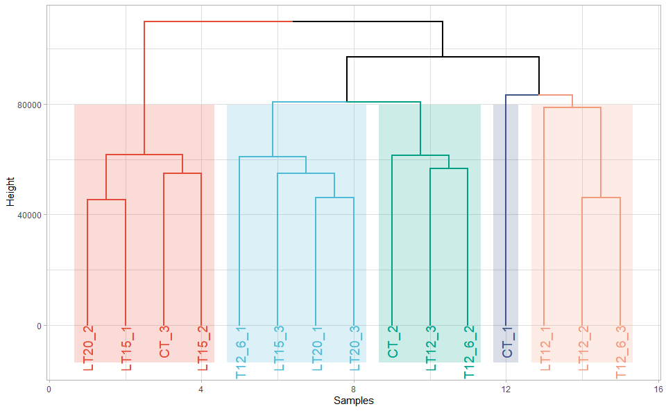
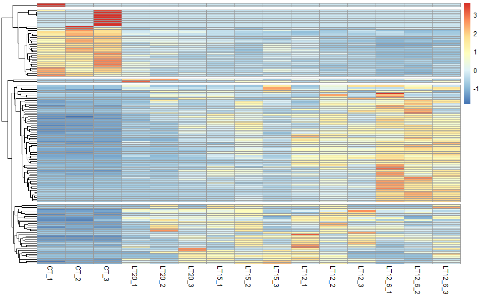
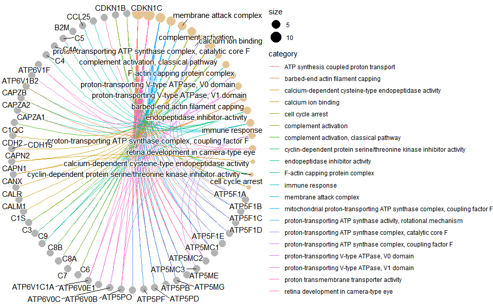

<!-- README.md is generated from README.Rmd. Please edit that file -->

# TOmicsVis

## 1. Introduction

#### 1.1 Meta Information

**TOmicsVis**: TranscriptOmics Visualization.

**Website**: <https://benben-miao.github.io/TOmicsVis/>

#### 1.2 Github and CRAN Install

[](https://cran.rstudio.com/web/packages/TOmicsVis/index.html)

**1.2.1 Install required packages from Bioconductor:**

``` r
# Install required packages from Bioconductor
install.packages("BiocManager")
BiocManager::install(c("ComplexHeatmap", "EnhancedVolcano", "clusterProfiler", "enrichplot", "impute", "preprocessCore", "Mfuzz"))
```

**1.2.2 Github**: <https://github.com/benben-miao/TOmicsVis/>

**Install from Github:**

``` r
install.packages("devtools")
devtools::install_github("benben-miao/TOmicsVis")

# Resolve network by GitClone
devtools::install_git("https://gitclone.com/github.com/benben-miao/TOmicsVis.git")
```

**1.2.3 CRAN**: <https://cran.r-project.org/package=TOmicsVis>

**Install from CRAN:**

``` r
# Install from CRAN
install.packages("TOmicsVis")
```

#### 1.3 Articles and Courses

**Videos Courses:** <https://space.bilibili.com/34105515/channel/series>

**Article Introduction:**
[全解TOmicsVis完美应用于转录组可视化R包](https://mp.weixin.qq.com/s/g8sRcK_ExlsOFniMWEJnVQ)

**Article Courses:** [TOmicsVis
转录组学R代码分析及可视化视频](https://mp.weixin.qq.com/s/mVXJmHPAnC9J1-zMj7eG7g)

#### 1.4 About and Authors

**OmicsSuite**: [Omics Suite Github:
https://github.com/omicssuite/](https://github.com/omicssuite/)

**Authors**:

- [benben-miao Github:
  https://github.com/benben-miao/](https://github.com/benben-miao/)

- [dongwei1220 Github:
  https://github.com/dongwei1220/](https://github.com/dongwei1220/)

## 2. Libary packages

``` r
# 1. Library TOmicsVis package
library(TOmicsVis)
#> 载入需要的程辑包：Biobase
#> 载入需要的程辑包：BiocGenerics
#> 
#> 载入程辑包：'BiocGenerics'
#> The following objects are masked from 'package:stats':
#> 
#>     IQR, mad, sd, var, xtabs
#> The following objects are masked from 'package:base':
#> 
#>     anyDuplicated, aperm, append, as.data.frame, basename, cbind,
#>     colnames, dirname, do.call, duplicated, eval, evalq, Filter, Find,
#>     get, grep, grepl, intersect, is.unsorted, lapply, Map, mapply,
#>     match, mget, order, paste, pmax, pmax.int, pmin, pmin.int,
#>     Position, rank, rbind, Reduce, rownames, sapply, setdiff, sort,
#>     table, tapply, union, unique, unsplit, which.max, which.min
#> Welcome to Bioconductor
#> 
#>     Vignettes contain introductory material; view with
#>     'browseVignettes()'. To cite Bioconductor, see
#>     'citation("Biobase")', and for packages 'citation("pkgname")'.
#> 载入需要的程辑包：e1071
#> 
#> Registered S3 method overwritten by 'GGally':
#>   method from   
#>   +.gg   ggplot2
#> 
#> 载入程辑包：'DynDoc'
#> The following object is masked from 'package:BiocGenerics':
#> 
#>     path

# 2. Extra package
# install.packages("ggplot2")
library(ggplot2)
```

## 3. Usage cases

### 3.1 Samples Statistics

#### 3.1.1 quantile_plot

**Input Data:** Dataframe: Weight and Sex traits dataframe (1st-col:
Weight, 2nd-col: Sex).

**Output Plot:** Quantile plot for visualizing data distribution.

``` r
# 1. Load example datasets
data(weight_sex)
head(weight_sex)
#>   Weight    Sex
#> 1  36.74 Female
#> 2  38.54 Female
#> 3  44.91 Female
#> 4  43.53 Female
#> 5  39.03 Female
#> 6  26.01 Female

# 2. Run quantile_plot plot function
quantile_plot(
  data = weight_sex,
  my_shape = "fill_circle",
  point_size = 1.5,
  conf_int = TRUE,
  conf_level = 0.95,
  split_panel = "Split_Panel",
  legend_pos = "right",
  legend_dir = "vertical",
  sci_fill_color = "Sci_NPG",
  sci_color_alpha = 0.75,
  ggTheme = "theme_light"
)
```

<!-- -->

Get help using command `?TOmicsVis::quantile_plot` or reference page
<https://benben-miao.github.io/TOmicsVis/reference/quantile_plot.html>.

``` r
# Get help with command in R console.
# ?TOmicsVis::quantile_plot
```

#### 3.1.2 corr_heatmap

**Input Data:** Dataframe: gene expression dataframe (1st-col:
Transcripts or Genes, 2nd-col~: Samples).

**Output Plot:** Plot: heatmap plot filled with Pearson correlation
values and P values.

``` r
# 1. Load example dataset
data(gene_expression)
head(gene_expression)
#>        Transcripts   CT_1   CT_2   CT_3 LT20_1 LT20_2 LT20_3 LT15_1 LT15_2
#> 1     transcript_0 655.78 631.08 669.89 654.21 402.56 447.09 510.08 442.22
#> 2     transcript_1  92.72 112.26 150.30  88.35  76.35  94.55 120.24  80.89
#> 3    transcript_10  21.74  31.11  22.58  15.09  13.67  13.24  12.48   7.53
#> 4   transcript_100   0.00   0.00   0.00   0.00   0.00   0.00   0.00   0.00
#> 5  transcript_1000   0.00  14.15  36.01   0.00   0.00 193.59 208.45   0.00
#> 6 transcript_10000  89.18 158.04  86.28  82.97 117.78 102.24 129.61 112.73
#>   LT15_3 LT12_1 LT12_2 LT12_3 LT12_6_1 LT12_6_2 LT12_6_3
#> 1 399.82 483.30 437.89 444.06   405.43   416.63   464.75
#> 2  73.94  96.25  82.62  85.48    65.12    61.94    73.44
#> 3  13.35  11.16  11.36   6.96     7.82     4.01    10.02
#> 4   0.00   0.00   0.00   0.00     0.00     0.00     0.00
#> 5 232.40 148.58   0.00 181.61     0.02    12.18     0.00
#> 6  85.70  80.89 124.11 115.25   113.87   107.69   119.83

# 2. Run corr_heatmap plot function
corr_heatmap(
  data = gene_expression,
  corr_method = "pearson",
  cell_shape = "square",
  fill_type = "full",
  lable_size = 3,
  axis_angle = 45,
  axis_size = 12,
  lable_digits = 3,
  color_low = "blue",
  color_mid = "white",
  color_high = "red",
  outline_color = "white",
  ggTheme = "theme_light"
)
#> Scale for fill is already present.
#> Adding another scale for fill, which will replace the existing scale.
```

<!-- -->

Get help using command `?TOmicsVis::corr_heatmap` or reference page
<https://benben-miao.github.io/TOmicsVis/reference/corr_heatmap.html>.

``` r
# Get help with command in R console.
# ?TOmicsVis::corr_heatmap
```

#### 3.1.3 pca_plot

**Input Data1:** Dataframe: gene expression dataframe (1st-col:
Transcripts or Genes, 2nd-col~: Samples).

**Input Data2:** Dataframe: Samples and groups for gene expression
(1st-col: Samples, 2nd-col: Groups).

**Output Plot:** Plot: PCA dimensional reduction visualization for
RNA-Seq.

``` r
# 1. Load example datasets
data(gene_expression)

data(samples_groups)
head(samples_groups)
#>   Samples Groups
#> 1    CT_1     CT
#> 2    CT_2     CT
#> 3    CT_3     CT
#> 4  LT20_1   LT20
#> 5  LT20_2   LT20
#> 6  LT20_3   LT20

# 2. Run pca_plot plot function
pca_plot(
  sample_gene = gene_expression,
  group_sample = samples_groups,
  xPC = 1,
  yPC = 2,
  point_size = 5,
  text_size = 5,
  fill_alpha = 0.10,
  border_alpha = 0.00,
  legend_pos = "right",
  legend_dir = "vertical",
  ggTheme = "theme_light"
)
```

<!-- -->

Get help using command `?TOmicsVis::pca_plot` or reference page
<https://benben-miao.github.io/TOmicsVis/reference/pca_plot.html>.

``` r
# Get help with command in R console.
# ?TOmicsVis::pca_plot
```

#### 3.1.4 dendro_plot

**Input Data:** Dataframe: gene expression dataframe (1st-col:
Transcripts or Genes, 2nd-col~: Samples).

**Output Plot:** Plot: dendrogram for multiple samples clustering.

``` r
# 1. Load example datasets
data(gene_expression)

# 2. Run plot function
dendro_plot(
  data = gene_expression,
  dist_method = "euclidean",
  hc_method = "ward.D2",
  tree_type = "rectangle",
  k_num = 5,
  palette = "npg",
  color_labels_by_k = TRUE,
  horiz = FALSE,
  label_size = 1,
  line_width = 1,
  rect = TRUE,
  rect_fill = TRUE,
  xlab = "Samples",
  ylab = "Height",
  ggTheme = "theme_light"
)
#> Registered S3 method overwritten by 'dendextend':
#>   method     from 
#>   rev.hclust vegan
```

<!-- -->

Get help using command `?TOmicsVis::dendro_plot` or reference page
<https://benben-miao.github.io/TOmicsVis/reference/dendro_plot.html>.

``` r
# Get help with command in R console.
# ?TOmicsVis::dendro_plot
```

### 3.2 Traits Analysis

#### 3.2.1 box_plot

**Input Data:** Dataframe: Length, Width, Weight, and Sex traits
dataframe (1st-col: Value, 2nd-col: Traits, 3rd-col: Sex).

**Output Plot:** Plot: Box plot support two levels and multiple groups
with P value.

``` r
# 1. Load example datasets
data(traits_sex)
head(traits_sex)
#>   Value Traits    Sex
#> 1 36.74 Weight Female
#> 2 38.54 Weight Female
#> 3 44.91 Weight Female
#> 4 43.53 Weight Female
#> 5 39.03 Weight Female
#> 6 26.01 Weight Female

# 2. Run box_plot plot function
box_plot(
  data = traits_sex,
  test_method = "t.test",
  test_label = "p.format",
  notch = TRUE,
  group_level = "Three_Column",
  add_element = "jitter",
  my_shape = "fill_circle",
  sci_fill_color = "Sci_AAAS",
  sci_fill_alpha = 0.5,
  sci_color_alpha = 1,
  legend_pos = "right",
  legend_dir = "vertical",
  ggTheme = "theme_light"
)
```

<!-- -->

Get help using command `?TOmicsVis::box_plot` or reference page
<https://benben-miao.github.io/TOmicsVis/reference/box_plot.html>.

``` r
# Get help with command in R console.
# ?TOmicsVis::box_plot
```

#### 3.2.2 violin_plot

**Input Data:** Dataframe: Length, Width, Weight, and Sex traits
dataframe (1st-col: Value, 2nd-col: Traits, 3rd-col: Sex).

**Output Plot:** Plot: Violin plot support two levels and multiple
groups with P value.

``` r
# 1. Load example datasets
data(traits_sex)

# 2. Run violin_plot plot function
violin_plot(
  data = traits_sex,
  test_method = "t.test",
  test_label = "p.format",
  group_level = "Three_Column",
  violin_orientation = "vertical",
  add_element = "boxplot",
  element_alpha = 0.5,
  my_shape = "plus_times",
  sci_fill_color = "Sci_AAAS",
  sci_fill_alpha = 0.5,
  sci_color_alpha = 1,
  legend_pos = "right",
  legend_dir = "vertical",
  ggTheme = "theme_light"
)
```

<!-- -->

Get help using command `?TOmicsVis::violin_plot` or reference page
<https://benben-miao.github.io/TOmicsVis/reference/violin_plot.html>.

``` r
# Get help with command in R console.
# ?TOmicsVis::violin_plot
```

#### 3.2.3 survival_plot

**Input Data:** Dataframe: survival record data (1st-col: Time, 2nd-col:
Status, 3rd-col: Group).

**Output Plot:** Survival plot for analyzing and visualizing survival
data.

``` r
# 1. Load example datasets
data(survival_data)
head(survival_data)
#>   Time Status Group
#> 1   48      0    CT
#> 2   48      0    CT
#> 3   48      0    CT
#> 4   48      0    CT
#> 5   48      0    CT
#> 6   48      0    CT

# 2. Run survival_plot plot function
survival_plot(
  data = survival_data,
  curve_function = "pct",
  conf_inter = TRUE,
  interval_style = "ribbon",
  risk_table = TRUE,
  num_censor = TRUE,
  sci_palette = "aaas",
  ggTheme = "theme_light",
  x_start = 0,
  y_start = 0,
  y_end = 100,
  x_break = 10,
  y_break = 10
)
```

<!-- -->

Get help using command `?TOmicsVis::survival_plot` or reference page
<https://benben-miao.github.io/TOmicsVis/reference/survival_plot.html>.

``` r
# Get help with command in R console.
# ?TOmicsVis::survival_plot
```

#### 3.2.4 tsne_plot

**Input Data1:** Dataframe: gene expression dataframe (1st-col:
Transcripts or Genes, 2nd-col~: Samples).

**Input Data2:** Dataframe: Samples and groups for gene expression
(1st-col: Samples, 2nd-col: Groups).

**Output Plot:** TSNE plot for analyzing and visualizing TSNE algorithm.

``` r
# 1. Load example datasets
data(gene_expression)
data(samples_groups)

# 2. Run tsne_plot plot function
tsne_plot(
  sample_gene = gene_expression,
  group_sample = samples_groups,
  seed = 1,
  multi_shape = FALSE,
  point_size = 5,
  point_alpha = 0.8,
  text_size = 5,
  text_alpha = 0.8,
  fill_alpha = 0.05,
  border_alpha = 0,
  sci_fill_color = "Sci_AAAS",
  legend_pos = "right",
  legend_dir = "vertical",
  ggTheme = "theme_light"
)
```

<!-- -->

Get help using command `?TOmicsVis::tsne_plot` or reference page
<https://benben-miao.github.io/TOmicsVis/reference/tsne_plot.html>.

``` r
# Get help with command in R console.
# ?TOmicsVis::tsne_plot
```

### 3.3 Differential Expression Analyais

#### 3.3.1 venn_plot

**Input Data2:** Dataframe: Paired comparisons differentially expressed
genes (degs) among groups (1st-col~: degs of paired comparisons).

**Output Plot:** Venn plot for stat common and unique gene among
multiple sets.

``` r
# 1. Load example datasets
data(paired_degs)
head(paired_degs)
#>        CT.vs.LT20      CT.vs.LT15       CT.vs.LT12     CT.vs.LT12_6
#> 1 transcript_9024 transcript_4738  transcript_9956 transcript_10354
#> 2  transcript_604 transcript_6050  transcript_7601  transcript_2959
#> 3 transcript_3912 transcript_1039  transcript_5960  transcript_5919
#> 4 transcript_8676 transcript_1344  transcript_3240  transcript_2395
#> 5 transcript_8832 transcript_3069 transcript_10224  transcript_9881
#> 6   transcript_74 transcript_9809  transcript_3151  transcript_8836

# 2. Run venn_plot plot function
venn_plot(
  data = paired_degs,
    title_size = 1,
    label_show = TRUE,
    label_size = 0.8,
    border_show = TRUE,
    line_type = "longdash",
    ellipse_shape = "circle",
    sci_fill_color = "Sci_AAAS",
    sci_fill_alpha = 0.65
)
```

<!-- -->

Get help using command `?TOmicsVis::venn_plot` or reference page
<https://benben-miao.github.io/TOmicsVis/reference/venn_plot.html>.

``` r
# Get help with command in R console.
# ?TOmicsVis::venn_plot
```

#### 3.3.2 flower_plot

**Input Data2:** Dataframe: Paired comparisons differentially expressed
genes (degs) among groups (1st-col~: degs of paired comparisons).

**Output Plot:** Flower plot for stat common and unique gene among
multiple sets.

``` r
# 1. Load example datasets
data(paired_degs)

# 2. Run plot function
flower_plot(
  flower_dat = paired_degs,
  angle = 90,
  a = 1,
  b = 2,
  r = 1,
  ellipse_col_pal = "Spectral",
  circle_col = "white",
  label_text_cex = 1
)
```

<!-- -->

Get help using command `?TOmicsVis::flower_plot` or reference page
<https://benben-miao.github.io/TOmicsVis/reference/flower_plot.html>.

``` r
# Get help with command in R console.
# ?TOmicsVis::flower_plot
```

#### 3.3.3 circos_heatmap

Circos heatmap plot for visualizing gene expressing in multiple samples.

``` r
# 1. Load circos_heatmap_data example datasets
data(circos_heatmap_data)

# 2. Run circos_heatmap plot function
circos_heatmap(
  data = circos_heatmap_data,
  low_color = "#0000ff",
  mid_color = "#ffffff",
  high_color = "#ff0000",
  gap_size = 10,
  cluster_run = TRUE,
  cluster_method = "complete",
  distance_method = "euclidean",
  dend_show = "inside",
  dend_height = 0.2,
  rowname_show = "outside",
  rowname_size = 0.8
)
```

<!-- -->

Get help using command `?TOmicsVis::circos_heatmap` or reference page
<https://benben-miao.github.io/TOmicsVis/reference/circos_heatmap.html>.

``` r
# Get help with command in R console.
# ?TOmicsVis::circos_heatmap
```

#### 3.3.4 volcano_plot

Volcano plot for visualizing differentailly expressed genes.

``` r
# 1. Load deg_data example datasets
data(deg_data)

# 2. Run volcano_plot plot function
volcano_plot(
  deg_data,
  log2fc_cutoff = 1,
  pq_value = "pvalue",
  pq_cutoff = 0.005,
  cutoff_line = "longdash",
  point_shape = "large_circle",
  point_size = 1,
  point_alpha = 0.5,
  color_normal = "#888888",
  color_log2fc = "#008000",
  color_pvalue = "#0088ee",
  color_Log2fc_p = "#ff0000",
  label_size = 3,
  boxed_labels = FALSE,
  draw_connectors = FALSE,
  legend_pos = "right"
)
```

<!-- -->

Get help using command `?TOmicsVis::volcano_plot` or reference page
<https://benben-miao.github.io/TOmicsVis/reference/volcano_plot.html>.

``` r
# Get help with command in R console.
# ?TOmicsVis::volcano_plot
```

#### 3.3.5 ma_plot

MversusA plot for visualizing differentially expressed genes.

``` r
# 1. Load deg_data example datasets
data(deg_data2)

# 2. Run volcano_plot plot function
ma_plot(
  deg_data2,
  foldchange = 2,
  fdr_value = 0.05,
  point_size = 0.5,
  color_up = "#FF0000",
  color_down = "#008800",
  color_alpha = 0.5,
  top_method = "fc",
  top_num = 20,
  label_size = 8,
  label_box = TRUE,
  title = "Group1 -versus- Group2",
  xlab = "Log2 mean expression",
  ylab = "Log2 fold change",
  ggTheme = "theme_minimal"
)
```

<!-- -->

Get help using command `?TOmicsVis::ma_plot` or reference page
<https://benben-miao.github.io/TOmicsVis/reference/ma_plot.html>.

``` r
# Get help with command in R console.
# ?TOmicsVis::ma_plot
```

#### 3.3.6 heatmap_group

Heatmap group for visualizing grouped gene expression data.

``` r
# 1. Load example datasets
data(heatmap_group_data)
head(heatmap_group_data)
#>                 V2          V3          V4          V5          V6          V7
#> Groups     Control     Control     Control       Treat       Treat       Treat
#> GeneID    Control1    Control2    Control3      Treat1      Treat2      Treat3
#> Gene1   6.59934411 5.226266025 3.693287538 9.308119032 8.987864851        <NA>
#> Gene2  5.760380377 4.892783021 5.448923917  8.66208104 8.793319848 8.765914637
#> Gene3  9.561905115 4.549168157 3.998654922 9.790770004 7.133187551  7.37959102
#> Gene4  8.396409316  8.71705522  8.03906411 4.417013007 4.725269731 3.542216879

# 2. Run heatmap_group plot function
heatmap_group(
  data = heatmap_group_data,
  scale_data = "none",
  clust_method = "complete",
  border_show = TRUE,
  value_show = TRUE,
  low_color = "#00880088",
  mid_color = "#ffffff",
  high_color = "#ff000088",
  na_color = "#ff8800",
  x_angle = 45
)
```

<!-- -->

Get help using command `?TOmicsVis::heatmap_group` or reference page
<https://benben-miao.github.io/TOmicsVis/reference/heatmap_group.html>.

``` r
# Get help with command in R console.
# ?TOmicsVis::heatmap_group
```

### 3.4 Advanced Analysis

#### 3.4.1 trend_plot

Trend plot for visualizing gene expression trend profile in multiple
traits.

``` r
# 1. Load chord_data example datasets
data(trend_data)

# 2. Run trend_plot plot function
trend_plot(
  trend_data,
  scale_method = "globalminmax",
  miss_value = "exclude",
  line_alpha = 0.5,
  show_points = TRUE,
  show_boxplot = TRUE,
  num_column = 2,
  xlab = "Traits",
  ylab = "Genes Expression",
  sci_fill_color = "Sci_AAAS",
  sci_fill_alpha = 0.8,
  sci_color_alpha = 0.8,
  legend_pos = "right",
  legend_dir = "vertical",
  ggTheme = "theme_light"
)
```

<!-- -->

Get help using command `?TOmicsVis::trend_plot` or reference page
<https://benben-miao.github.io/TOmicsVis/reference/trend_plot.html>.

``` r
# Get help with command in R console.
# ?TOmicsVis::trend_plot
```

#### 3.4.2 gene_cluster_trend

Gene cluster trend plot for visualizing gene expression trend profile in
multiple samples.

``` r
# 1. Load example datasets
data(gene_cluster_data)

# 2. Run plot function
gene_cluster_trend(
  gene_cluster_data,
  thres = 0.25,
  min_std = 0.2,
  palette = "PiYG",
  cluster_num = 4
)
#> 0 genes excluded.
#> 12 genes excluded.
```

<!-- -->

    #> NULL

Get help using command `?TOmicsVis::gene_cluster_trend` or reference
page
<https://benben-miao.github.io/TOmicsVis/reference/gene_cluster_trend.html>.

``` r
# Get help with command in R console.
# ?TOmicsVis::gene_cluster_trend
```

#### 3.4.3 gene_rank_plot

Gene cluster trend plot for visualizing gene expression trend profile in
multiple samples.

``` r
# 1. Load example datasets
data(deg_data)

# 2. Run plot function
gene_rank_plot(
  data = deg_data,
  log2fc = 1,
  palette = "Spectral",
  top_n = 10,
  genes_to_label = NULL,
  label_size = 5,
  base_size = 12,
  title = "Gene ranking dotplot",
  xlab = "Ranking of differentially expressed genes",
  ylab = "Log2FoldChange"
)
```

<!-- -->

Get help using command `?TOmicsVis::gene_rank_plot` or reference page
<https://benben-miao.github.io/TOmicsVis/reference/gene_rank_plot.html>.

``` r
# Get help with command in R console.
# ?TOmicsVis::gene_rank_plot
```

#### 3.4.4 wgcna_pipeline

WGCNA analysis pipeline for RNA-Seq.

``` r
# 1. Load wgcna_pipeline example datasets
data(wgcna_gene_exp)
data(wgcna_sample_group)

# 2. Run wgcna_pipeline plot function
# wgcna_pipeline(wgcna_gene_exp, wgcna_sample_group)
```

Get help using command `?TOmicsVis::wgcna_pipeline` or reference page
<https://benben-miao.github.io/TOmicsVis/reference/wgcna_pipeline.html>.

``` r
# Get help with command in R console.
# ?TOmicsVis::wgcna_pipeline
```

#### 3.4.5 network_plot

Network plot for analyzing and visualizing relationship of genes.

``` r
# 1. Load example datasets
data(network_data)
head(network_data)
#>   node1           node2
#> 1  ABL2  PC-3p-5622_465
#> 2  ABL2  PC-5p-33384_55
#> 3  ABL2  chi-miR-107-3p
#> 4  ABL2  chi-miR-15b-5p
#> 5 CASP2 PC-3p-10204_250
#> 6 CASP2    bta-miR-6123

# 2. Run network_plot plot function
network_plot(
  network_data,
  calcBy = "degree",
  degreeValue = 0.05,
  nodeColorNormal = "#00888888",
  nodeBorderColor = "#FFFFFF",
  nodeColorFrom = "#FF000088",
  nodeColorTo = "#00880088",
  nodeShapeNormal = "circle",
  nodeShapeSpatial = "csquare",
  nodeSize = 10,
  labelSize = 0.5,
  edgeCurved = TRUE,
  netLayout = "layout_on_sphere"
)
```

<!-- -->

Get help using command `?TOmicsVis::network_plot` or reference page
<https://benben-miao.github.io/TOmicsVis/reference/network_plot.html>.

``` r
# Get help with command in R console.
# ?TOmicsVis::network_plot
```

#### 3.4.6 heatmap_cluster

Heatmap cluster plot for visualizing clustered gene expression data.

``` r
# 1. Load example datasets
data(gene_exp2)
head(gene_exp2)
#>          S1_rep1   S1_rep2    S2_rep1    S2_rep2    S3_rep1    S3_rep2
#> Gene1  316.79234  301.5714  391.75201  344.48179  180.03179  167.99952
#> Gene2  204.21777  194.4057   64.07219   56.34101   93.47004   87.22305
#> Gene3 1049.90451  999.4598 3196.23863 2810.56888 4958.83561 4627.41614
#> Gene4 1413.60565 1345.6862 3356.37956 2951.38662 3947.88238 3684.02909
#> Gene5   98.77808   94.0321  401.04150  352.65038  140.01861  130.66059
#> Gene6 1202.25882 1144.4940 1135.11172  998.14502  784.29842  731.88052

# 2. Run network_plot plot function
heatmap_cluster(
  data = gene_exp2,
  dist_method = "euclidean",
  hc_method = "average",
  k_num = 5,
  show_rownames = FALSE,
  palette = "Spectral",
  cluster_pal = "Set1",
  gaps_col = NULL,
  angle_col = 45,
  label_size = 10,
  base_size = 12
)
```

<!-- -->

    #> Using Cluster, gene as id variables

<!-- --><!-- -->

Get help using command `?TOmicsVis::heatmap_cluster` or reference page
<https://benben-miao.github.io/TOmicsVis/reference/heatmap_cluster.html>.

``` r
# Get help with command in R console.
# ?TOmicsVis::heatmap_cluster
```

### 3.5 GO and KEGG Enrichment

#### 3.5.1 chord_plot

Chord plot for visualizing the relationships of pathways and genes.

``` r
# 1. Load chord_data example datasets
data(chord_data)

# 2. Run chord_plot plot function
chord_plot(
  chord_data,
  multi_colors = "RainbowColors",
  color_alpha = 0.5,
  link_visible = TRUE,
  link_dir = -1,
  link_type = "diffHeight",
  sector_scale = "Origin",
  width_circle = 3,
  dist_name = 3,
  label_dir = "Vertical",
  dist_label = 0.3
)
```

<!-- -->

    #>      rn         cn value1 value2 o1 o2 x1  x2       col
    #> 1    S1 Samples.E1      4      4  5 20 61 161 #FF00007F
    #> 2    S2 Samples.E1      7      7  5 19 45 157 #FF3D007F
    #> 3    S3 Samples.E1      9      9  5 18 55 150 #FF7A007F
    #> 4    S4 Samples.E1     14     14  5 17 55 141 #FFB8007F
    #> 5    S5 Samples.E1      1      1  5 16 22 127 #FFF5007F
    #> 6    S6 Samples.E1     10     10  5 15 59 126 #CCFF007F
    #> 7    S7 Samples.E1      3      3  5 14 31 116 #8FFF007F
    #> 8    S8 Samples.E1     15     15  5 13 52 113 #52FF007F
    #> 9    S9 Samples.E1      5      5  5 12 37  98 #14FF007F
    #> 10  S10 Samples.E1      7      7  5 11 27  93 #00FF297F
    #> 11  S11 Samples.E1      6      6  5 10 35  86 #00FF667F
    #> 12  S12 Samples.E1     11     11  5  9 49  80 #00FFA37F
    #> 13  S13 Samples.E1     18     18  5  8 69  69 #00FFE07F
    #> 14  S14 Samples.E1      1      1  5  7 22  51 #00E0FF7F
    #> 15  S15 Samples.E1      5      5  5  6 58  50 #00A3FF7F
    #> 16  S16 Samples.E1     12     12  5  5 48  45 #0066FF7F
    #> 17  S17 Samples.E1      9      9  5  4 23  33 #0029FF7F
    #> 18  S18 Samples.E1      5      5  5  3 50  24 #1400FF7F
    #> 19  S19 Samples.E1      4      4  5  2 40  19 #5200FF7F
    #> 20  S20 Samples.E1     15     15  5  1 58  15 #8F00FF7F
    #> 21   S1         E2     16     16  4 20 57 166 #FF00007F
    #> 22   S2         E2     11     11  4 19 38 150 #FF3D007F
    #> 23   S3         E2      2      2  4 18 46 139 #FF7A007F
    #> 24   S4         E2      9      9  4 17 41 137 #FFB8007F
    #> 25   S5         E2      1      1  4 16 21 128 #FFF5007F
    #> 26   S6         E2     18     18  4 15 49 127 #CCFF007F
    #> 27   S7         E2      8      8  4 14 28 109 #8FFF007F
    #> 28   S8         E2      4      4  4 13 37 101 #52FF007F
    #> 29   S9         E2      4      4  4 12 32  97 #14FF007F
    #> 30  S10         E2      9      9  4 11 20  93 #00FF297F
    #> 31  S11         E2      7      7  4 10 29  84 #00FF667F
    #> 32  S12         E2      2      2  4  9 38  77 #00FFA37F
    #> 33  S13         E2     13     13  4  8 51  75 #00FFE07F
    #> 34  S14         E2      2      2  4  7 21  62 #00E0FF7F
    #> 35  S15         E2     13     13  4  6 53  60 #00A3FF7F
    #> 36  S16         E2      7      7  4  5 36  47 #0066FF7F
    #> 37  S17         E2      2      2  4  4 14  40 #0029FF7F
    #> 38  S18         E2     13     13  4  3 45  38 #1400FF7F
    #> 39  S19         E2     12     12  4  2 36  25 #5200FF7F
    #> 40  S20         E2     13     13  4  1 43  13 #8F00FF7F
    #> 41   S1         E3     12     12  3 20 41 150 #FF00007F
    #> 42   S2         E3      2      2  3 19 27 138 #FF3D007F
    #> 43   S3         E3     17     17  3 18 44 136 #FF7A007F
    #> 44   S4         E3     12     12  3 17 32 119 #FFB8007F
    #> 45   S5         E3      7      7  3 16 20 107 #FFF5007F
    #> 46   S6         E3      9      9  3 15 31 100 #CCFF007F
    #> 47   S7         E3      4      4  3 14 20  91 #8FFF007F
    #> 48   S8         E3      9      9  3 13 33  87 #52FF007F
    #> 49   S9         E3      7      7  3 12 28  78 #14FF007F
    #> 50  S10         E3      1      1  3 11 11  71 #00FF297F
    #> 51  S11         E3      5      5  3 10 22  70 #00FF667F
    #> 52  S12         E3      2      2  3  9 36  65 #00FFA37F
    #> 53  S13         E3      8      8  3  8 38  63 #00FFE07F
    #> 54  S14         E3      2      2  3  7 19  55 #00E0FF7F
    #> 55  S15         E3      6      6  3  6 40  53 #00A3FF7F
    #> 56  S16         E3     15     15  3  5 29  47 #0066FF7F
    #> 57  S17         E3      1      1  3  4 12  32 #0029FF7F
    #> 58  S18         E3     13     13  3  3 32  31 #1400FF7F
    #> 59  S19         E3      4      4  3  2 24  18 #5200FF7F
    #> 60  S20         E3     14     14  3  1 30  14 #8F00FF7F
    #> 61   S1         E4     18     18  2 20 29 227 #FF00007F
    #> 62   S2         E4     15     15  2 19 25 209 #FF3D007F
    #> 63   S3         E4     16     16  2 18 27 194 #FF7A007F
    #> 64   S4         E4      3      3  2 17 20 178 #FFB8007F
    #> 65   S5         E4      1      1  2 16 13 175 #FFF5007F
    #> 66   S6         E4     13     13  2 15 22 174 #CCFF007F
    #> 67   S7         E4     15     15  2 14 16 161 #8FFF007F
    #> 68   S8         E4     13     13  2 13 24 146 #52FF007F
    #> 69   S9         E4      3      3  2 12 21 133 #14FF007F
    #> 70  S10         E4      4      4  2 11 10 130 #00FF297F
    #> 71  S11         E4      8      8  2 10 17 126 #00FF667F
    #> 72  S12         E4     16     16  2  9 34 118 #00FFA37F
    #> 73  S13         E4     14     14  2  8 30 102 #00FFE07F
    #> 74  S14         E4     14     14  2  7 17  88 #00E0FF7F
    #> 75  S15         E4     16     16  2  6 34  74 #00A3FF7F
    #> 76  S16         E4     12     12  2  5 14  58 #0066FF7F
    #> 77  S17         E4     10     10  2  4 11  46 #0029FF7F
    #> 78  S18         E4     11     11  2  3 19  36 #1400FF7F
    #> 79  S19         E4     14     14  2  2 20  25 #5200FF7F
    #> 80  S20         E4     11     11  2  1 16  11 #8F00FF7F
    #> 81   S1         E5     11     11  1 20 11 192 #FF00007F
    #> 82   S2         E5     10     10  1 19 10 181 #FF3D007F
    #> 83   S3         E5     11     11  1 18 11 171 #FF7A007F
    #> 84   S4         E5     17     17  1 17 17 160 #FFB8007F
    #> 85   S5         E5     12     12  1 16 12 143 #FFF5007F
    #> 86   S6         E5      9      9  1 15  9 131 #CCFF007F
    #> 87   S7         E5      1      1  1 14  1 122 #8FFF007F
    #> 88   S8         E5     11     11  1 13 11 121 #52FF007F
    #> 89   S9         E5     18     18  1 12 18 110 #14FF007F
    #> 90  S10         E5      6      6  1 11  6  92 #00FF297F
    #> 91  S11         E5      9      9  1 10  9  86 #00FF667F
    #> 92  S12         E5     18     18  1  9 18  77 #00FFA37F
    #> 93  S13         E5     16     16  1  8 16  59 #00FFE07F
    #> 94  S14         E5      3      3  1  7  3  43 #00E0FF7F
    #> 95  S15         E5     18     18  1  6 18  40 #00A3FF7F
    #> 96  S16         E5      2      2  1  5  2  22 #0066FF7F
    #> 97  S17         E5      1      1  1  4  1  20 #0029FF7F
    #> 98  S18         E5      8      8  1  3  8  19 #1400FF7F
    #> 99  S19         E5      6      6  1  2  6  11 #5200FF7F
    #> 100 S20         E5      5      5  1  1  5   5 #8F00FF7F

Get help using command `?TOmicsVis::chord_plot` or reference page
<https://benben-miao.github.io/TOmicsVis/reference/chord_plot.html>.

``` r
# Get help with command in R console.
# ?TOmicsVis::chord_plot
```

#### 3.5.2 go_enrich

GO enrichment analysis based on GO annotation results (None/Exist
Reference Genome).

``` r
# 1. Load example datasets
data(go_anno)
head(go_anno)
#>       id
#> 1 gene_1
#> 2 gene_2
#> 3 gene_3
#> 4 gene_4
#> 5 gene_5
#> 6 gene_6
#>                                                                                                                                                                               biological_process
#> 1                                                                                                                                             GO:0015986(ATP synthesis coupled proton transport)
#> 2 GO:0071236(cellular response to antibiotic);GO:0071493(cellular response to UV-B);GO:0008630(intrinsic apoptotic signaling pathway in response to DNA damage);GO:0010043(response to zinc ion)
#> 3                                                                                                                                                               GO:0009058(biosynthetic process)
#> 4                                                                                                                                                                 GO:0006096(glycolytic process)
#> 5                                                                                                                                                                                           <NA>
#> 6                                                                                                                                                                        GO:0006412(translation)
#>                                                                           cellular_component
#> 1 "GO:0000276(mitochondrial proton-transporting ATP synthase complex, coupling factor F(o))"
#> 2                                                                      GO:0005737(cytoplasm)
#> 3                                                                                       <NA>
#> 4                                              GO:0000015(phosphopyruvate hydratase complex)
#> 5                                                                                       <NA>
#> 6                                              GO:0022625(cytosolic large ribosomal subunit)
#>                                                                                                                                     molecular_function
#> 1                    GO:0047624(adenosine-tetraphosphatase activity);GO:0015078(proton transmembrane transporter activity);GO:0016887(ATPase activity)
#> 2 "GO:0046872(metal ion binding);GO:0003680(AT DNA binding);GO:0008301(DNA binding, bending);GO:0042277(peptide binding);GO:0008270(zinc ion binding)"
#> 3                                                                                                                       GO:0003824(catalytic activity)
#> 4                                                                     GO:0000287(magnesium ion binding);GO:0004634(phosphopyruvate hydratase activity)
#> 5                                                                                                               GO:0005319(lipid transporter activity)
#> 6                                                                               GO:0003723(RNA binding);GO:0003735(structural constituent of ribosome)

data(go_deg_fc)
head(go_deg_fc)
#>        id log2FC
#> 1 gene_14  -1.20
#> 2 gene_15   1.25
#> 3 gene_16   1.30
#> 4 gene_17   1.35
#> 5 gene_18  -1.50
#> 6 gene_20  -1.55

# 2. Run go_enrich analysis function
res <- go_enrich(
  go_anno,
  go_deg_fc,
  padjust_method = "fdr",
  pvalue_cutoff = 0.5,
  qvalue_cutoff = 0.5
)
head(res)
#>           ID           ontology
#> 1 GO:0000027 biological process
#> 2 GO:0001732 biological process
#> 3 GO:0001944 biological process
#> 4 GO:0003723 molecular function
#> 5 GO:0003735 molecular function
#> 6 GO:0003743 molecular function
#>                                               Description GeneRatio BgRatio
#> 1                        ribosomal large subunit assembly      1/11   1/100
#> 2 formation of cytoplasmic translation initiation complex      1/11   1/100
#> 3                                 vasculature development      1/11   1/100
#> 4                                             RNA binding      1/11  11/100
#> 5                      structural constituent of ribosome      3/11  26/100
#> 6                  translation initiation factor activity      1/11   1/100
#>      pvalue  p.adjust    qvalue                  geneID Count
#> 1 0.1100000 0.1850000 0.1578947                 gene_23     1
#> 2 0.1100000 0.1850000 0.1578947                 gene_21     1
#> 3 0.1100000 0.1850000 0.1578947                 gene_21     1
#> 4 0.7421470 0.7421470 0.6334113                 gene_23     1
#> 5 0.5849832 0.6365993 0.5433280 gene_22/gene_23/gene_24     3
#> 6 0.1100000 0.1850000 0.1578947                 gene_21     1
```

Get help using command `?TOmicsVis::go_enrich` or reference page
<https://benben-miao.github.io/TOmicsVis/reference/go_enrich.html>.

``` r
# Get help with command in R console.
# ?TOmicsVis::go_enrich
```

#### 3.5.3 go_enrich_stat

GO enrichment analysis and stat plot based on GO annotation results
(None/Exist Reference Genome).

``` r
# 1. Load example datasets
data(go_anno)
# head(go_anno)

data(go_deg_fc)
# head(go_deg_fc)

# 2. Run go_enrich_stat analysis function
go_enrich_stat(
  go_anno,
  go_deg_fc,
  padjust_method = "fdr",
  pvalue_cutoff = 0.5,
  qvalue_cutoff = 0.5,
  max_go_item = 15,
  strip_fill = "#CDCDCD",
  xtext_angle = 45,
  sci_fill_color = "Sci_AAAS",
  sci_fill_alpha = 0.8,
  ggTheme = "theme_light"
)
```

<!-- -->

Get help using command `?TOmicsVis::go_enrich_stat` or reference page
<https://benben-miao.github.io/TOmicsVis/reference/go_enrich_stat.html>.

``` r
# Get help with command in R console.
# ?TOmicsVis::go_enrich_stat
```

#### 3.5.4 go_enrich_bar

GO enrichment analysis and bar plot based on GO annotation results
(None/Exist Reference Genome).

``` r
# 1. Load example datasets
data(go_anno)
# head(go_anno)

data(go_deg_fc)
# head(go_deg_fc)

# 2. Run go_enrich_bar analysis function
go_enrich_bar(
  go_anno,
  go_deg_fc,
  padjust_method = "fdr",
  pvalue_cutoff = 0.5,
  qvalue_cutoff = 0.5,
  sign_by = "p.adjust",
  category_num = 30,
  font_size = 12,
  low_color = "#ff0000aa",
  high_color = "#008800aa",
  ggTheme = "theme_light"
)
#> Scale for fill is already present.
#> Adding another scale for fill, which will replace the existing scale.
```

<!-- -->

Get help using command `?TOmicsVis::go_enrich_bar` or reference page
<https://benben-miao.github.io/TOmicsVis/reference/go_enrich_bar.html>.

``` r
# Get help with command in R console.
# ?TOmicsVis::go_enrich_bar
```

#### 3.5.5 go_enrich_dot

GO enrichment analysis and dot plot based on GO annotation results
(None/Exist Reference Genome).

``` r
# 1. Load example datasets
data(go_anno)
# head(go_anno)

data(go_deg_fc)
# head(go_deg_fc)

# 2. Run go_enrich_dot analysis function
go_enrich_dot(
  go_anno,
  go_deg_fc,
  padjust_method = "fdr",
  pvalue_cutoff = 0.5,
  qvalue_cutoff = 0.5,
  sign_by = "p.adjust",
  category_num = 30,
  font_size = 12,
  low_color = "#ff0000aa",
  high_color = "#008800aa",
  ggTheme = "theme_light"
)
#> Scale for colour is already present.
#> Adding another scale for colour, which will replace the existing scale.
```

<!-- -->

Get help using command `?TOmicsVis::go_enrich_dot` or reference page
<https://benben-miao.github.io/TOmicsVis/reference/go_enrich_dot.html>.

``` r
# Get help with command in R console.
# ?TOmicsVis::go_enrich_dot
```

#### 3.5.6 go_enrich_tree

GO enrichment analysis and tree plot based on GO annotation results
(None/Exist Reference Genome).

``` r
# 1. Load example datasets
data(go_anno)
# head(go_anno)

data(go_deg_fc)
# head(go_deg_fc)

# 2. Run go_enrich_tree analysis function
go_enrich_tree(
  go_anno,
  go_deg_fc,
  padjust_method = "fdr",
  pvalue_cutoff = 0.5,
  qvalue_cutoff = 0.5,
  sign_by = "p.adjust",
  category_num = 20,
  font_size = 4,
  low_color = "#ff0000aa",
  high_color = "#008800aa",
  hclust_method = "complete",
  ggTheme = "theme_light"
)
```

Get help using command `?TOmicsVis::go_enrich_tree`.

``` r
# Get help with command in R console.
# ?TOmicsVis::go_enrich_tree
```

#### 3.5.7 go_enrich_net

GO enrichment analysis and net plot based on GO annotation results
(None/Exist Reference Genome).

``` r
# 1. Load example datasets
data(go_anno)
# head(go_anno)

data(go_deg_fc)
# head(go_deg_fc)

# 2. Run go_enrich_net analysis function
go_enrich_net(
  go_anno,
  go_deg_fc,
  padjust_method = "fdr",
  pvalue_cutoff = 0.5,
  qvalue_cutoff = 0.5,
  category_num = 20,
  net_layout = "circle",
  net_circular = TRUE,
  low_color = "#ff0000aa",
  high_color = "#008800aa"
)
#> Scale for size is already present.
#> Adding another scale for size, which will replace the existing scale.
#> Scale for colour is already present.
#> Adding another scale for colour, which will replace the existing scale.
```

<!-- -->

Get help using command `?TOmicsVis::go_enrich_net` or reference page
<https://benben-miao.github.io/TOmicsVis/reference/go_enrich_net.html>.

``` r
# Get help with command in R console.
# ?TOmicsVis::go_enrich_net
```

#### 3.5.8 kegg_enrich

KEGG enrichment analysis based on KEGG annotation results (None/Exist
Reference Genome).

``` r
# 1. Load example datasets
data(kegg_anno)
head(kegg_anno)
#>       id
#> 1 gene_1
#> 2 gene_2
#> 3 gene_3
#> 4 gene_4
#> 5 gene_5
#> 6 gene_6
#>                                                                                                                              kegg_pathway
#> 1 ko04810(Regulation of actin cytoskeleton);ko04510(Focal adhesion);ko04151(PI3K-Akt signaling pathway);ko04512(ECM-receptor interaction)
#> 2                                                                                               ko04977(Vitamin digestion and absorption)
#> 3 ko04810(Regulation of actin cytoskeleton);ko04510(Focal adhesion);ko04151(PI3K-Akt signaling pathway);ko04512(ECM-receptor interaction)
#> 4                                                                                               ko04977(Vitamin digestion and absorption)
#> 5                                                                                            ko04610(Complement and coagulation cascades)
#> 6                                                                                                                       ko04142(Lysosome)

data(kegg_deg_fc)
head(kegg_deg_fc)
#>        id log2FC
#> 1  gene_1   1.20
#> 2  gene_2  -1.25
#> 3  gene_3   1.30
#> 4  gene_4  -1.35
#> 5  gene_5   1.40
#> 6 gene_30   1.45

# 2. Run go_enrich analysis function
res <- kegg_enrich(
  kegg_anno,
  kegg_deg_fc,
  padjust_method = "fdr",
  pvalue_cutoff = 1,
  qvalue_cutoff = 1
)
head(res)
#>                ID                              Description GeneRatio BgRatio
#> ko04977   ko04977         Vitamin digestion and absorption      5/15   12/93
#> ko04510   ko04510                           Focal adhesion      2/15    2/93
#> ko04512   ko04512                 ECM-receptor interaction      2/15    2/93
#> "ko00260 "ko00260 Glycine, serine and threonine metabolism      4/15   11/93
#> ko00460   ko00460               Cyanoamino acid metabolism      4/15   11/93
#> ko00670   ko00670                One carbon pool by folate      4/15   11/93
#>              pvalue  p.adjust    qvalue                                geneID
#> ko04977  0.02247971 0.1227209 0.1033439 gene_2/gene_4/gene_33/gene_34/gene_19
#> ko04510  0.02454418 0.1227209 0.1033439                         gene_1/gene_3
#> ko04512  0.02454418 0.1227209 0.1033439                         gene_1/gene_3
#> "ko00260 0.07369837 0.1842459 0.1551545       gene_30/gene_15/gene_17/gene_18
#> ko00460  0.07369837 0.1842459 0.1551545       gene_30/gene_15/gene_17/gene_18
#> ko00670  0.07369837 0.1842459 0.1551545       gene_30/gene_15/gene_17/gene_18
#>          Count
#> ko04977      5
#> ko04510      2
#> ko04512      2
#> "ko00260     4
#> ko00460      4
#> ko00670      4
```

Get help using command `?TOmicsVis::kegg_enrich` or reference page
<https://benben-miao.github.io/TOmicsVis/reference/kegg_enrich.html>.

``` r
# Get help with command in R console.
# ?TOmicsVis::kegg_enrich
```

#### 3.5.9 kegg_enrich_bar

KEGG enrichment analysis and bar plot based on KEGG annotation results
(None/Exist Reference Genome).

``` r
# 1. Load example datasets
data(kegg_anno)
# head(kegg_anno)

data(kegg_deg_fc)
# head(kegg_deg_fc)

# 2. Run kegg_enrich_bar analysis function
kegg_enrich_bar(
  kegg_anno,
  kegg_deg_fc,
  padjust_method = "fdr",
  pvalue_cutoff = 1,
  qvalue_cutoff = 1,
  sign_by = "p.adjust",
  category_num = 30,
  font_size = 12,
  low_color = "#ff0000aa",
  high_color = "#008800aa",
  ggTheme = "theme_light"
)
#> Scale for fill is already present.
#> Adding another scale for fill, which will replace the existing scale.
```

<!-- -->

Get help using command `?TOmicsVis::kegg_enrich_bar` or reference page
<https://benben-miao.github.io/TOmicsVis/reference/kegg_enrich_bar.html>.

``` r
# Get help with command in R console.
# ?TOmicsVis::kegg_enrich_bar
```

#### 3.5.10 kegg_enrich_dot

KEGG enrichment analysis and dot plot based on KEGG annotation results
(None/Exist Reference Genome).

``` r
# 1. Load example datasets
data(kegg_anno)
# head(kegg_anno)

data(kegg_deg_fc)
# head(kegg_deg_fc)

# 2. Run kegg_enrich_dot analysis function
kegg_enrich_dot(
  kegg_anno,
  kegg_deg_fc,
  padjust_method = "fdr",
  pvalue_cutoff = 1,
  qvalue_cutoff = 1,
  sign_by = "p.adjust",
  category_num = 30,
  font_size = 12,
  low_color = "#ff0000aa",
  high_color = "#008800aa",
  ggTheme = "theme_light"
)
#> Scale for colour is already present.
#> Adding another scale for colour, which will replace the existing scale.
```

<!-- -->

Get help using command `?TOmicsVis::kegg_enrich_dot` or reference page
<https://benben-miao.github.io/TOmicsVis/reference/kegg_enrich_dot.html>.

``` r
# Get help with command in R console.
# ?TOmicsVis::kegg_enrich_dot
```

#### 3.5.11 kegg_enrich_tree

KEGG enrichment analysis and tree plot based on KEGG annotation results
(None/Exist Reference Genome).

``` r
# 1. Load example datasets
data(kegg_anno)
# head(kegg_anno)

data(kegg_deg_fc)
# head(kegg_deg_fc)

# 2. Run kegg_enrich_tree analysis function
kegg_enrich_tree(
  kegg_anno,
  kegg_deg_fc,
  padjust_method = "fdr",
  pvalue_cutoff = 1,
  qvalue_cutoff = 1,
  sign_by = "p.adjust",
  category_num = 20,
  font_size = 4,
  low_color = "#ff0000aa",
  high_color = "#008800aa",
  hclust_method = "complete",
  ggTheme = "theme_light"
)
```

Get help using command `?TOmicsVis::kegg_enrich_tree`.

``` r
# Get help with command in R console.
# ?TOmicsVis::kegg_enrich_tree
```

#### 3.5.12 kegg_enrich_net

KEGG enrichment analysis and net plot based on KEGG annotation results
(None/Exist Reference Genome).

``` r
# 1. Load example datasets
data(kegg_anno)
# head(kegg_anno)

data(kegg_deg_fc)
# head(kegg_deg_fc)

# 2. Run kegg_enrich_net analysis function
kegg_enrich_net(
  kegg_anno,
  kegg_deg_fc,
  padjust_method = "fdr",
  pvalue_cutoff = 1,
  qvalue_cutoff = 1,
  category_num = 20,
  net_layout = "circle",
  net_circular = TRUE,
  low_color = "#ff0000aa",
  high_color = "#008800aa"
)
#> Scale for size is already present.
#> Adding another scale for size, which will replace the existing scale.
#> Scale for colour is already present.
#> Adding another scale for colour, which will replace the existing scale.
```

<!-- -->

Get help using command `?TOmicsVis::kegg_enrich_net` or reference page
<https://benben-miao.github.io/TOmicsVis/reference/kegg_enrich_net.html>.

``` r
# Get help with command in R console.
# ?TOmicsVis::kegg_enrich_net
```

### 3.6 Tables Operations

#### 3.6.1 table_split

Table split used for splitting a grouped column to multiple columns.

``` r
# 1. Load table_split_data example datasets
data(table_split_data)
head(table_split_data)
#>   month day variable value
#> 1     5   1    ozone    41
#> 2     5   2    ozone    36
#> 3     5   3    ozone    12
#> 4     5   4    ozone    18
#> 5     5   5    ozone    NA
#> 6     5   6    ozone    28

# 2. Run table_split plot function
res <- table_split(table_split_data, 
                  grouped_var = "variable", 
                  miss_drop = TRUE
                  )
head(res)
#>   month day ozone solar.r temp wind
#> 1     5   1    41     190   67  7.4
#> 2     5   2    36     118   72  8.0
#> 3     5   3    12     149   74 12.6
#> 4     5   4    18     313   62 11.5
#> 5     5   5    NA      NA   56 14.3
#> 6     5   6    28      NA   66 14.9
```

Get help using command `?TOmicsVis::table_split` or reference page
<https://benben-miao.github.io/TOmicsVis/reference/table_split.html>.

``` r
# Get help with command in R console.
# ?TOmicsVis::table_split
```

#### 3.6.2 table_merge

Table merge used to merge multiple variables to on variable.

``` r
# 1. Load example datasets
data(table_merge_data)
head(table_merge_data)
#>   Ozone Solar.R Wind Temp Month Day
#> 1    41     190  7.4   67     5   1
#> 2    36     118  8.0   72     5   2
#> 3    12     149 12.6   74     5   3
#> 4    18     313 11.5   62     5   4
#> 5    NA      NA 14.3   56     5   5
#> 6    28      NA 14.9   66     5   6

# 2. Run function
res <- table_merge(
  table_merge_data,
  merge_vars = c("Ozone", "Solar.R", "Wind", "Temp"),
  new_var = "Variable",
  new_value = "Value",
  na_remove = FALSE
)
head(res)
#>   Month Day Variable Value
#> 1     5   1    Ozone    41
#> 2     5   2    Ozone    36
#> 3     5   3    Ozone    12
#> 4     5   4    Ozone    18
#> 5     5   5    Ozone    NA
#> 6     5   6    Ozone    28
```

Get help using command `?TOmicsVis::table_merge` or reference page
<https://benben-miao.github.io/TOmicsVis/reference/table_merge.html>.

``` r
# Get help with command in R console.
# ?TOmicsVis::table_merge
```

#### 3.6.3 table_filter

Table filter used to filter row by column condition.

``` r
# 1. Load example datasets
data(table_filter_data)
head(table_filter_data)
#> # A tibble: 6 × 14
#>   name      height  mass hair_color skin_color eye_color birth_year sex   gender
#>   <chr>      <int> <dbl> <chr>      <chr>      <chr>          <dbl> <chr> <chr> 
#> 1 Luke Sky…    172    77 blond      fair       blue            19   male  mascu…
#> 2 C-3PO        167    75 <NA>       gold       yellow         112   none  mascu…
#> 3 R2-D2         96    32 <NA>       white, bl… red             33   none  mascu…
#> 4 Darth Va…    202   136 none       white      yellow          41.9 male  mascu…
#> 5 Leia Org…    150    49 brown      light      brown           19   fema… femin…
#> 6 Owen Lars    178   120 brown, gr… light      blue            52   male  mascu…
#> # ℹ 5 more variables: homeworld <chr>, species <chr>, films <list>,
#> #   vehicles <list>, starships <list>

# 2. Run function
res <- table_filter(table_filter_data, 
                    height > 100 & eye_color == "black"
                    )
head(res)
#> # A tibble: 6 × 14
#>   name      height  mass hair_color skin_color eye_color birth_year sex   gender
#>   <chr>      <int> <dbl> <chr>      <chr>      <chr>          <dbl> <chr> <chr> 
#> 1 Greedo       173    74 <NA>       green      black             44 male  mascu…
#> 2 Nien Nunb    160    68 none       grey       black             NA male  mascu…
#> 3 Gasgano      122    NA none       white, bl… black             NA male  mascu…
#> 4 Kit Fisto    196    87 none       green      black             NA male  mascu…
#> 5 Plo Koon     188    80 none       orange     black             22 male  mascu…
#> 6 Lama Su      229    88 none       grey       black             NA male  mascu…
#> # ℹ 5 more variables: homeworld <chr>, species <chr>, films <list>,
#> #   vehicles <list>, starships <list>
```

Get help using command `?TOmicsVis::table_filter` or reference page
<https://benben-miao.github.io/TOmicsVis/reference/table_filter.html>.

``` r
# Get help with command in R console.
# ?TOmicsVis::table_filter
```

#### 3.6.4 table_cross

Table cross used to cross search and merge results in two tables.

``` r
# 1. Load example datasets
data(table_cross_data1)
head(table_cross_data1)
#>      geneID root_exp leave_exp
#> 1 Unigene01  16.4798    3.3122
#> 2 Unigene02  44.5027   24.1932
#> 3 Unigene03  86.9566   43.0663

data(table_cross_data2)
head(table_cross_data2)
#>      geneID  KO_id                     ko_definition
#> 1 Unigene02 K10592 E3 ubiquitin-protein ligase HUWE1
#> 2 Unigene03 K10592    NADH dehydrogenase I subunit 4
#> 3 Unigene04 K05579         dehydrogenase I subunit 7

# 2. Run function
res <- table_cross(
  table_cross_data1,
  table_cross_data2,
  inter_var = "geneID",
  left_index = TRUE,
  right_index = FALSE
)
head(res)
#>      geneID root_exp leave_exp  KO_id                     ko_definition
#> 1 Unigene01  16.4798    3.3122   <NA>                              <NA>
#> 2 Unigene02  44.5027   24.1932 K10592 E3 ubiquitin-protein ligase HUWE1
#> 3 Unigene03  86.9566   43.0663 K10592    NADH dehydrogenase I subunit 4
```

Get help using command `?TOmicsVis::table_cross` or reference page
<https://benben-miao.github.io/TOmicsVis/reference/table_cross.html>.

``` r
# Get help with command in R console.
# ?TOmicsVis::table_cross
```
