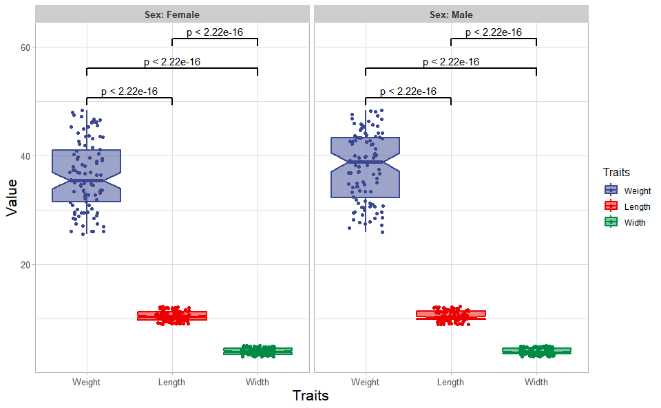
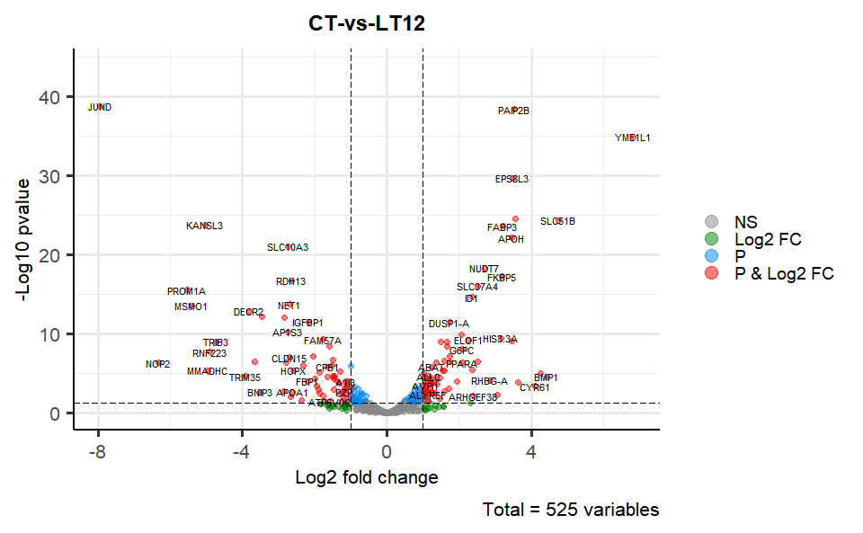
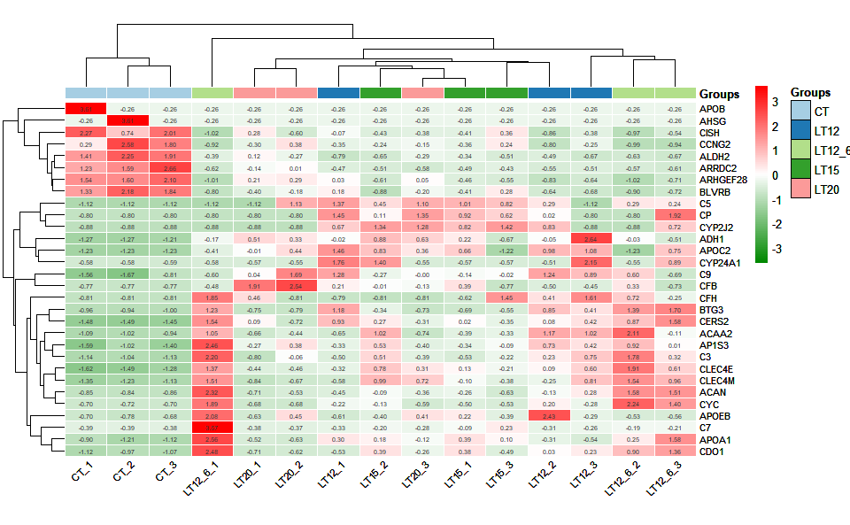
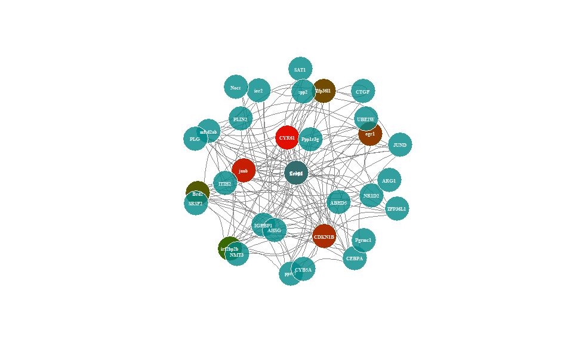

<!-- README.md is generated from README.Rmd. Please edit that file -->

# TOmicsVis

## 1. Introduction

**TOmicsVis**: TranscriptOmics Visualization.

**CRAN**: <https://cran.r-project.org/web/packages/TOmicsVis/index.html>

**Github**: <https://github.com/benben-miao/TOmicsVis/>

**Website**: <https://benben-miao.github.io/TOmicsVis/>

**README**:
<https://cran.r-project.org/web/packages/TOmicsVis/readme/README.html>

**Manual**:
<https://cran.r-project.org/web/packages/TOmicsVis/TOmicsVis.pdf>

**Authors@R**:

- [Benben Miao:
  https://github.com/benben-miao](https://github.com/benben-miao)

- [Wei Dong:
  https://github.com/dongwei1220](https://github.com/dongwei1220)

## 2. Install package

``` r
# 1. TOmicsVis
# install.packages("devtools")
# devtools::install_github("benben-miao/TOmicsVis")
library(TOmicsVis)
#> 
#> Registered S3 method overwritten by 'GGally':
#>   method from   
#>   +.gg   ggplot2

# 2. Extra package
# install.packages("ggplot2")
library(ggplot2)
```

## 3. Usage cases

### 3.1 Samples Statistics

#### 3.1.1 quantile_plot

Quantile plot for visualizing data distribution.

``` r
# 1. Load box_data example datasets
data(quantile_data)

# 2. Run quantile_plot plot function
quantile_plot(
  quantile_data,
  my_shape = "fill_circle",
  point_size = 2.0,
  conf_int = TRUE,
  conf_level = 0.95,
  split_panel = "One_Panel",
  legend_pos = "right",
  legend_dir = "vertical",
  sci_fill_color = "Sci_Simpsons",
  sci_color_alpha = 0.50,
  ggTheme = "theme_light"
)
```

<!-- -->

Get help using command `?TOmicsVis::quantile_plot` or reference page
<https://benben-miao.github.io/TOmicsVis/reference/quantile_plot.html>.

``` r
# Get help with command in R console.
# ?TOmicsVis::quantile_plot
```

#### 3.1.2 corr_heatmap

Correlation Heatmap for samples/groups based on Pearson algorithm.

``` r
# 1. Load gene_exp example dataset
data(gene_exp)
head(gene_exp)
#>              M1       M2       M3       M4       M5       M6        M7       M8
#> RGL4   8.454808 8.019389 8.990836 9.718631 7.908075 4.147051  4.985084 4.576711
#> MPP7   8.690520 8.630346 7.080873 9.838476 8.271824 5.179200  5.200868 3.266993
#> UGCG   8.648366 8.600555 9.431046 7.923021 8.309214 4.902510  5.750804 4.492856
#> CYSTM1 8.628884 9.238677 8.487243 8.958537 7.357109 4.541605  6.370533 4.246651
#> ANXA2  4.983769 6.748022 6.220791 4.719403 3.284346 8.089850 10.637472 7.214912
#> ENDOD1 5.551640 5.406465 4.663785 3.550765 4.103507 8.393991  9.538503 9.069923
#>              M9      M10
#> RGL4   4.930349 4.293700
#> MPP7   5.565226 4.300309
#> UGCG   4.659987 3.306275
#> CYSTM1 4.745769 3.449627
#> ANXA2  9.002710 5.123359
#> ENDOD1 8.639664 7.106392

# 2. Run corr_heatmap plot function
corr_heatmap(
  gene_exp,
  corr_method = "pearson",
  cell_shape = "square",
  fill_type = "full",
  lable_size = 3,
  lable_digits = 3,
  color_low = "#008800ee",
  color_mid = "white",
  color_high = "#ff0000ee",
  ggTheme = "theme_light"
)
#> Scale for fill is already present.
#> Adding another scale for fill, which will replace the existing scale.
```

<!-- -->

Get help using command `?TOmicsVis::corr_heatmap` or reference page
<https://benben-miao.github.io/TOmicsVis/reference/corr_heatmap.html>.

``` r
# Get help with command in R console.
# ?TOmicsVis::corr_heatmap
```

#### 3.1.3 pca_plot

PCA dimensional reduction visualization for RNA-Seq.

``` r
# 1. Load pca_sample_gene and pca_group_sample example datasets
data(pca_sample_gene)
data(pca_group_sample)

# 2. Run pca_plot plot function
pca_plot(
  pca_sample_gene,
  pca_group_sample,
  point_size = 5,
  text_size = 5,
  ellipse_alpha = 0.30,
  legend_pos = "right",
  legend_dir = "vertical",
  ggTheme = "theme_light"
)
```

<!-- -->

Get help using command `?TOmicsVis::pca_plot` or reference page
<https://benben-miao.github.io/TOmicsVis/reference/pca_plot.html>.

``` r
# Get help with command in R console.
# ?TOmicsVis::pca_plot
```

#### 3.1.4 dendro_plot

Dendrograms for multiple samples/groups clustering.

``` r
# 1. Load example datasets
data(gene_exp)

# 2. Run pca_plot plot function
dendro_plot(
  gene_exp,
  dist_method = "euclidean",
  hc_method = "average",
  tree_type = "rectangle",
  k_num = 3,
  palette = "npg",
  color_labels_by_k = TRUE,
  horiz = TRUE,
  label_size = 0.8,
  line_width = 0.7,
  rect = TRUE,
  rect_fill = TRUE,
  title = "Cluster Dendrogram",
  xlab = "",
  ylab = "Height"
)
#> Registered S3 method overwritten by 'dendextend':
#>   method     from 
#>   rev.hclust vegan
#> Warning: The `<scale>` argument of `guides()` cannot be `FALSE`. Use "none" instead as
#> of ggplot2 3.3.4.
#> ℹ The deprecated feature was likely used in the factoextra package.
#>   Please report the issue at <]8;;https://github.com/kassambara/factoextra/issueshttps://github.com/kassambara/factoextra/issues]8;;>.
```

<!-- -->

Get help using command `?TOmicsVis::dendro_plot` or reference page
<https://benben-miao.github.io/TOmicsVis/reference/dendro_plot.html>.

``` r
# Get help with command in R console.
# ?TOmicsVis::dendro_plot
```

### 3.2 Traits Analysis

#### 3.2.1 box_plot

Box plot support two levels and multiple groups with P value.

``` r
# 1. Load box_data example datasets
data(box_data)

# 2. Run box_plot plot function
box_plot(
  box_data,
  test_method = "wilcox.test",
  test_label = "p.format",
  notch = TRUE,
  group_level = "Three_Column",
  add_element = "dotplot",
  my_shape = "fill_circle",
  sci_fill_color = "Sci_AAAS",
  sci_fill_alpha = 0.5,
  sci_color_alpha = 1,
  legend_pos = "right",
  legend_dir = "vertical",
  ggTheme = "theme_light"
)
#> Bin width defaults to 1/30 of the range of the data. Pick better value with
#> `binwidth`.
#> Notch went outside hinges
#> ℹ Do you want `notch = FALSE`?
#> Notch went outside hinges
#> ℹ Do you want `notch = FALSE`?
#> Notch went outside hinges
#> ℹ Do you want `notch = FALSE`?
#> Notch went outside hinges
#> ℹ Do you want `notch = FALSE`?
#> Notch went outside hinges
#> ℹ Do you want `notch = FALSE`?
#> Notch went outside hinges
#> ℹ Do you want `notch = FALSE`?
```

<!-- -->

Get help using command `?TOmicsVis::box_plot` or reference page
<https://benben-miao.github.io/TOmicsVis/reference/box_plot.html>.

``` r
# Get help with command in R console.
# ?TOmicsVis::box_plot
```

#### 3.2.2 violin_plot

Violin plot support two levels and multiple groups with P value.

``` r
# 1. Load box_data example datasets
data(box_data)

# 2. Run violin_plot plot function
violin_plot(
  box_data,
  test_method = "wilcox.test",
  test_label = "p.format",
  group_level = "Three_Column",
  violin_orientation = "vertical",
  add_element = "boxplot",
  element_alpha = 0.5,
  my_shape = "plus_times",
  sci_fill_color = "Sci_NPG",
  sci_fill_alpha = 0.5,
  sci_color_alpha = 1,
  legend_pos = "right",
  legend_dir = "vertical",
  ggTheme = "theme_light"
)
```

<!-- -->

Get help using command `?TOmicsVis::violin_plot` or reference page
<https://benben-miao.github.io/TOmicsVis/reference/violin_plot.html>.

``` r
# Get help with command in R console.
# ?TOmicsVis::violin_plot
```

#### 3.2.3 survival_plot

Survival plot for analyzing and visualizing survival data.

``` r
# 1. Load survival_plot example datasets
data(survival_data)

# 2. Run survival_plot plot function
survival_plot(
  survival_data,
  curve_function = "pct",
  conf_inter = TRUE,
  interval_style = "ribbon",
  risk_table = TRUE,
  num_censor = TRUE,
  sci_palette = "npg",
  ggTheme = "theme_light",
  x_start = 0,
  y_start = 0,
  y_end = 100,
  x_break = 100,
  y_break = 25
)
```

<!-- -->

Get help using command `?TOmicsVis::survival_plot` or reference page
<https://benben-miao.github.io/TOmicsVis/reference/survival_plot.html>.

``` r
# Get help with command in R console.
# ?TOmicsVis::survival_plot
```

#### 3.2.4 tsne_plot

TSNE plot for analyzing and visualizing TSNE algorithm.

``` r
# 1. Load tsne_plot example datasets
data(tsne_data)

# 2. Run tsne_plot plot function
tsne_plot(
  tsne_data,
  point_size = 4,
  point_alpha = 0.80,
  text_size = 2,
  text_alpha = 1.00,
  ci_level = 0.95,
  ellipse_alpha = 0.10,
  sci_fill_color = "Sci_NPG",
  sci_color_alpha = 0.50,
  legend_pos = "right",
  legend_dir = "vertical",
  ggTheme = "theme_light"
)
```

<!-- -->

Get help using command `?TOmicsVis::tsne_plot` or reference page
<https://benben-miao.github.io/TOmicsVis/reference/tsne_plot.html>.

``` r
# Get help with command in R console.
# ?TOmicsVis::tsne_plot
```

### 3.3 Differential Expression Analyais

#### 3.3.1 venn_plot

Venn plot for stat common and unique gene among multiple sets.

``` r
# 1. Load venn_data example datasets
data(venn_data)

# 2. Run venn_plot plot function
venn_plot(
  venn_data,
  line_type = "blank",
  ellipse_shape = "circle",
  sci_fill_color = "Sci_D3",
  sci_fill_alpha = 0.60
)
```

<!-- -->

Get help using command `?TOmicsVis::venn_plot` or reference page
<https://benben-miao.github.io/TOmicsVis/reference/venn_plot.html>.

``` r
# Get help with command in R console.
# ?TOmicsVis::venn_plot
```

#### 3.3.2 circos_heatmap

Circos heatmap plot for visualizing gene expressing in multiple samples.

``` r
# 1. Load circos_heatmap_data example datasets
data(circos_heatmap_data)

# 2. Run circos_heatmap plot function
circos_heatmap(
  circos_heatmap_data,
  low_color = "#008800aa",
  mid_color = "#ffffff",
  high_color = "#ff0000aa",
  gap_size = 45,
  cluster_method = "complete",
  distance_method = "euclidean",
  dend_height = 0.2,
  rowname_size = 0.5
)
```

<!-- -->

Get help using command `?TOmicsVis::circos_heatmap` or reference page
<https://benben-miao.github.io/TOmicsVis/reference/circos_heatmap.html>.

``` r
# Get help with command in R console.
# ?TOmicsVis::circos_heatmap
```

#### 3.3.3 volcano_plot

Volcano plot for visualizing differentailly expressed genes.

``` r
# 1. Load deg_data example datasets
data(deg_data)

# 2. Run volcano_plot plot function
volcano_plot(
  deg_data,
  log2fc_cutoff = 1,
  pq_value = "pvalue",
  pq_cutoff = 0.01,
  cutoff_line = "longdash",
  point_shape = "large_circle",
  point_size = 1.5,
  point_alpha = 0.5,
  color_normal = "#888888",
  color_log2fc = "#008000",
  color_pvalue = "#0088ee",
  color_Log2fc_p = "#ff0000",
  label_size = 3,
  boxed_labels = FALSE,
  draw_connectors = TRUE,
  legend_pos = "right"
)
```

<!-- -->

Get help using command `?TOmicsVis::volcano_plot` or reference page
<https://benben-miao.github.io/TOmicsVis/reference/volcano_plot.html>.

``` r
# Get help with command in R console.
# ?TOmicsVis::volcano_plot
```

#### 3.3.4 ma_plot

MversusA plot for visualizing differentially expressed genes.

``` r
# 1. Load deg_data example datasets
data(deg_data2)

# 2. Run volcano_plot plot function
ma_plot(
  deg_data2,
  foldchange = 2,
  fdr_value = 0.05,
  point_size = 1.5,
  color_up = "#FF000088",
  color_down = "#00880088",
  color_alpha = 0.20,
  top_method = "fc",
  top_num = 20,
  label_size = 8,
  label_box = TRUE,
  title = "Group1 -versus- Group2",
  xlab = "Log2 mean expression",
  ylab = "Log2 fold change",
  ggTheme = "theme_minimal"
)
```

<!-- -->

Get help using command `?TOmicsVis::ma_plot` or reference page
<https://benben-miao.github.io/TOmicsVis/reference/ma_plot.html>.

``` r
# Get help with command in R console.
# ?TOmicsVis::ma_plot
```

#### 3.3.5 heatmap_group

Heatmap group for visualizing grouped gene expression data.

``` r
# 1. Load example datasets
data(heatmap_group_data)
head(heatmap_group_data)
#>                 V2          V3          V4          V5          V6          V7
#> Groups     Control     Control     Control       Treat       Treat       Treat
#> GeneID    Control1    Control2    Control3      Treat1      Treat2      Treat3
#> Gene1   6.59934411 5.226266025 3.693287538 9.308119032 8.987864851        <NA>
#> Gene2  5.760380377 4.892783021 5.448923917  8.66208104 8.793319848 8.765914637
#> Gene3  9.561905115 4.549168157 3.998654922 9.790770004 7.133187551  7.37959102
#> Gene4  8.396409316  8.71705522  8.03906411 4.417013007 4.725269731 3.542216879

# 2. Run heatmap_group plot function
heatmap_group(
  heatmap_group_data,
  scale_data = "none",
  clust_method = "complete",
  border_show = TRUE,
  value_show = TRUE,
  low_color = "#00880088",
  mid_color = "#ffffff",
  high_color = "#ff000088",
  na_color = "#ffaa00",
  x_angle = 45
)
```

<!-- -->

Get help using command `?TOmicsVis::heatmap_group` or reference page
<https://benben-miao.github.io/TOmicsVis/reference/heatmap_group.html>.

``` r
# Get help with command in R console.
# ?TOmicsVis::heatmap_group
```

#### 3.3.6 gene_rank_plot

Gene ranking dotplot for visualizing differentailly expressed genes.

``` r
# 1. Load example datasets
data(deg_data)

# 2. Run gene_rank_plot plot function
gene_rank_plot(
  deg_data,
  log2fc = 1,
  palette = "Spectral",
  top_n = 10,
  genes_to_label = NULL,
  label_size = 5,
  base_size = 12,
  title = "Gene ranking dotplot",
  xlab = "Ranking of differentially expressed genes",
  ylab = "Log2FoldChange"
)
```

<!-- -->

Get help using command `?TOmicsVis::gene_rank_plot` or reference page
<https://benben-miao.github.io/TOmicsVis/reference/gene_rank_plot.html>.

``` r
# Get help with command in R console.
# ?TOmicsVis::gene_rank_plot
```

### 3.4 Advanced Analysis

#### 3.4.1 trend_plot

Trend plot for visualizing gene expression trend profile in multiple
traits.

``` r
# 1. Load chord_data example datasets
data(trend_data)

# 2. Run trend_plot plot function
trend_plot(
  trend_data,
  scale_method = "globalminmax",
  miss_value = "exclude",
  line_alpha = 0.3,
  show_points = TRUE,
  show_boxplot = TRUE,
  num_column = 2,
  xlab = "Traits",
  ylab = "Genes Expression",
  sci_fill_color = "Sci_Futurama",
  sci_fill_alpha = 0.5,
  sci_color_alpha = 0.5,
  legend_pos = "right",
  legend_dir = "vertical",
  ggTheme = "theme_light"
)
```

<!-- -->

Get help using command `?TOmicsVis::trend_plot` or reference page
<https://benben-miao.github.io/TOmicsVis/reference/trend_plot.html>.

``` r
# Get help with command in R console.
# ?TOmicsVis::trend_plot
```

#### 3.4.2 wgcna_pipeline

WGCNA analysis pipeline for RNA-Seq.

``` r
# 1. Load wgcna_pipeline example datasets
data(wgcna_gene_exp)
data(wgcna_sample_group)

# 2. Run wgcna_pipeline plot function
# wgcna_pipeline(wgcna_gene_exp, wgcna_sample_group)
```

Get help using command `?TOmicsVis::wgcna_pipeline` or reference page
<https://benben-miao.github.io/TOmicsVis/reference/wgcna_pipeline.html>.

``` r
# Get help with command in R console.
# ?TOmicsVis::wgcna_pipeline
```

#### 3.4.3 network_plot

Network plot for analyzing and visualizing relationship of genes.

``` r
# 1. Load example datasets
data(network_data)
head(network_data)
#>   node1           node2
#> 1  ABL2  PC-3p-5622_465
#> 2  ABL2  PC-5p-33384_55
#> 3  ABL2  chi-miR-107-3p
#> 4  ABL2  chi-miR-15b-5p
#> 5 CASP2 PC-3p-10204_250
#> 6 CASP2    bta-miR-6123
network_data <- head(network_data, 150)

# 2. Run network_plot plot function
network_plot(
  network_data,
  calcBy = "degree",
  degreeValue = 0.1,
  nodeColorNormal = "#ff880055",
  nodeBorderColor = "#FFFFFF",
  nodeColorFrom = "#ff000055",
  nodeColorTo = "#00880055",
  nodeShapeNormal = "circle",
  nodeShapeSpatial = "circle",
  nodeSize = 20,
  labelSize = 0.5,
  edgeCurved = TRUE,
  netLayout = "layout_on_sphere"
)
```

<!-- -->

Get help using command `?TOmicsVis::network_plot` or reference page
<https://benben-miao.github.io/TOmicsVis/reference/network_plot.html>.

``` r
# Get help with command in R console.
# ?TOmicsVis::network_plot
```

### 3.5 GO and KEGG Enrichment

#### 3.5.1 chord_plot

Chord plot for visualizing the relationships of pathways and genes.

``` r
# 1. Load chord_data example datasets
data(chord_data)
colnames(chord_data) <- c("G1","G2","G3","G4","G5")

# 2. Run chord_plot plot function
chord_plot(
  chord_data,
  multi_colors = "VividColors",
  color_alpha = 0.5,
  link_visible = TRUE,
  link_dir = -1,
  link_type = "diffHeight",
  sector_scale = "Scale",
  width_circle = 3,
  dist_name = 3,
  label_dir = "Vertical",
  dist_label = 0.3
)
```

<!-- -->

    #>      rn cn     value1      value2 o1 o2         x1         x2       col
    #> 1    S1 G1 0.06557377 0.024844720  5 20 1.00000000 1.00000000 #D26AD37F
    #> 2    S2 G1 0.15555556 0.043478261  5 19 1.00000000 0.97515528 #E254907F
    #> 3    S3 G1 0.16363636 0.055900621  5 18 1.00000000 0.93167702 #88A1E07F
    #> 4    S4 G1 0.25454545 0.086956522  5 17 1.00000000 0.87577640 #DFC8B97F
    #> 5    S5 G1 0.04545455 0.006211180  5 16 1.00000000 0.78881988 #754FE47F
    #> 6    S6 G1 0.16949153 0.062111801  5 15 1.00000000 0.78260870 #D1BDDC7F
    #> 7    S7 G1 0.09677419 0.018633540  5 14 1.00000000 0.72049689 #E690917F
    #> 8    S8 G1 0.28846154 0.093167702  5 13 1.00000000 0.70186335 #D839DC7F
    #> 9    S9 G1 0.13513514 0.031055901  5 12 1.00000000 0.60869565 #6DE3547F
    #> 10  S10 G1 0.25925926 0.043478261  5 11 1.00000000 0.57763975 #CFE3EA7F
    #> 11  S11 G1 0.17142857 0.037267081  5 10 1.00000000 0.53416149 #DE9CDF7F
    #> 12  S12 G1 0.22448980 0.068322981  5  9 1.00000000 0.49689441 #E1C24F7F
    #> 13  S13 G1 0.26086957 0.111801242  5  8 1.00000000 0.42857143 #DBE9AA7F
    #> 14  S14 G1 0.04545455 0.006211180  5  7 1.00000000 0.31677019 #DE6C397F
    #> 15  S15 G1 0.08620690 0.031055901  5  6 1.00000000 0.31055901 #AEE5CD7F
    #> 16  S16 G1 0.25000000 0.074534161  5  5 1.00000000 0.27950311 #61E8E57F
    #> 17  S17 G1 0.39130435 0.055900621  5  4 1.00000000 0.20496894 #946C8E7F
    #> 18  S18 G1 0.10000000 0.031055901  5  3 1.00000000 0.14906832 #75C0E27F
    #> 19  S19 G1 0.10000000 0.024844720  5  2 1.00000000 0.11801242 #6CA19A7F
    #> 20  S20 G1 0.25862069 0.093167702  5  1 1.00000000 0.09316770 #66DFA77F
    #> 21   S1 G2 0.26229508 0.096385542  4 20 0.93442623 1.00000000 #D26AD37F
    #> 22   S2 G2 0.24444444 0.066265060  4 19 0.84444444 0.90361446 #E254907F
    #> 23   S3 G2 0.03636364 0.012048193  4 18 0.83636364 0.83734940 #88A1E07F
    #> 24   S4 G2 0.16363636 0.054216867  4 17 0.74545455 0.82530120 #DFC8B97F
    #> 25   S5 G2 0.04545455 0.006024096  4 16 0.95454545 0.77108434 #754FE47F
    #> 26   S6 G2 0.30508475 0.108433735  4 15 0.83050847 0.76506024 #D1BDDC7F
    #> 27   S7 G2 0.25806452 0.048192771  4 14 0.90322581 0.65662651 #E690917F
    #> 28   S8 G2 0.07692308 0.024096386  4 13 0.71153846 0.60843373 #D839DC7F
    #> 29   S9 G2 0.10810811 0.024096386  4 12 0.86486486 0.58433735 #6DE3547F
    #> 30  S10 G2 0.33333333 0.054216867  4 11 0.74074074 0.56024096 #CFE3EA7F
    #> 31  S11 G2 0.20000000 0.042168675  4 10 0.82857143 0.50602410 #DE9CDF7F
    #> 32  S12 G2 0.04081633 0.012048193  4  9 0.77551020 0.46385542 #E1C24F7F
    #> 33  S13 G2 0.18840580 0.078313253  4  8 0.73913043 0.45180723 #DBE9AA7F
    #> 34  S14 G2 0.09090909 0.012048193  4  7 0.95454545 0.37349398 #DE6C397F
    #> 35  S15 G2 0.22413793 0.078313253  4  6 0.91379310 0.36144578 #AEE5CD7F
    #> 36  S16 G2 0.14583333 0.042168675  4  5 0.75000000 0.28313253 #61E8E57F
    #> 37  S17 G2 0.08695652 0.012048193  4  4 0.60869565 0.24096386 #946C8E7F
    #> 38  S18 G2 0.26000000 0.078313253  4  3 0.90000000 0.22891566 #75C0E27F
    #> 39  S19 G2 0.30000000 0.072289157  4  2 0.90000000 0.15060241 #6CA19A7F
    #> 40  S20 G2 0.22413793 0.078313253  4  1 0.74137931 0.07831325 #66DFA77F
    #> 41   S1 G3 0.19672131 0.080000000  3 20 0.67213115 1.00000000 #D26AD37F
    #> 42   S2 G3 0.04444444 0.013333333  3 19 0.60000000 0.92000000 #E254907F
    #> 43   S3 G3 0.30909091 0.113333333  3 18 0.80000000 0.90666667 #88A1E07F
    #> 44   S4 G3 0.21818182 0.080000000  3 17 0.58181818 0.79333333 #DFC8B97F
    #> 45   S5 G3 0.31818182 0.046666667  3 16 0.90909091 0.71333333 #754FE47F
    #> 46   S6 G3 0.15254237 0.060000000  3 15 0.52542373 0.66666667 #D1BDDC7F
    #> 47   S7 G3 0.12903226 0.026666667  3 14 0.64516129 0.60666667 #E690917F
    #> 48   S8 G3 0.17307692 0.060000000  3 13 0.63461538 0.58000000 #D839DC7F
    #> 49   S9 G3 0.18918919 0.046666667  3 12 0.75675676 0.52000000 #6DE3547F
    #> 50  S10 G3 0.03703704 0.006666667  3 11 0.40740741 0.47333333 #CFE3EA7F
    #> 51  S11 G3 0.14285714 0.033333333  3 10 0.62857143 0.46666667 #DE9CDF7F
    #> 52  S12 G3 0.04081633 0.013333333  3  9 0.73469388 0.43333333 #E1C24F7F
    #> 53  S13 G3 0.11594203 0.053333333  3  8 0.55072464 0.42000000 #DBE9AA7F
    #> 54  S14 G3 0.09090909 0.013333333  3  7 0.86363636 0.36666667 #DE6C397F
    #> 55  S15 G3 0.10344828 0.040000000  3  6 0.68965517 0.35333333 #AEE5CD7F
    #> 56  S16 G3 0.31250000 0.100000000  3  5 0.60416667 0.31333333 #61E8E57F
    #> 57  S17 G3 0.04347826 0.006666667  3  4 0.52173913 0.21333333 #946C8E7F
    #> 58  S18 G3 0.26000000 0.086666667  3  3 0.64000000 0.20666667 #75C0E27F
    #> 59  S19 G3 0.10000000 0.026666667  3  2 0.60000000 0.12000000 #6CA19A7F
    #> 60  S20 G3 0.24137931 0.093333333  3  1 0.51724138 0.09333333 #66DFA77F
    #> 61   S1 G4 0.29508197 0.079295154  2 20 0.47540984 1.00000000 #D26AD37F
    #> 62   S2 G4 0.33333333 0.066079295  2 19 0.55555556 0.92070485 #E254907F
    #> 63   S3 G4 0.29090909 0.070484581  2 18 0.49090909 0.85462555 #88A1E07F
    #> 64   S4 G4 0.05454545 0.013215859  2 17 0.36363636 0.78414097 #DFC8B97F
    #> 65   S5 G4 0.04545455 0.004405286  2 16 0.59090909 0.77092511 #754FE47F
    #> 66   S6 G4 0.22033898 0.057268722  2 15 0.37288136 0.76651982 #D1BDDC7F
    #> 67   S7 G4 0.48387097 0.066079295  2 14 0.51612903 0.70925110 #E690917F
    #> 68   S8 G4 0.25000000 0.057268722  2 13 0.46153846 0.64317181 #D839DC7F
    #> 69   S9 G4 0.08108108 0.013215859  2 12 0.56756757 0.58590308 #6DE3547F
    #> 70  S10 G4 0.14814815 0.017621145  2 11 0.37037037 0.57268722 #CFE3EA7F
    #> 71  S11 G4 0.22857143 0.035242291  2 10 0.48571429 0.55506608 #DE9CDF7F
    #> 72  S12 G4 0.32653061 0.070484581  2  9 0.69387755 0.51982379 #E1C24F7F
    #> 73  S13 G4 0.20289855 0.061674009  2  8 0.43478261 0.44933921 #DBE9AA7F
    #> 74  S14 G4 0.63636364 0.061674009  2  7 0.77272727 0.38766520 #DE6C397F
    #> 75  S15 G4 0.27586207 0.070484581  2  6 0.58620690 0.32599119 #AEE5CD7F
    #> 76  S16 G4 0.25000000 0.052863436  2  5 0.29166667 0.25550661 #61E8E57F
    #> 77  S17 G4 0.43478261 0.044052863  2  4 0.47826087 0.20264317 #946C8E7F
    #> 78  S18 G4 0.22000000 0.048458150  2  3 0.38000000 0.15859031 #75C0E27F
    #> 79  S19 G4 0.35000000 0.061674009  2  2 0.50000000 0.11013216 #6CA19A7F
    #> 80  S20 G4 0.18965517 0.048458150  2  1 0.27586207 0.04845815 #66DFA77F
    #> 81   S1 G5 0.18032787 0.057291667  1 20 0.18032787 1.00000000 #D26AD37F
    #> 82   S2 G5 0.22222222 0.052083333  1 19 0.22222222 0.94270833 #E254907F
    #> 83   S3 G5 0.20000000 0.057291667  1 18 0.20000000 0.89062500 #88A1E07F
    #> 84   S4 G5 0.30909091 0.088541667  1 17 0.30909091 0.83333333 #DFC8B97F
    #> 85   S5 G5 0.54545455 0.062500000  1 16 0.54545455 0.74479167 #754FE47F
    #> 86   S6 G5 0.15254237 0.046875000  1 15 0.15254237 0.68229167 #D1BDDC7F
    #> 87   S7 G5 0.03225806 0.005208333  1 14 0.03225806 0.63541667 #E690917F
    #> 88   S8 G5 0.21153846 0.057291667  1 13 0.21153846 0.63020833 #D839DC7F
    #> 89   S9 G5 0.48648649 0.093750000  1 12 0.48648649 0.57291667 #6DE3547F
    #> 90  S10 G5 0.22222222 0.031250000  1 11 0.22222222 0.47916667 #CFE3EA7F
    #> 91  S11 G5 0.25714286 0.046875000  1 10 0.25714286 0.44791667 #DE9CDF7F
    #> 92  S12 G5 0.36734694 0.093750000  1  9 0.36734694 0.40104167 #E1C24F7F
    #> 93  S13 G5 0.23188406 0.083333333  1  8 0.23188406 0.30729167 #DBE9AA7F
    #> 94  S14 G5 0.13636364 0.015625000  1  7 0.13636364 0.22395833 #DE6C397F
    #> 95  S15 G5 0.31034483 0.093750000  1  6 0.31034483 0.20833333 #AEE5CD7F
    #> 96  S16 G5 0.04166667 0.010416667  1  5 0.04166667 0.11458333 #61E8E57F
    #> 97  S17 G5 0.04347826 0.005208333  1  4 0.04347826 0.10416667 #946C8E7F
    #> 98  S18 G5 0.16000000 0.041666667  1  3 0.16000000 0.09895833 #75C0E27F
    #> 99  S19 G5 0.15000000 0.031250000  1  2 0.15000000 0.05729167 #6CA19A7F
    #> 100 S20 G5 0.08620690 0.026041667  1  1 0.08620690 0.02604167 #66DFA77F

Get help using command `?TOmicsVis::chord_plot` or reference page
<https://benben-miao.github.io/TOmicsVis/reference/chord_plot.html>.

``` r
# Get help with command in R console.
# ?TOmicsVis::chord_plot
```

#### 3.5.2 go_enrich

GO enrichment analysis based on GO annotation results (None/Exist
Reference Genome).

``` r
# 1. Load example datasets
data(go_anno)
head(go_anno)
#>       id
#> 1 gene_1
#> 2 gene_2
#> 3 gene_3
#> 4 gene_4
#> 5 gene_5
#> 6 gene_6
#>                                                                                                 biological_process
#> 1 GO:0003181(atrioventricular valve morphogenesis);GO:0003128(heart field specification);GO:0001756(somitogenesis)
#> 2                                                                                                             <NA>
#> 3                                                                                                             <NA>
#> 4 GO:0003181(atrioventricular valve morphogenesis);GO:0003128(heart field specification);GO:0001756(somitogenesis)
#> 5                                                                                GO:0006956(complement activation)
#> 6                                                                                                             <NA>
#>                    cellular_component
#> 1    GO:0005576(extracellular region)
#> 2     GO:0005615(extracellular space)
#> 3                                <NA>
#> 4    GO:0005576(extracellular region)
#> 5 GO:0005579(membrane attack complex)
#> 6                                <NA>
#>                             molecular_function
#> 1                                         <NA>
#> 2 GO:0004866(endopeptidase inhibitor activity)
#> 3                                         <NA>
#> 4                                         <NA>
#> 5                                         <NA>
#> 6                                         <NA>

data(go_deg_fc)
head(go_deg_fc)
#>        id log2FC
#> 1  gene_5  -1.20
#> 2 gene_12  -1.25
#> 3 gene_15  -1.30
#> 4 gene_22  -1.35
#> 5 gene_28  -1.40
#> 6 gene_33  -1.45

# 2. Run go_enrich analysis function
res <- go_enrich(
  go_anno,
  go_deg_fc,
  padjust_method = "fdr",
  pvalue_cutoff = 0.5,
  qvalue_cutoff = 0.5
)
head(res)
#>           ID           ontology                                    Description
#> 1 GO:0000015 cellular component              phosphopyruvate hydratase complex
#> 2 GO:0000027 biological process               ribosomal large subunit assembly
#> 3 GO:0000028 biological process               ribosomal small subunit assembly
#> 4 GO:0000280 biological process                               nuclear division
#> 5 GO:0000287 molecular function                          magnesium ion binding
#> 6 GO:0000334 molecular function 3-hydroxyanthranilate 3,4-dioxygenase activity
#>   GeneRatio BgRatio      pvalue   p.adjust     qvalue
#> 1      1/49   1/431 0.113689095 0.21992317 0.21992317
#> 2      1/49   1/431 0.113689095 0.21992317 0.21992317
#> 3      2/49   5/431 0.101279745 0.21992317 0.21992317
#> 4      5/49   9/431 0.001384956 0.08171238 0.08171238
#> 5      1/49   1/431 0.113689095 0.21992317 0.21992317
#> 6      1/49   1/431 0.113689095 0.21992317 0.21992317
#>                                     geneID Count
#> 1                                  gene_89     1
#> 2                                 gene_276     1
#> 3                         gene_12/gene_557     2
#> 4 gene_35/gene_58/gene_73/gene_91/gene_158     5
#> 5                                  gene_89     1
#> 6                                 gene_459     1
```

Get help using command `?TOmicsVis::go_enrich` or reference page
<https://benben-miao.github.io/TOmicsVis/reference/go_enrich.html>.

``` r
# Get help with command in R console.
# ?TOmicsVis::go_enrich
```

#### 3.5.3 go_enrich_stat

GO enrichment analysis and stat plot based on GO annotation results
(None/Exist Reference Genome).

``` r
# 1. Load example datasets
data(go_anno)
# head(go_anno)

data(go_deg_fc)
# head(go_deg_fc)

# 2. Run go_enrich_stat analysis function
go_enrich_stat(
  go_anno,
  go_deg_fc,
  padjust_method = "fdr",
  pvalue_cutoff = 0.5,
  qvalue_cutoff = 0.5,
  max_go_item = 15,
  strip_fill = "#CDCDCD",
  xtext_angle = 45,
  sci_fill_color = "Sci_AAAS",
  sci_fill_alpha = 0.8,
  ggTheme = "theme_light"
)
```

<!-- -->

Get help using command `?TOmicsVis::go_enrich_stat` or reference page
<https://benben-miao.github.io/TOmicsVis/reference/go_enrich_stat.html>.

``` r
# Get help with command in R console.
# ?TOmicsVis::go_enrich_stat
```

#### 3.5.4 go_enrich_bar

GO enrichment analysis and bar plot based on GO annotation results
(None/Exist Reference Genome).

``` r
# 1. Load example datasets
data(go_anno)
# head(go_anno)

data(go_deg_fc)
# head(go_deg_fc)

# 2. Run go_enrich_bar analysis function
go_enrich_bar(
  go_anno,
  go_deg_fc,
  padjust_method = "fdr",
  pvalue_cutoff = 0.5,
  qvalue_cutoff = 0.5,
  sign_by = "p.adjust",
  category_num = 30,
  font_size = 12,
  low_color = "#ff0000aa",
  high_color = "#008888aa",
  ggTheme = "theme_light"
)
#> Scale for fill is already present.
#> Adding another scale for fill, which will replace the existing scale.
```

<!-- -->

Get help using command `?TOmicsVis::go_enrich_bar` or reference page
<https://benben-miao.github.io/TOmicsVis/reference/go_enrich_bar.html>.

``` r
# Get help with command in R console.
# ?TOmicsVis::go_enrich_bar
```

#### 3.5.5 go_enrich_dot

GO enrichment analysis and dot plot based on GO annotation results
(None/Exist Reference Genome).

``` r
# 1. Load example datasets
data(go_anno)
# head(go_anno)

data(go_deg_fc)
# head(go_deg_fc)

# 2. Run go_enrich_dot analysis function
go_enrich_dot(
  go_anno,
  go_deg_fc,
  padjust_method = "fdr",
  pvalue_cutoff = 0.5,
  qvalue_cutoff = 0.5,
  sign_by = "p.adjust",
  category_num = 30,
  font_size = 12,
  low_color = "#ff0000aa",
  high_color = "#008888aa",
  ggTheme = "theme_light"
)
#> Scale for colour is already present.
#> Adding another scale for colour, which will replace the existing scale.
```

<!-- -->

Get help using command `?TOmicsVis::go_enrich_dot` or reference page
<https://benben-miao.github.io/TOmicsVis/reference/go_enrich_dot.html>.

``` r
# Get help with command in R console.
# ?TOmicsVis::go_enrich_dot
```

#### 3.5.6 go_enrich_tree

GO enrichment analysis and tree plot based on GO annotation results
(None/Exist Reference Genome).

``` r
# 1. Load example datasets
data(go_anno)
# head(go_anno)

data(go_deg_fc)
# head(go_deg_fc)

# 2. Run go_enrich_tree analysis function
go_enrich_tree(
  go_anno,
  go_deg_fc,
  padjust_method = "fdr",
  pvalue_cutoff = 0.5,
  qvalue_cutoff = 0.5,
  sign_by = "p.adjust",
  category_num = 20,
  font_size = 4,
  low_color = "#ff0000aa",
  high_color = "#008888aa",
  hclust_method = "complete",
  ggTheme = "theme_light"
)
#> Scale for colour is already present.
#> Adding another scale for colour, which will replace the existing scale.
```

<!-- -->

Get help using command `?TOmicsVis::go_enrich_tree` or reference page
<https://benben-miao.github.io/TOmicsVis/reference/go_enrich_tree.html>.

``` r
# Get help with command in R console.
# ?TOmicsVis::go_enrich_tree
```

#### 3.5.7 go_enrich_net

GO enrichment analysis and net plot based on GO annotation results
(None/Exist Reference Genome).

``` r
# 1. Load example datasets
data(go_anno)
# head(go_anno)

data(go_deg_fc)
# head(go_deg_fc)

# 2. Run go_enrich_net analysis function
go_enrich_net(
  go_anno,
  go_deg_fc,
  padjust_method = "fdr",
  pvalue_cutoff = 0.5,
  qvalue_cutoff = 0.5,
  category_num = 20,
  net_layout = "circle",
  net_circular = TRUE,
  low_color = "#ff0000aa",
  high_color = "#008888aa"
)
#> Scale for size is already present.
#> Adding another scale for size, which will replace the existing scale.
#> Scale for colour is already present.
#> Adding another scale for colour, which will replace the existing scale.
```

<!-- -->

Get help using command `?TOmicsVis::go_enrich_net` or reference page
<https://benben-miao.github.io/TOmicsVis/reference/go_enrich_net.html>.

``` r
# Get help with command in R console.
# ?TOmicsVis::go_enrich_net
```

#### 3.5.8 kegg_enrich

KEGG enrichment analysis based on KEGG annotation results (None/Exist
Reference Genome).

``` r
# 1. Load example datasets
data(kegg_anno)
head(kegg_anno)
#>       id
#> 1 gene_1
#> 2 gene_2
#> 3 gene_3
#> 4 gene_4
#> 5 gene_5
#> 6 gene_6
#>                                                                                                                              kegg_pathway
#> 1 ko04810(Regulation of actin cytoskeleton);ko04510(Focal adhesion);ko04151(PI3K-Akt signaling pathway);ko04512(ECM-receptor interaction)
#> 2                                                                                            ko04610(Complement and coagulation cascades)
#> 3 ko04810(Regulation of actin cytoskeleton);ko04510(Focal adhesion);ko04151(PI3K-Akt signaling pathway);ko04512(ECM-receptor interaction)
#> 4 ko04810(Regulation of actin cytoskeleton);ko04510(Focal adhesion);ko04151(PI3K-Akt signaling pathway);ko04512(ECM-receptor interaction)
#> 5                                                                                            ko04610(Complement and coagulation cascades)
#> 6                                                                                                                       ko04142(Lysosome)

data(kegg_deg_fc)
head(kegg_deg_fc)
#>        id log2FC
#> 1  gene_5  -1.20
#> 2 gene_12  -1.25
#> 3 gene_15  -1.30
#> 4 gene_22  -1.35
#> 5 gene_28  -1.40
#> 6 gene_33  -1.45

# 2. Run go_enrich analysis function
res <- kegg_enrich(
  kegg_anno,
  kegg_deg_fc,
  padjust_method = "fdr",
  pvalue_cutoff = 1,
  qvalue_cutoff = 1
)
head(res)
#>              ID                    Description GeneRatio BgRatio     pvalue
#> ko00240 ko00240          Pyrimidine metabolism      3/38  10/504 0.03283089
#> ko04016 ko04016 MAPK signaling pathway - plant      2/38   6/504 0.06848785
#> ko00052 ko00052           Galactose metabolism      1/38   1/504 0.07539683
#> ko04066 ko04066        HIF-1 signaling pathway      2/38   7/504 0.09139001
#> ko03010 ko03010                       Ribosome     10/38  87/504 0.09838857
#> ko01200 ko01200              Carbon metabolism      3/38  17/504 0.12885914
#>          p.adjust    qvalue
#> ko00240 0.6627232 0.6627232
#> ko04016 0.6627232 0.6627232
#> ko00052 0.6627232 0.6627232
#> ko04066 0.6627232 0.6627232
#> ko03010 0.6627232 0.6627232
#> ko01200 0.6627232 0.6627232
#>                                                                                          geneID
#> ko00240                                                                gene_56/gene_58/gene_112
#> ko04016                                                                         gene_56/gene_58
#> ko00052                                                                                 gene_22
#> ko04066                                                                         gene_15/gene_89
#> ko03010 gene_33/gene_72/gene_275/gene_276/gene_285/gene_286/gene_303/gene_383/gene_460/gene_557
#> ko01200                                                               gene_89/gene_113/gene_240
#>         Count
#> ko00240     3
#> ko04016     2
#> ko00052     1
#> ko04066     2
#> ko03010    10
#> ko01200     3
```

Get help using command `?TOmicsVis::kegg_enrich` or reference page
<https://benben-miao.github.io/TOmicsVis/reference/kegg_enrich.html>.

``` r
# Get help with command in R console.
# ?TOmicsVis::kegg_enrich
```

#### 3.5.9 kegg_enrich_bar

KEGG enrichment analysis and bar plot based on KEGG annotation results
(None/Exist Reference Genome).

``` r
# 1. Load example datasets
data(kegg_anno)
# head(kegg_anno)

data(kegg_deg_fc)
# head(kegg_deg_fc)

# 2. Run kegg_enrich_bar analysis function
kegg_enrich_bar(
  kegg_anno,
  kegg_deg_fc,
  padjust_method = "fdr",
  pvalue_cutoff = 1,
  qvalue_cutoff = 1,
  sign_by = "p.adjust",
  category_num = 30,
  font_size = 12,
  low_color = "#ff0000aa",
  high_color = "#008888aa",
  ggTheme = "theme_light"
)
#> Scale for fill is already present.
#> Adding another scale for fill, which will replace the existing scale.
```

<!-- -->

Get help using command `?TOmicsVis::kegg_enrich_bar` or reference page
<https://benben-miao.github.io/TOmicsVis/reference/kegg_enrich_bar.html>.

``` r
# Get help with command in R console.
# ?TOmicsVis::kegg_enrich_bar
```

#### 3.5.10 kegg_enrich_dot

KEGG enrichment analysis and dot plot based on KEGG annotation results
(None/Exist Reference Genome).

``` r
# 1. Load example datasets
data(kegg_anno)
# head(kegg_anno)

data(kegg_deg_fc)
# head(kegg_deg_fc)

# 2. Run kegg_enrich_dot analysis function
kegg_enrich_dot(
  kegg_anno,
  kegg_deg_fc,
  padjust_method = "fdr",
  pvalue_cutoff = 1,
  qvalue_cutoff = 1,
  sign_by = "p.adjust",
  category_num = 30,
  font_size = 12,
  low_color = "#ff0000aa",
  high_color = "#008888aa",
  ggTheme = "theme_light"
)
#> Scale for colour is already present.
#> Adding another scale for colour, which will replace the existing scale.
```

<!-- -->

Get help using command `?TOmicsVis::kegg_enrich_dot` or reference page
<https://benben-miao.github.io/TOmicsVis/reference/kegg_enrich_dot.html>.

``` r
# Get help with command in R console.
# ?TOmicsVis::kegg_enrich_dot
```

#### 3.5.11 kegg_enrich_tree

KEGG enrichment analysis and tree plot based on KEGG annotation results
(None/Exist Reference Genome).

``` r
# 1. Load example datasets
data(kegg_anno)
# head(kegg_anno)

data(kegg_deg_fc)
# head(kegg_deg_fc)

# 2. Run kegg_enrich_tree analysis function
kegg_enrich_tree(
  kegg_anno,
  kegg_deg_fc,
  padjust_method = "fdr",
  pvalue_cutoff = 1,
  qvalue_cutoff = 1,
  sign_by = "p.adjust",
  category_num = 20,
  font_size = 4,
  low_color = "#ff0000aa",
  high_color = "#008888aa",
  hclust_method = "complete",
  ggTheme = "theme_light"
)
#> Scale for colour is already present.
#> Adding another scale for colour, which will replace the existing scale.
```

<!-- -->

Get help using command `?TOmicsVis::kegg_enrich_tree` or reference page
<https://benben-miao.github.io/TOmicsVis/reference/kegg_enrich_tree.html>.

``` r
# Get help with command in R console.
# ?TOmicsVis::kegg_enrich_tree
```

#### 3.5.12 kegg_enrich_net

KEGG enrichment analysis and net plot based on KEGG annotation results
(None/Exist Reference Genome).

``` r
# 1. Load example datasets
data(kegg_anno)
# head(kegg_anno)

data(kegg_deg_fc)
# head(kegg_deg_fc)

# 2. Run kegg_enrich_net analysis function
kegg_enrich_net(
  kegg_anno,
  kegg_deg_fc,
  padjust_method = "fdr",
  pvalue_cutoff = 1,
  qvalue_cutoff = 1,
  category_num = 20,
  net_layout = "circle",
  net_circular = TRUE,
  low_color = "#ff0000aa",
  high_color = "#008888aa"
)
#> Scale for size is already present.
#> Adding another scale for size, which will replace the existing scale.
#> Scale for colour is already present.
#> Adding another scale for colour, which will replace the existing scale.
```

<!-- -->

Get help using command `?TOmicsVis::kegg_enrich_net` or reference page
<https://benben-miao.github.io/TOmicsVis/reference/kegg_enrich_net.html>.

``` r
# Get help with command in R console.
# ?TOmicsVis::kegg_enrich_net
```

### 3.6 Tables Operations

#### 3.6.1 table_split

Table split used for splitting a grouped column to multiple columns.

``` r
# 1. Load table_split_data example datasets
data(table_split_data)
head(table_split_data)
#>   month day variable value
#> 1     5   1    ozone    41
#> 2     5   2    ozone    36
#> 3     5   3    ozone    12
#> 4     5   4    ozone    18
#> 5     5   5    ozone    NA
#> 6     5   6    ozone    28

# 2. Run table_split plot function
res <- table_split(table_split_data, 
                  grouped_var = "variable", 
                  miss_drop = TRUE
                  )
head(res)
#>   month day ozone solar.r temp wind
#> 1     5   1    41     190   67  7.4
#> 2     5   2    36     118   72  8.0
#> 3     5   3    12     149   74 12.6
#> 4     5   4    18     313   62 11.5
#> 5     5   5    NA      NA   56 14.3
#> 6     5   6    28      NA   66 14.9
```

Get help using command `?TOmicsVis::table_split` or reference page
<https://benben-miao.github.io/TOmicsVis/reference/table_split.html>.

``` r
# Get help with command in R console.
# ?TOmicsVis::table_split
```

#### 3.6.2 table_merge

Table merge used to merge multiple variables to on variable.

``` r
# 1. Load example datasets
data(table_merge_data)
head(table_merge_data)
#>   Ozone Solar.R Wind Temp Month Day
#> 1    41     190  7.4   67     5   1
#> 2    36     118  8.0   72     5   2
#> 3    12     149 12.6   74     5   3
#> 4    18     313 11.5   62     5   4
#> 5    NA      NA 14.3   56     5   5
#> 6    28      NA 14.9   66     5   6

# 2. Run function
res <- table_merge(
  table_merge_data,
  merge_vars = c("Ozone", "Solar.R", "Wind", "Temp"),
  new_var = "Variable",
  new_value = "Value",
  na_remove = FALSE
)
head(res)
#>   Month Day Variable Value
#> 1     5   1    Ozone    41
#> 2     5   2    Ozone    36
#> 3     5   3    Ozone    12
#> 4     5   4    Ozone    18
#> 5     5   5    Ozone    NA
#> 6     5   6    Ozone    28
```

Get help using command `?TOmicsVis::table_merge` or reference page
<https://benben-miao.github.io/TOmicsVis/reference/table_merge.html>.

``` r
# Get help with command in R console.
# ?TOmicsVis::table_merge
```

#### 3.6.3 table_filter

Table filter used to filter row by column condition.

``` r
# 1. Load example datasets
data(table_filter_data)
head(table_filter_data)
#> # A tibble: 6 × 14
#>   name         height  mass hair_…¹ skin_…² eye_c…³ birth…⁴ sex   gender homew…⁵
#>   <chr>         <int> <dbl> <chr>   <chr>   <chr>     <dbl> <chr> <chr>  <chr>  
#> 1 Luke Skywal…    172    77 blond   fair    blue       19   male  mascu… Tatooi…
#> 2 C-3PO           167    75 <NA>    gold    yellow    112   none  mascu… Tatooi…
#> 3 R2-D2            96    32 <NA>    white,… red        33   none  mascu… Naboo  
#> 4 Darth Vader     202   136 none    white   yellow     41.9 male  mascu… Tatooi…
#> 5 Leia Organa     150    49 brown   light   brown      19   fema… femin… Aldera…
#> 6 Owen Lars       178   120 brown,… light   blue       52   male  mascu… Tatooi…
#> # … with 4 more variables: species <chr>, films <list>, vehicles <list>,
#> #   starships <list>, and abbreviated variable names ¹​hair_color, ²​skin_color,
#> #   ³​eye_color, ⁴​birth_year, ⁵​homeworld

# 2. Run function
res <- table_filter(table_filter_data, 
                    height > 100 & eye_color == "black"
                    )
head(res)
#> # A tibble: 6 × 14
#>   name      height  mass hair_color skin_…¹ eye_c…² birth…³ sex   gender homew…⁴
#>   <chr>      <int> <dbl> <chr>      <chr>   <chr>     <dbl> <chr> <chr>  <chr>  
#> 1 Greedo       173    74 <NA>       green   black        44 male  mascu… Rodia  
#> 2 Nien Nunb    160    68 none       grey    black        NA male  mascu… Sullust
#> 3 Gasgano      122    NA none       white,… black        NA male  mascu… Troiken
#> 4 Kit Fisto    196    87 none       green   black        NA male  mascu… Glee A…
#> 5 Plo Koon     188    80 none       orange  black        22 male  mascu… Dorin  
#> 6 Lama Su      229    88 none       grey    black        NA male  mascu… Kamino 
#> # … with 4 more variables: species <chr>, films <list>, vehicles <list>,
#> #   starships <list>, and abbreviated variable names ¹​skin_color, ²​eye_color,
#> #   ³​birth_year, ⁴​homeworld
```

Get help using command `?TOmicsVis::table_filter` or reference page
<https://benben-miao.github.io/TOmicsVis/reference/table_filter.html>.

``` r
# Get help with command in R console.
# ?TOmicsVis::table_filter
```

#### 3.6.4 table_cross

Table cross used to cross search and merge results in two tables.

``` r
# 1. Load example datasets
data(table_cross_data1)
head(table_cross_data1)
#>      geneID root_exp leave_exp
#> 1 Unigene01  16.4798    3.3122
#> 2 Unigene02  44.5027   24.1932
#> 3 Unigene03  86.9566   43.0663

data(table_cross_data2)
head(table_cross_data2)
#>      geneID  KO_id                     ko_definition
#> 1 Unigene02 K10592 E3 ubiquitin-protein ligase HUWE1
#> 2 Unigene03 K10592    NADH dehydrogenase I subunit 4
#> 3 Unigene04 K05579         dehydrogenase I subunit 7

# 2. Run function
res <- table_cross(
  table_cross_data1,
  table_cross_data2,
  inter_var = "geneID",
  left_index = TRUE,
  right_index = FALSE
)
head(res)
#>      geneID root_exp leave_exp  KO_id                     ko_definition
#> 1 Unigene01  16.4798    3.3122   <NA>                              <NA>
#> 2 Unigene02  44.5027   24.1932 K10592 E3 ubiquitin-protein ligase HUWE1
#> 3 Unigene03  86.9566   43.0663 K10592    NADH dehydrogenase I subunit 4
```

Get help using command `?TOmicsVis::table_cross` or reference page
<https://benben-miao.github.io/TOmicsVis/reference/table_cross.html>.

``` r
# Get help with command in R console.
# ?TOmicsVis::table_cross
```
